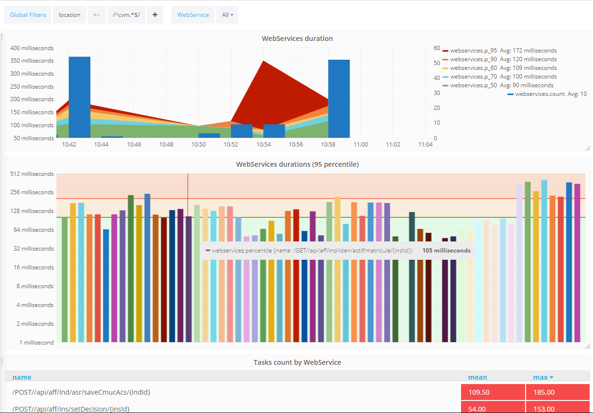
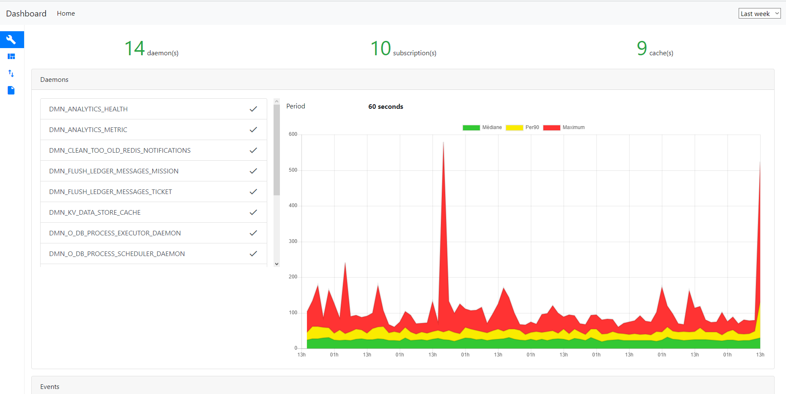

# Analytics 

## Collecte des données 

La maîtrise des performances est un enjeu majeur dans les systèmes d'information. La non-performance est une des premières causes de rejet des applications par les utilisateurs et donc anticiper au maximum les éventuels problèmes de performances est important.
Vertigo intègre nativement un composant d'Analytics qui permet d'envoyer les traces d'appels vers un serveur dédié pour y calculer des indicateurs de performances.

Les sondes nativement incluses dans vertigo sont placées à des endroits stratégiques qui permettent une compréhension fine du système et  de débusquer dès le développement les futurs problèmes de performances. Les emplacements sont les suivants :

- appel d'un WebService Vega
- appel d'une page Vertigo-Ui
- appel à la base de données
- appel au moteur de recherche
- exécution d'un démon

> Evidement, il est possible de placer des points de contrôle supplémentaires en cas de besoin.

### Configuration

La collecte des données n'est pas optionnelle dans une application Vertigo car son impact est extrêmement faible. En revanche, la consommation des données récoltées est paramétrable.

Il existe des *Connector* d'analytics qu'il est possible de brancher à la collecte des données. Ces *Connector* ont pour but de réceptionner les données collectées et de les traiter. Il est possible de positonner autant de *Connecter* que voulu afin de s'adapter aux besoins du projet.

Les connecteurs inclus dans vertigo sont :

- `SmartLoggerAnalyticsConnectorPlugin` : qui permet de logger de manière intelligente les informations, notamment à destination du developpeur. Ce connecteur permet très simplement de connaitre le nombre d'appels à la base de données pour chaque appel de webservice ou d'écran.
- `SocketLoggerAnalyticsConnectorPlugin` : qui permet la transmission des données au serveur analytics de Vertigo. Ce serveur d'analytics disponible [ici](https://github.com/KleeGroup/analytica-server/tree/dev/analytics-server) est capable d'agréger les données collectées sur plusieurs serveurs d'une même application ou bien même de plusieurs applications en vue de leur exploitation. L'utilisation standard est le stockage de données dans une base InfluxDB pour des visualisations via vertigo-dashboard ou Grafana.

Pour activer ces connecteurs, voici un extrait de la configuration Yaml à inclure dans votre application :

```yaml
io.vertigo.commons.CommonsFeatures:
    features:
    featuresConfig:
      - analytics.smartLoggerConnector:
          aggregatedBy: sql
      - analytics.socketLoggerConnector:
          hostName: ${analyticsHost}
```

## Affichage des résultats

Il est possible d'afficher les données collectées via différentes méthodes puisque les données sont stockées dans une base de données timeseries InfluxDB.

Il est donc possible d'utiliser ces informations pour construire des tableaux de bord à partir de différents outils du marché. On pourra citer :

- Chronograf de la suite InfluxData TICK : https://www.influxdata.com/time-series-platform/chronograf/
- Grafana : https://grafana.com

Voici un exemple de tableau de bord réalisé sur Grafana :




### Vertigo-dashboard

L'extension **vertigo-dashboard** permet d'inclure directement depuis l'application des tableaux de bord préconfigurés et sans dépendance à un produit tiers.

Il se configure en ajoutant dans votre configuration Yaml le module suivant :

```yaml
io.vertigo.dashboard.DashboardFeatures:
    features:
      - analytics:
```

En vous rendant sur l'url */dashboard* sur votre application web, vous trouverez alors des tableaux de bord présentant les différents modules de votre application, vous donnant ainsi des indications précises sur la santé et l'utilisation de l'application. Ces précieuses données sont importantes en vue de l'amélioration continue du système, qu'il soit en développement ou en production.

Il existe des écrans dédiés aux modules suivants : **vertigo-commons**, **vertigo-dynamo**, **vertigo-vega**, **vertigo-ui** qui présente les éléments saillants relatifs à ces modules.

Voici un exemple de tableau de bord dédié à la **vertigo-commons** issu de vertigo-dashboard qui détaille la liste des démons de l'application et leur durée exécution :

