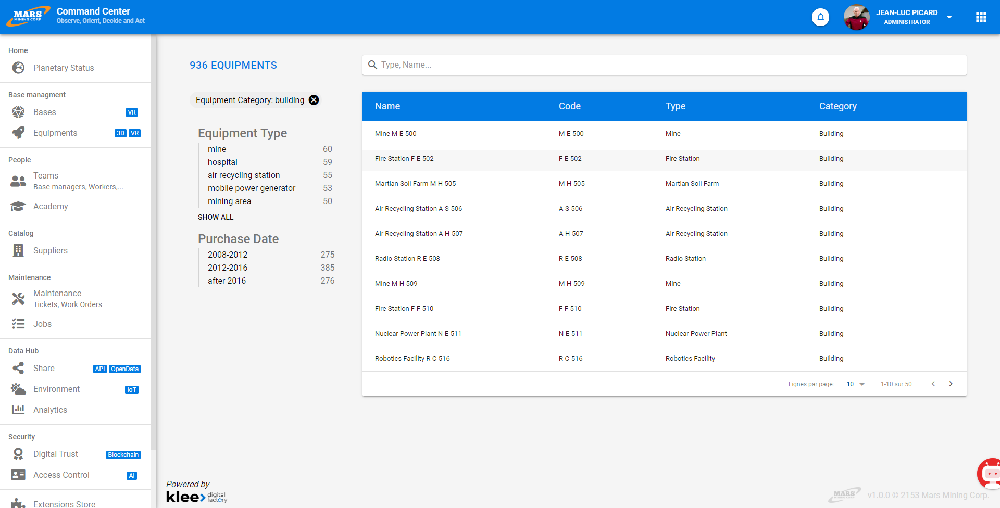

# Recherche

Dans les projets Vertigo, l'intégration d'un moteur de recherche puissant est simplifiée et pérennisée par l'utilisation du module **vertigo-datafactory**.

## Principe général

L'intégration d'un moteur de recherche est devenue un standard dans les projets car son apport de valeur est indéniable.

Le module de recherche Vertigo permet :

- d'apporter une fonctionnalité de recherche **riche et performante** (facettes, recherche plein texte, phonétique, compteurs de résultats, tri par pertinence, etc..., tout cela avec des temps de réponse de quelques millisecondes : incomparables avec des requêtes SQL)
- de placer la **recherche au centre** : toutes les entités clés peuvent être indexées et recherchées par les utilisateurs. C'est un point d'accès privilégié : on entre par la recherche, on navigue par la recherche. Les critères restent simples et l'on affine par les facettes.
- de rendre **accessible** l'information : l'utilisateur est soit un néophyte soit auto-formé. La recherche proposée reprend les standards actuels du net et permet une prise en main rapide. 
- au **développeur de paramétrer le mécanisme** de recherche. Le paramétrage ouvre les possibilités, tout en outillant et stabilisant les composants techniques sous-jacents.
- de **générer les façades d'appel aux recherches** paramétrées lors du MDA. L'usage du moteur de recherche est donc décorélé du paramétrage des recherches mis à disposition.

Le module de recherche Vertigo supporte les trois cas d'usage principaux :

- recherche d'**un élément** à partir d'**informations connues**
- recherche d'**un élément** **sans information** connue précisément
- constitution d'**un ensemble** d'éléments pour une action globale **par étapes** successives

!> La recherche est un filtre : plus l'utilisateur donne d'informations, plus on réduit le champ des résultats.

!> La recherche la plus courante est dite *plain text*, ce qui signifie : "cherche un document qui contient un mot qui commence par", *ca ne signifie pas "contient"*. <br/>
Les performances du moteur sont assurées par un index des mots des documents (comme dans un livre), il faut donc toujours le début du mot pour s'y retrouver dans l'index : pas de recherche `*oitur*`  

**Moteur utilisé**

[ElasticSearch](https://www.elastic.co/products/elasticsearch) & [Lucene](https://lucene.apache.org/).<br/> 
Le mécanisme de recherche est le [QueryStringQuery](https://www.elastic.co/guide/en/elasticsearch/reference/current/query-dsl-query-string-query.html)<br/>

ElasticSearch est un moteur de recherche basé sur la bibliothèque Java Lucene.<br/>
Ce moteur est supporté par la société Elastic et est activement et régulièrement mis à jour. La conséquence principale de cette activité est une certaine volatilité de l'API (il y a régulièrement des breaking-changes).<br/> 
C'est l'un des intérêts du module Vertigo : une bonne partie des modifications peuvent être absorbées par le module, ce qui simplifie la montée de version pour les projets.<br/>
Vertigo maintient deux versions du plugin ElasticSearch : la version courante et la version précédente. 

*Ecran de recherche d'équipement dans l'application démo [Mars](https://github.com/vertigo-io/vertigo-university/tree/master/mars)*


## Configuration

### Activer le module

Pour commencer, il faut activer le module **vertigo-datafactory** et le connecteur **vertigo-elasticsearch-connector**<br/>
Le module propose deux modes de fonctionnement : 
- le mode *standard* utilisant un serveur ElasticSearch distant
- le mode *embedded* utilisant un serveur ElasticSearch local, démarré en même temps que l'application (utile pour les tests) 

!> Le mode embedded est déprécié par ElasticSearch depuis la version 5.

Exemple de configuration pour le mode Standard :
```yaml
modules
  io.vertigo.commons.CommonsFeatures:
  io.vertigo.dynamo.DynamoFeatures:
    features:
      - search
    featuresConfig:
      - search.elasticsearchTransport:
          servers.names: ${esHost}
          envIndex: mars
          cluster.name: mars
          rowsPerQuery: 50
          config.file: search/elasticsearch.yml
```

Exemple de configuration pour le mode Embedded :
```yaml
modules
  io.vertigo.connectors.elasticsearch.ElasticSearchFeatures:
    features:
      - restHL:
          servers.names: ${esHost}
  io.vertigo.datafactory.DataFactoryFeatures:
    features:
      - search:
    featuresConfig:
      - collections.luceneIndex:
      - search.elasticsearch.restHL:
          envIndexPrefix: mars
          rowsPerQuery: 50
          config.file: search/elasticsearch.yml
```

> Notez que le paramètre `envIndexPrefix` permet d'indiquer un préfixe des index pour un environnement applicatif, ainsi un même serveur ElasticSearch peut être utilisé pour différents environnements.
> Les nouvelles versions d'ElasticSearch imposent un seul type de documents par index.

### Configuration ElasticSearch

Le fichier elasticsearch.yml donne la configuration de l'index ElasticSearch. Il permet de configurer les types d'analyzers utilisés par l'application et rattachés aux Domaines du modèle.
Cette configuration est envoyée par l'application au serveur ElasticSearch au démarrage.

Exemple de configuration d'analyser (cette configuration conviendra à la plupart des projets) :
```yaml
index :
    analysis :
        normalizer :
            code :
                type : custom
            sortable :
                type : custom
                filter : [lowercase, asciifolding]  
        analyzer :
            multiple_code :
                tokenizer : piped_keywords
                filter : [standard]
            text_fr :
                tokenizer : standard
                filter : [standard, lowercase, asciifolding, snowball, elision]
        tokenizer :
            piped_keywords :
                type : pattern
                pattern : '([|,] *)'
        filter :
            snowball:
                type : snowball
                language: French
            elision:
                type : elision
                articles: [l, m, t, qu, n, s, j, d]
```


### Identifier vos **KeyConcept** *(entités métiers clés)*
Soit dans vos fichiers **KSP**: 
```javascript
alter DtDefinition DtEquipment {
  stereotype : "KeyConcept"
}
```

Soit dans votre fichier **OOM** : <br/>
Sur vos classes, indiquer le **Stereotype**: `KeyConcept`

### Ajout un DtObject représentant vos données d'index

Les index sont très puissants et gèrent des données **documentaires**. Il n'y pas de relationnel, il faut donc convertir votre grappe d'objets partant de votre **KeyConcept** en **Document**.<br/>
Très simplement, il s'agit de créer un DtObject mettant les données à plat.
```javascript
create DtDefinition DtEquipmentIndex {
   field equipmentId              {domain: DoId           label:"Id"      cardinality:"1"}
   field name                     {domain: DoLabel        label: "Name" }
   field code                     {domain: DoCode         label: "Code" }
   field purchaseDate             {domain: DoLocaldate    label: "Date of purchase" }
   field description              {domain: DoDescription  label: "Description" }
   field tags                     {domain: DoTags         label: "Tags" }
   field equipmentTypeName        {domain: DoLabel        label:"Type" }
   field equipmentCategoryName    {domain: DoLabel        label:"Category" }
}
```

Il est possible de préciser comment la donnée est indexée par la propriété **indexType** du domaine.<br/>
Cette propriété permet la conversion du simple **Domain Vertigo**, vers le type ElasticSearch plus complexe.<br/>
Sa syntaxe est la suivante :<br/>
``indexType : "myAnalyzer{:myDataType}{:stored|notStored}{:sortable|notSortable}{:facetable|notFacetable}"``

> Les champs ayant l'attribut `sortable`, sont automatiquement doublés avec une version `keyword` du champ.
> Ce pseudo permet de trier correctement le champ. Vertigo l'utilise de manière transparente pour les tris et les facettes.
> Il peut être utilisé dans les requêtes : <br/>
> **Exemple :**<br/>
> ``field1.keyword:#query#``


Exemple de domain :

```javascript
create Domain DoCode {
   dataType : String
   indexType : "code:keyword"
}

create Domain DoLabel {
   dataType : String
   indexType : "text_fr:sortable"
}

create Domain DoDescription {
   dataType : String
   indexType : "text_fr"
}

create Domain DoTags {
   dataType : String
   indexType : "multiple_code:facetable"
}
```


### Définition des index

Les index sont déclarés comme des **Definitions** Vertigo. Il est possible de le faire en Java ou en DSL.<br/>
Le plus simple est via le DSL, c'est cette méthode qui est décrite ici.

#### **IndexDefinition**

L'**IndexDefinition** représente un Index. Il n'en faut qu'une seule par KeyConcept. <br/>
*Il est donc parfois nécessaire de créer des KeyConcept agrégeant d'autres KeyConcepts.*

**Propriétés**
- `keyConcept`* : Nom du Dt KeyConcept, utilisé pour suivre les modifications et déclencher les réindexations
- `dtIndex`* : Nom du Dt représentant le document, à la fois les champs recherchés et les champs retournés
- `searchLoader`* : Nom d'un composant Vertigo utilisé pour recharger les documents à partir d'une liste d'Ids (doit implémenter l'interface SearchLoader<keyConcept, dtIndex>)
- `indexCopyTo` : Ajoute un champ agrégeant une liste de champs du document, utilise la fonction de *copy* optimisée du moteur (le champ doit préexister dans le DtIndex)
  - `from` : liste des champs séparés par une virgule

```javascript
create IndexDefinition IdxEquipment {  
  keyConcept : DtEquipment
  dtIndex : DtEquipmentIndex 
  loaderId : "EquipmentSearchLoader"
  indexCopyTo allText { from: "name,code,description,tags,equipmentTypeName,equipmentCategoryName" }
}
```
> L'attribut `loaderId` pointe sur un composant Vertigo qui implémente l'interface `SearchLoader<? extends DtObject>` adapté pour l'objet d'index


#### **FacetDefinition**

La **FacetDefinition** représente une définition de facette. Il en existe deux types : 

**Propriétés**
- `dtDefinition`* : Nom du Dt d'index
- `fieldName`* : Nom du champ portant la facette
- `label`* : Label de la facette
- `order` : Change le mode de tri de la facette : alpha, count (par défaut pour les *terms*), definition (pour les ranges)
- `multiSelectable` : Boolean indiquant que les valeurs de facettes sont multi-sélectionnables (*false* par défaut) 
- `range` : Ajoute une valeur de facette (pour les facettes **range**), le nom est utilisé comme code
  - `filter`* : filtre de recherche pour cette valeur. Reprend la syntaxe du moteur de recherche utilisé (ici ElasticSearch).
  - `label`* : label de cette valeur

!> Attention : les facettes multiSelectable impactent les performances 
  
* les facettes **term** dont les valeurs sont tirées dynamiquement des données de l'index 

```javascript
create FacetDefinition FctEquipmentEquipmentTypeName {
   dtDefinition:DtEquipmentIndex, fieldName:"equipmentTypeName", label:"Equipment Type"
}
```

* les facettes **range** qui sont prédéfinies et rassemblent un ensemble de valeurs dans chaque facette

```javascript
create FacetDefinition FctEquipmentPurchaseDate {
   dtDefinition:DtEquipmentIndex, fieldName:"purchaseDate", label:"Purchase Date"
   range r1 { filter:"purchaseDate:[01/01/2008 TO 01/01/2012]", label:"2008-2012"},
   range r2 { filter:"purchaseDate:[01/01/2012 TO 01/01/2016]", label:"2012-2016"},
   range r3 { filter:"purchaseDate:[01/01/2016 TO *]", label:"after 2016"}
}
```

#### **FacetedQueryDefinition**

La **FacetedQueryDefinition** représente une définition de requête de recherche. Associée à un KeyConcept, elle précise également :

* Les facettes utilisées
* Le type de critère d'entrée (par son **domain**) 
* La *class* de construction de la requête envoyée au moteur de recherche
* Le pattern de la requête du moteur de recherche

**Propriétés**
- `keyConcept`* : Nom du Dt du KeyConcept
- `domainCriteria`* : Nom du domain du critère d'entrée.
- `facets`* : Liste des facettes activées dans cette recherche
- `listFilterBuilderClass`* : Nom du moteur permettant la traduction de la requête(*io.vertigo.dynamox.search.DslListFilterBuilder* préconisé)
- `listFilterBuilderQuery`* : Requête de la recherche (voir syntaxe [VertigoSearchDSL](#syntaxe-vertigosearchdsl))
  

```javascript
create FacetedQueryDefinition QryEquipment {
   keyConcept : DtEquipment
   facets : [FctEquipmentEquipmentTypeName, FctEquipmentPurchaseDate ]
   domainCriteria : DoLabel
   listFilterBuilderClass : "io.vertigo.dynamox.search.DslListFilterBuilder"  
   listFilterBuilderQuery : "allText:#+query*#"
}
```

#### **Code généré**

Le module [MDA](/basic/mda) de Vertigo (*vertigo-studio*) utilise ces informations pour générer une méthode pour chaque FacetedQueryDefinition dans le DAO du KeyConcept associé.

### Service de chargement des données

Vertigo effectue automatiquement les mises à jour de l'index lorsque les données sont modifiées.<br/>
Pour cela, Vertigo surveille les modifications d'objet qui passent par le DAO de votre KeyConcept. Si vous effectuez une mise à jour hors de ce DAO ou sur un autre *object* que le KeyConcept de l'index, vous devez l'indiquer en utilisant le readOneForUpdate **au début** du service effectuant la modification *(cela pose un lock)*.

Pour cette opération, Vertigo à besoin du service de chargement des données de l'index :

```java
public interface SearchLoader<K extends KeyConcept, I extends DtObject> extends Component {
   /**
    * Load all data from a list of keyConcepts.
    */
   List<SearchIndex<K, I>> loadData(SearchChunk<K> searchChunk);

   /**
    * Create a chunk iterator for crawl all keyConcept data.
    */
   Iterable<SearchChunk<K>> chunk(final Class<K> keyConceptClass);
}
```

Pour les cas standard, Vertigo propose un `AbstractSqlSearchLoader` a étendre. Il suffit d'implémenter le chargement de la liste des SearchIndex à partir d'une liste d'id.

Exemple :
```java
public final class EquipmentSearchLoader extends AbstractSqlSearchLoader<Long, Equipment, EquipmentIndex> {

   private final EquipmentServices myEquipmentServices;

   @Inject
   public EquipmentSearchLoader(final EquipmentServices equipmentServices, final TaskManager taskManager, final VTransactionManager transactionManager) {
      super(taskManager, transactionManager);
      myEquipmentServices = equipmentServices;
   }

   @Override
   public List<SearchIndex<Equipment, EquipmentIndex>> loadData(final SearchChunk<Equipment> searchChunk) {
      final SearchIndexDefinition indexDefinition = Home.getApp().getDefinitionSpace().resolve("IdxEquipment", SearchIndexDefinition.class);
      final List<Long> equipmentIds = new ArrayList<>();
      for (final UID<Equipment> uid : searchChunk.getAllUIDs()) {
         equipmentIds.add((Long) uid.getId());
      }
      final DtList<EquipmentIndex> equipmentIndexes = basemanagementPAO.loadEquipmentIndex(equipmentIds);
      final List<SearchIndex<Equipment, EquipmentIndex>> equipmentSearchIndexes = new ArrayList<>(searchChunk.getAllUIDs().size());
      for (final EquipmentIndex equipmentIndex : equipmentIndexes) {
         equipmentSearchIndexes.add(SearchIndex.<Equipment, EquipmentIndex> createIndex(indexDefinition,
               UID.of(indexDefinition.getKeyConceptDtDefinition(), equipmentIndex.getEquipmentId()), equipmentIndex));
      }
      return equipmentSearchIndexes;
   }
}
```


Il est possible de filtrer la liste des KeyConcept à indexer en surchargeant la méthode `getSqlQueryFilter` pour préciser un filtre SQL :
```java
  /** {@inheritDoc} */
  @Override
  protected String getSqlQueryFilter() {
    //only index equipement with a purchaseDate
    return "PURCHASE_DATE is not null";
  }
```

### Récupération de l'objet à indexer

Une tâche SQL de récupération de l'objet à indexer doit être déclarée :
```json
create Task TkLoadEquipmentIndex {
   className : "io.vertigo.basics.task.TaskEngineSelect",
   request : "   select equ.EQUIPMENT_ID,
                  equ.NAME, 
                  equ.CODE, 
                  equ.PURCHASE_DATE, 
                  equ.TAGS, 
                  equipmentType.LABEL as EQUIPMENT_TYPE_NAME,
                  equipmentCategory.LABEL as EQUIPMENT_CATEGORY_NAME
            from EQUIPMENT equ
            join EQUIPMENT_TYPE equipmentType on equipmentType.equipment_type_id = equ.equipment_type_id
            join EQUIPMENT_CATEGORY equipmentCategory on equipmentCategory.equipment_category_id = equipmentType.equipment_category_id
            where EQUIPMENT_ID in (#equipmentIds.rownum#);"
   in equipmentIds {domain : DoLong             cardinality:"*"} 
   out dtcIndex    {domain : DoDtEquipmentIndex cardinality:"*"} 
}
    
```

### Lancer l'indexation

Maintenant que tout est configuré, il faut lancer la première indexation.
Rien de plus simple : il suffit de créer un service qui appelle la méthode `reindexAll` de `SearchManager` 

Exemple :
```java
  /** {@inheritDoc} */
  @Override
  public void reindexAllEquipements() {
    searchManager.reindexAll(searchManager.findFirstIndexDefinitionByKeyConcept(Equipement.class));
  }
```

### Lancer une recherche

Pour lancer une recherche, Vertigo a généré du code dans le DAO du KeyConcept associé à l'index. Il faut d'abord créer une SearchQuery et la faire exécuter par le DAO.

Exemple :
```java
     public FacetedQueryResult<EquipmentIndex, SearchQuery> searchEquipments(final String criteria, final SelectedFacetValues selectedFacetValues, final DtListState dtListState) {
      final SearchQuery searchQuery = equipmentSearchClient.createSearchQueryBuilderEquipment(criteria, selectedFacetValues).build();
      return equipmentSearchClient.loadList(searchQuery, dtListState);
   }
```

L'objet de résultat `FacetedQueryResult` fournit de nombreuses informations utiles pour l'affichage :

* liste des documents correspondants
* facettes (et pour chaque facette, le nombre de documents par valeur de facette)
* highlights (si activés)
* la searchQuery source de la requête

### Ajouter la sélection d'une facette

La méthode générée dans le DAO du KeyConcept prend en paramètre un `SelectedFacetValues`.
Vertigo propose un pont entre cet objet et les IHMs utilisées (WebServices, SpringMVC ou Struts2)


## Syntaxe VertigoSearchDSL

Le DslListFilterBuilder vise à construire la requête Lucene de la manière la plus intuitive possible pour le développeur :
Voir [Lucene QueryParser](https://lucene.apache.org/core/8_0_0/queryparser/org/apache/lucene/queryparser/classic/package-summary.html#package.description)

* L'expression subit le moins de modifications possible
* Les critères sont posés en les encapsulant dans des `#` (Ex: `#query#`)
* Avec les critères de valeur null, soit l'expression complète est retirée, soit le critère est remplacé par la valeur par défaut déclarée.
* Les opérateurs placés à l'intérieur des `#` seront reproduits pour chaque mot, les opérateurs à l'extérieur sont repoduits autour du critère complet.
* Les critères et mots sont en *optionnel* par défaut (il faut donc préciser le caractère obligatoire des critères/mots avec le préfix `+`)
* L'utilisateur (avancé) peut surcharger le champ du document sur lequel on effectue la recherche, rajouter des parenthèses ou changer les opérateurs (OR, AND, +, -, ...)

### Syntaxe de base

> Une spécificité forte de la syntaxe de recherche est que les critères sont indépendants : il n'y a pas de notion de OR et AND comme en SQL, le principe est que chaque critère porte son caractère *Obligatoire* ou *Optionnel*.
> Ce principe est intéressant, puisqu'il simplifie la syntaxe (surtout quand la requête est manipulée dynamiquement) et empêche l'altération, par un utilisateur malveillant, des critères de filtrage obligatoires positionnés par le développeur.

#### Fields
* `#query#` : criteria.toString() *(A utiliser quand criteria est directement la chaîne de saisie utilisateur)*
* `#myField#` : criteria.myField
* `#myField#!(myDefault)` : criteria.myField!=null?criteria.myField:myDefault

* `field1:#query#` : le champ `field1` doit contenir un des mots de la query, en OR avec les autres critères
* `+field1:#query#` : idem mais ce critère est obligatoire
* `-field1:#query#` : idem mais ce critère est interdit
* `field1:#query#!(inactif)` : si le critère est null, on recherche les documents ou `field1` contient "inactif"<br/><br/>

* `field1:"#query#"` : le champ `field1` doit contenir la saisie exacte de la query
* `field1:#+query#` : le champ `field1` doit contenir tous les mots de la query
* `field1:#-query#` : aucun mot de la query ne doit être dans le champ `field1` de l'index 
* `+field1:(#+nom# #+prenom#)` : le champ `field1` doit contenir tous les mots du critère `nom` et du critère `prenom`
* `field1:#query*#` : le champ `field1` doit avoir un mot qui commence par un des préfixes de la query
* `field1:#query#^2` : le champ `field1` à un poids de 2
* `field1:#query~2#` : le champ `field1` doit contenir un des mots de la query avec une distance de Levenshtein de 2 (2 max). **Attention peu performant**.<br/><br/>

* `+field1:(#+nom*# #+prenom*#)` : le champ `field1` doit contenir des mots avec tous les préfixes du critère `nom` et ceux du critère `prenom`

#### Modes d'échappement de la saisie utilisateur

Par défaut, la saisie utilisateur est très peu échappée. Il est même permis à l'utilisateur de faire une recherche avancée en utilisant lui-même la syntaxe Lucene.
Il peut ajouter des poids ou du *fuzzy*, faire une recherche exacte avec " ", ajouter une recherche en OR (ou AND) entre deux termes et même chercher dans un autre champ de l'index avec myOtherField:(mes mots clés).
Cette fonctionnalité est autorisée car elle ne s'adresse qu'aux utilisateurs avancés et ne permet pas de sortir du périmètre autorisé par la sécurité.

Dans tous les cas, une syntaxe incomplète saisie par l'utilisateur sera échappée : les ( ), { } ou [ ] mal fermés, ou les AND OR mal utilisés.

Le développeur peut toutefois agir sur le mode d'échappement lors de l'écriture de la requête, par l'emploi d'un suffixe sur la déclaration du champ :

* `removeReserved` : Les caractères réservés sont simplement retirés (syntaxe : myField1:#+query*#removeReserved )
* `escapeReserved` : Les caractères réservés sont échappés (syntaxe : myField1:#+query*#escapeReserved )

Ceci peut être utile quand les valeurs recherchées contiennent des caractères réservés (par exemple une recherche par IP : 192.168.0.456)

> Les caractères réservés sont : 
> `+ - = & | > < ! ( ) { } [ ] ^\" ~ * ? : / OR AND`

#### Range

Les critères de type **range** reprennent la syntaxe Lucene.<br/>
Les bornes utilisent les caractères [ ou { pour indiquer le caractère inclusif.<br/>
L'étoile `*` représente l'infini<br/>
Les dates supportent le mot clef `now` et des opérations "+ ou - un délai"

* `+date_creation:[#critDateDebut# to #critDateFin#]` : date de création comprise entre deux dates. Si un critère est null, il sera remplacé par *.
* `+date_debut:[* to #critDateFin#} +date_fin:{#critDateDebut# to *]` : Un document avec une période d'activité est recherché sur l'intersection avec la période du critère. Dans notre exemple, les bornes sont exclues.
* `+date_creation:[now-6M to *]` : date de création de moins de 6 mois

> Les formats de date acceptés sont : dd/MM/yyyy | strict_date_optional_time | epoch_second

#### Poids des champs :
`+(title:#query#^2 content:#query#)` : Recherche dans le titre et dans le contenu. Le titre a un poids de 2 par rapport au contenu vis-à-vis de la pertinence.

#### Recherche multi-mode :
`+(content:#query#^4 content:#query*#^2 contentPhonetic:#query#)` : on cherche le maximum de mots dans *content* avec des poids plus ou moins forts selon les cas.

#### Recherche multi-champs :
La préconisation Lucene est de créer un champ qui concatène toutes les données à rechercher (par exemple `nomPrenom`, `codePostalComune`, etc ...)<br/>
La propriété `indexCopyTo` de l'IndexDefinition est utilisée pour ça.

* `+_all:#+query*#` : on recherche dans tous les champs. C'est la préconsiation Lucene : on crée un champ qui concatène les champs de recherche. Ce champ est paramétrable. 
* `+[codePostal,commune]:#+query*#` : on recherche les critères dans code postal et commune.
* `+[field1,field2]:#+query*#` : Tous les préfixes de la query doivent être présent soit dans `field1` soit dans `field2`
* `+[field1^2,field2]:#+query*#` : Idem, mais le `field1` à un poids de 2

!> La recherche multichamp [field1, field2] est moins performante et inadaptée s’il y a beaucoup de mots saisi par l'utilisateur (ils sont multipliés par le nombre de champ)


## Bien construire sa recherche

Une recherche utilisateur est basée sur l'assemblage entre des critères utilisateur, **des critères système de filtrage contextuel et un filtre de sécurité**

Pour avoir une meilleure accessibilité, il est préférable de proposer un comportement similaire aux recherches des sites internet grand public (au hasard Google)<br/>
En partant du constat que :
* La recherche est un filtre, plus on donne d'infos, plus on réduit le champ des résultats. 
* Le KeyConcept indexé peut être éclaté en plusieurs champs.
* Les mots clés fournis par l'utilisateur ne sont pas forcément dans le même champ.

### Problématique

Globalement, la recherche multifield correspond à ce qui est attendu par l'utilisateur, il veut trouver son entité quels que soient les choix de structure de l'index dont il n'a même pas connaissance.<br/>
Le problème est expliqué sur le site d'ElasticSearch [ICI](https://www.elastic.co/guide/en/elasticsearch/guide/master/multi-field-search.html)<br/>
Les techniques les plus intuitives ne donnent pas de bons résultats : 

La recherche sur différents champs, avec les mots saisis en OU :
`+(field1:#query*# field2:#query*#)` <br/>
**KO** : les mots sont en `Optionel` et des mots saisis peuvent être absents des résultats.

La recherche sur différent champs, avec les mots saisis en ET :
`+(field1:#+query*# field2:#+query*#)` <br/>
**KO** : les mots sont en `Obligatoire` et tous les mots saisis doivent être présents dans le même champ.

### Solution

#### copyTo champ custom

?> Cette solution est celle préconisée

ElasticSearch propose des champs custom qui sont l'assemblage de plusieurs champs de l'index. Par exemple, le champ `_all` est natif et contient tous les champs tokenizés.<br/>
Il s'agit de la préconisation Lucene en créant des champs qui concatènent toutes les données à rechercher (par exemple `nomPrenom`, `codePostalCommune`, etc ...)

ElasticSearch ajoute la possibilité de configurer les champs de ce type par la fonctionalité `copy_to`. (doc ElasticSearch [ici](https://www.elastic.co/guide/en/elasticsearch/guide/master/custom-all.html))

Dans Vertigo, vous devez déclarer les instructions `indexCopyTo` dans la définition de l'index. Vous indiquez que l'un des champs de l'index est la copie de un ou plusieurs autres champs de l'index.<br/>
Cette copie est effectuée côté ElasticSearch et est plus efficace qu'une copie Java ou SQL.

Exemple de KSP : 

```json
create IndexDefinition IdxCar {
    keyConcept : DtCar
    dtIndex : DtCar
    indexCopyTo allText { from: "make,model,description,year,kilo,price,motorType" },
    indexCopyTo modelPhonetic { from: "model" },
    loaderId : "CarSearchLoader"
}
```

Cette fonction permet de créer des champs de recherche multichamps, mais peut aussi être utilisée pour peupler des champs proposant un autre analyzer que le champ principal (pour du tri, ou du phonétique par exemple).

Pour utiliser les champs ``copy_to``, il faut que le champ existe dans le Dt de l'index et que les champs copiés dedans aient tous un indexType.<br/>
Pour cela, nous préconisons d'ajouter des champs computed :
```json
computed modelPhonetic { domain:DoPhonetic label:"model sort" expression:"throw new io.vertigo.lang.VSystemException(\"Can't use index copyTo field\");"}
computed allText { domain:DoFullText label:"index all" expression:"throw new io.vertigo.lang.VSystemException(\"Can't use index copyTo field\");"}
```

Pour l'indexType des types primitifs, nous préconisons de définir l'indexType standard : 

```json
create Domain DoVisitCount {
    dataType: Integer
    indexType: "standard:integer"
}
```

#### Recherche multi-champs :

!> Cette solution ne convient pas à tous les cas, en revanche elle peut être utilisée pour tester des évolutions de la recherche avant l'ajout d'un custom field.

Le DslListFilterBuilder permet de faire une recherche sur plusieurs champs : 
`+[codePostal,commune]:#+query*#` : on recherche les critères dans code postal et commune.

Cette syntaxe est résolue par Vertigo et reproduit le mécanisme du cross-field d'ElasticSearch (mais ne l'utilise pas). En couplant ce mécanisme avec les custom field présentés ci-dessus, il est possible de limiter la complexité des requêtes obtenues.

Par rapport au custom field, cette syntaxe permet un comportement différent par champs : tokenizer utilisé et poids différent.

*Exemple:*

`+[commune,annee,titre^5]:#+query*#` : L'année est bien un nombre et le titre à un poids de 5 par rapport aux autres.

!> Attention : Utiliser cette syntaxe sur un nombre limité de champs, car comme son nom l'indique, elle effectue un cross-join des champs avec les mots saisis. ElasticSearch est très performant avec ce type de recherches, mais il est inutile de le pousser aux limites.

*Exemple:*  

`+[codePostal,commune]:#+query*#` 
avec les mots clés ==92350 Le plessis robinson== devient : 
```
+( +(codePostal:92350* commune:92350*) 
   +(codePostal:Le* commune:Le*) 
   +(codePostal:plessis* commune:plessis*) 
   +(codePostal:robinson* commune:robinson*) )
```

#### Recherche multi-champs :

?> *(plus simple, mais à tester)*

Une solution à envisager est le mix des deux solutions présentées ci-dessus :<br/>
On vérifie d'abord la présence des mots clés saisis par l'utilisateur dans `_all` puis on affecte le poids à certains champs en OU.

```java
+_all:#+query*# //_all en obligatoire contient tous les mots saisis par l'utilisateur
+titre:#query*#^5 //le titre est boosté avec les mots en Optionnel; il n'est pas obligé de contenir tous les termes
```


## Filtre de sécurité

Le filtre de sécurité a vocation à être conservé en session et être ajouté à chaque recherche.<br/>
Le module de sécurité de Vertigo permet de générer le filtre dans différents langages (et notamment Lucene) à partir d'une déclaration unifiée des règles de sécurité.

Il se positionne avec le code suivant :
```java
searchQueryBuilder.withSecurityFilter(session.getSearchSecurityFilter())
```

Il correspond à une expression de recherche qui sera directement ajoutée à la recherche en mode obligatoire. (avec `+()`)
La saisie utilisateur ne peut pas désactiver ce filtre : non seulement il y a des échappements, mais de plus elle est cloisonnée dans une autre sous-requête.


