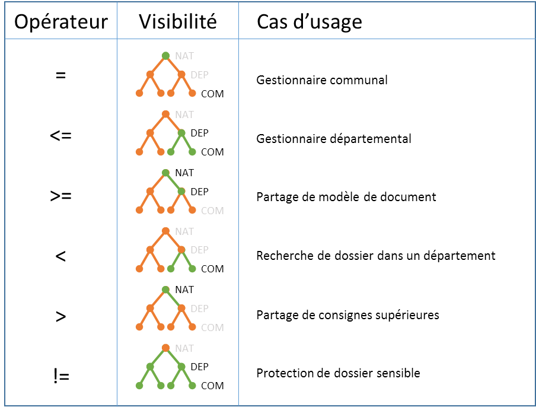

# Sécurité

Le module **Account** de Vertigo permet la gestion simplifiée des comptes utilisateurs. 
Ce module permet avant tout la mise à disposition aux autres modules de la notion transverse de compte utilisateur. Ceci permet à Vertigo de proposer des extensions comme **"notifications"** ou **"commentaires"**. 

Ce module propose des fonctionnalités de gestion des utilisateurs réparties sur trois axes orthogonaux :
- **Authentication** : Gestion de l'authentification
- **Authorization** : Gestion des autorisations
- **Identity Provider** : Connexion avec des fournisseurs d'identité
 

## Configuration

Afin d'utiliser les fonctionnalités de **Account** il convient d'ajouter ce module à la configuration de l'application.
Pour plus de détail vous pouvez vous rapporter au chapitre dédié à la [configuration](/basic/configuration) de l'application.


Voici une configuration typique d'une application utilisant le module Account

```yaml
modules
  io.vertigo.account.AccountFeatures:
    features:
      - security:
          userSessionClassName: io.mars.commons.MarsUserSession
      - account:
      - authentication:
      - authorization:
    featuresConfig:
      - account.store.store:
          userIdentityEntity: DtPerson
          groupIdentityEntity: DtGroups
          userAuthField: email
          photoFileInfo: FiFileInfoStd
          userToAccountMapping: 'id:personId, displayName:lastName, email:email, authToken:email, photo: picturefileId'
          groupToGroupAccountMapping: 'id:groupId, displayName:name'
      - authentication.text:
          filePath: /initdata/userAccounts.txt
```


### Features disponibles :
- **security** : Active le module, et le premier niveau de sécurité (authentifié ou non)
  - userSessionClassName : Nom de la class de la session applicative 
- **account** : Active les fonctionnalités autour de la notion de compte utilisateur
- **authentication** : Active les fonctionnalités d'authentification
- **identityProvider** : Active les fonctionnalités de fournisseur d'identité
- **authorization** : Active les fonctionnalités liées aux autorisations

### Configurations standards 

#### Account
- **account.store.store** : Stockage des *Account* par le *StoreManager*
  - userIdentityEntity : Nom de l'entité portant les *Account*
  - groupIdentityEntity : Nom de l'entité portant les groupes d'*Account* (doit avoir une FK vers *Account*)
  - userAuthField : Nom du champ relié à l'authentification *(authToken)*
  - photoFileInfo *(optional)* : Nom du *FileInfo* utilisé pour le stockage des photos
  - userToAccountMapping : Mapping des champs de l'entité vers *Account*
  - groupToGroupAccountMapping : Mapping des champs de l'entité Groupe vers *GroupeAccount*
- **account.store.text** : Stockage des *Account* par un fichier text
  - accountFilePath : Chemin du fichier des *Account* 
  - accountFilePattern : RegExp de lecture du fichier (avec des capturesGroup [nommés](https://stackoverflow.com/a/415635/2273508) : id, displayName, email, authToken, photoUrl)
  - groupFilePath : Chemin du fichier des *AccountGroup* 
  - groupFilePattern :  RegExp de lecture du fichier (avec des capturesGroup [nommés](https://stackoverflow.com/a/415635/2273508) : id, displayName, accountIds)
- **account.store.loader** : Stockage des *Account* délégué à un loader spécifique *(implements [AccountLoader](https://github.com/vertigo-io/vertigo/blob/master/vertigo-account-impl/src/main/java/io/vertigo/account/plugins/account/store/loader/AccountLoader.java))*
- **account.cache.memory** : Active le cache mémoire (**Attention** pas de purge automatique)
- **account.cache.redis** : Active le cache Redis via le *RedisConnector* (**Attention** pas de purge automatique)

#### Authentication
- **authentication.text** : Permet l'authentification basée sur un fichier texte
  - filePath : Chemin du fichier. (Format du fichier : accountKey    login    password    //comments )
?> Le hash des mots de passe utilise l'algorithme [PBKDF2WithHmacSHA256](https://en.wikipedia.org/wiki/PBKDF2)

- **authentication.store** : Permet l'authentification basée sur le *StoreManager*
  - userCredentialEntity : Nom de l'entité portant l'authentification
  - userLoginField : Nom du champ 
  - userPasswordField : Nom du champ password
  - userTokenIdField : Nom du champ *authToken* (champ utilisé pour le lien vers *Account*)
?> Le hash des mots de passe utilise l'algorithme [PBKDF2WithHmacSHA256](https://en.wikipedia.org/wiki/PBKDF2)

- **authentication.ldap** : Permet l'authentification déporté sur un LDAP
  - userLoginTemplate : Template du DN de l'utilisateur (contient {0} pour fusionner le login)
  - ldapServerHost : Nom du serveur LDAP
  - ldapServerPort : Port du serveur LDAP
- **authentication.mock** : Pour les tests, authentification toujours vrai

#### IdentityProvider
- **identityProvider.store** : Provision des *Identités* depuis le *StoreManager*
  - userIdentityEntity : Nom de l'entité portant les *Identités*
  - userAuthField : Nom du champ relié à l'authentification *(authToken)*
  - photoIdField *(optional)* : Id du FileInfo de stockage de la photo
  - photoFileInfo *(optional)* : Nom du *FileInfo* utilisé pour le stockage des photos
- **identityProvider.ldap** : Provision des *Identités* depuis un LDAP
  - ldapServerHost : Nom du serveur LDAP
  - ldapServerPort : Port du serveur LDAP (par défaut : 389)
  - ldapAccountBaseDn : Base de recherche des DNs d'Accounts
  - ldapReaderLogin : Login du reader LDAP
  - ldapReaderPassword : Password du reader LDAP
  - ldapUserAuthAttribute : Attribut LDAP utilisé pour retrouver un user par son *authToken*
  - userIdentityEntity : Nom de l'entité portant l'identité (ie: du User au sens application)
  - ldapUserAttributeMapping : Mapping des champs du LDAP vers l'entité d'identité
- **identityProvider.text** : Provision des *Identités* depuis un fichier text
  - identityFilePath : Chemin du fichier des *Identité* 
  - identityFilePattern : RegExp de lecture du fichier (avec des capturesGroup [nommés](https://stackoverflow.com/a/415635/2273508))
  - userAuthField : Nom du champ relié à l'authentification *(authToken)*
  - userIdentityEntity : Nom de l'entité portant l'identité (ie: du User au sens application)

  
## Autorisations

### Principes

Dans une application métier on considère en générale que tous les utilisateurs n'auront pas accès à tout. Vertigo propose un mécanisme de sécurité qui permet de protéger les éléments de l'application qui doivent l'être.

D'un point de vue technique le mécanisme permet de sécuriser des éléments fins de l'application (que l'on nomme *Ressource*) : des pages, des services, des données ou autres. 
Il peut aussi s'agir de quelque chose de plus abstrait comme un caractère **confidentiel** transverse à l'application.<br/>
Mais pour rester compréhensible le développeur va paramétrer le mécanisme de sécurité pour englober ces *Ressources* dans des *Authorization* qui correspondent à des fonctionnalités proposées par l'application 
(*Consulter les dossiers*, *Déposer un dossier*, *Valider les dossiers*, ...)

Le mécanisme de sécurité de Vertigo est assez *bas niveau*. Vertigo ne connait que la notion d' **Authorization** : soit globales, soit portées par une entité (les `SecuredEntity`).

Il est laissé à l'application la charge de rationaliser le modèle, par exemple il est préconisé que l'application gère la sécurité à un niveau plus macro avec une notion de *Profil* et de *Périmètre*.
La liste des *Profils* associés à un utilisateur est spécifique à l'application et à sa charge. 
Un *Profil* étant une liste d'**Authorizations** rattaché à un **Périmètre** applicatif.

**Note**<br/>
La bonne pratique dans ce domaine est que si l'utilisateur a plusieurs **Profils**, il devra n'en avoir qu'un seul actif à la fois (il pourra en changer pendant sa session), 
ceci afin d'éviter des collisions (intersections) de règles de sécurité difficiles à comprendre, à implémenter de manières performantes et à tester.<br/>
Dans un système où la gestion des utilisateurs est centralisée, le **Profil** utilisateur peut être géré par le système centralisé (il fournit le **Profil** par utilisateur par appli) 

### Notion de *contexte de sécurité*

Le modèle présenté ci-dessus permet déjà de gérer de nombreux cas. Mais plus les clients sont gros et plus ils ont une organisation forte qui pèse sur la sécurité de l'application. 
Il apparaît alors que la sécurité doit être relative à un contexte. Ce contexte peut être géographique, organisationnel, lié à un état, à une date ou autre, voir tout ça en même temps. <br/>
Ce *contexte de sécurité* est aussi appellé **Périmètre** de sécurité.

Le mécanisme de Vertigo permet d’assurer et de mettre en place ce type de sécurité de manière générique dans les projets.
Au sens vertigo le *contexte de sécurité* est une notion :

- dans laquelle s'inscrivent les utilisateurs et les `SecuredEntities` 
- qui est composée d'axes (géographique, organisationnel, ...)
- dont chaque axe peut être hiérarchique (ex: continent, pays, régions, communes, villes)

Pour rester compatible avec le mécanisme prévu par Vertigo, l'application doit respecter quelques règles :

- L'utilisateur n'a qu'un et un seul contexte actif à la fois
- Le contexte de l'utilisateur est transverse à ses droits 
- La hiérarchie du contexte est sans exception et correctement orienté (un parent accède à tous ses enfants, petits-enfants ...) 

!>Les exceptions devront être gérées spécifiquement par l'application.


### Types d'autorisation

Deux types d'autorisations sont proposées :
- **Global Authorizations** : Autorisations globales utilisées pour protéger des fonctions de l'application (écrans, bouttons, traitements, ...)
  - name : Code de l'autorisation
  - label : Libellé de l'autorisation

- **Secured Entity Operations** : Autorisations pour une opération sur une entité sécurisée
  - entity : Nom de l'entité protégé
  - securityFields : Liste des champs participant aux contraintes de sécurité (ie : critères de filtrage)
  - securityDimensions : Listes de dimensions de sécurité (pseudo champs de sécurité déduit d'autres champs de l'entité)
    - name : Nom de la dimension
    - type : Type de la dimension (ENUM : pour une énumération ordonnée, TREE : pour une structure hiérarchique)
    - values *(Type:ENUM)* : Liste ordonnées des valeurs possibles
    - fields *(Type:TREE)* : Liste des champs ordonnés (et à plat) de l'arborescence
  - operations : Liste des opérations possibles sur l'entité
    - __comment : Permet de placer un commentaire dans la configuration
    - name : Code de l'opération
    - label : Libellé de l'opération
    - grants *(optional)* : Liste d'opérations données par cette opération (ie : l'utilisateur ayant cette opération, possède aussi celles du grants)
    - overrides *(optional)* : Liste d'opérations surchargées par cette opération (ie : pour l'utilisateur ayant cette opération, la règle de cette opération surcharge celles des autres overrides)
    - rules : Liste de règle de sécurité. 
      - Syntaxe proche du SQL ( myField *operateur* value (and|or)? )*
      - Les différentes règles de la liste sont considérées en **OU**
      - **${myParam}** pour placer une propriété du context utilisateur (propriété de périmètre dans la session du user)
      - Ecriture simple pour les axes **TREE** : GEO <= ${geo} : On sélectionne les `SecuredEntities` *inférieur ou égale* dans le périmètre géographique de l'utilisateur (Ex: toutes les communes ou dans le département d'un responsable départementale)
      - Ecriture simple pour les axes **ENUM** : etaCd>=PUB AND etaCd<ARC (Ex : tous les `SecuredEntities` dont l'état est *supérieur ou égale* à 'PUB'*lié* et *strictement inférieur* à 'ARC'*hivé*)

> Chaque **Secured Entity Operations** est associée à une authorization générée. Il ainsi possible de vérifier si un utilisateur a "à priori" le droit d'éffectuer une opération sur une entité avant même de regarder le contexte de sécurité de l'utilisateur.
> Ceci est utilisé, notament pour gérer les éléments d'IHM affiché.<br/>
> **Exemple:** Récupération des opérations possibles sur une entité pour déterminer les menus à proposer

### Utilisations

La force du modèle de sécurité de Vertigo, est de permettre une unique définition du modèle pour une utilisation dans plusieurs technologies ayant chacune leur syntaxe et leurs cas d'usage.

#### API

L'API proposée permet de gérer la plus part des cas d'usages rencontrés.

- **hasAuthorization(AuthorizationName...)** : Vérifie que l'utilisateur à l'une des autorisations passé en paramètre
- **isAuthorized(KeyConcept, OperationName)** : Vérifie que l'utilisateur peut réaliser l'opération sur l'**entity** avec son contexte de sécurité actif
- **getCriteriaSecurity(Class<KeyConcept>, OperationName)** : Génère un [Criteria] valable pour l'utilisateur connecté, un type d'entité et une opération. Le Criteria permet de nombreux usage, voir détail plus bas.
- **getSearchSecurity(Class<KeyConcept>, OperationName)** : Génère le filtre de sécurité dans la syntaxe ElasticSearch applicable pour l'utilisateur connecté, un type d'entité et une opération.
- **getAuthorizedOperations(KeyConcept)** : Liste des opérations possibles par l'utilisateur connecté sur l'entité passé en paramètre (utilisé par la couche IHM pour adapter les actions possibles)

#### Criteria

Le Criteria Vertigo est un élément transverse représentant un filtre, qui peut ensuite être traduit dans plusieurs langages.

> Peut être utilisé directement dans le DAO.findAll

- **toPredicate** : Conversion en Predicat Java (pour les stream, ou un test localisé)
- **toSQL** : Conversion en clause Where pour une requète SQL (préférer l'usage par le DAO)


#### Aspect

!> Bien que pratique, le controle de sécurité par aspect n'est pas préconisé, à cause du caractère non systématique de cette technique. A réserver aux développeurs avertis.

**Vertigo Authorization** propose deux annotations permettant l'implémentation des controles de sécurité par AOP.

- **@Secured({`liste de nom d'authorization`})** : Permet de sécuriser une *méthode* seule ou toute une *class* en vérifiant que l'utilisateur a l'une des autorisations
- **@SecuredOperation(`nom d'authorization`)** : Permet de sécuriser une `SecuredEntity` passé en paramètre en vérifiant que l'utilisateur est autorisé à réaliser cette opération sur l'entité 

> `@SecuredOperation` nécessite que la méthode soit annotée par `@Secured`

!> Attention : les annotations sont vérifiées par AOP, ce mode de contrôle est donc **non réentrant**

!> Re-attention : Le `@SecuredOperation` nécessite l'entité, ce qui signifie qu'elle doit déjà être chargée (du coup avant le check de sécurité)


### Chargement

Les autorisations sont chargées via un DefinitionProvider dans la Feature du module applicatif.<br/>

*Exemple :*
```Java 
  .addDefinitionProvider(DefinitionProviderConfig.builder(JsonSecurityDefinitionProvider.class)
    .addDefinitionResource("security", "mars-auth-config.json")
    .build())
```


### Exemple pour les règles de sécurité : ENUM et TREE

**ENUM** : Exemple de cas d’usage pour un dossier.<br/>
Etats possibles : 
- (ENC) En cours de saisie
- (SOU) Soumis
- (ACC) Accepté
- (REF) Refusé
- (ARC) Archivé


**TREE** : Exemple de cas d’usage pour un dossier.<br/>
Arbre géographique : 
- (NAT) National
- (DEP) Département
- (COM) Commune




