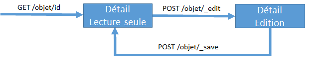

# UI

L'extension Vertigo-ui permet la création d'écrans riches, de manière simple et sécurisée.

Pour ce faire elle s'appuie sur deux frameworks du marché (SpingMVC et VueJS) auxquels elle adjoint la philosophie de Vertigo : simplicité et robustesse.

## Principe général

Vertigo propose des écrans et interfaces utilisateurs en utilisant le paradigme MPA ou Multiple Page Application et en suivant le pattern MVC.

Ce choix s'explique pour les raisons principales suivantes :

- Utilisation des fonctionnalités natives du web, pour une plus grande compatibilité et une adoption plus simple par une grande variété d'utilisateurs
- Meilleure sécurisation des informations et de l'application
- Simplicité de développement
- Permet de concentrer les efforts sur les écrans à forte valeur ajoutée

Afin d'atteindre cet objectif de création simple d'écrans ergonomiques, fiables et parfaitement adapté aux besoins des utilisateurs nous proposons une méthode de construction qui utilise un état de vue ou ViewState.

L'idée sous-jacente est donc :

- sur une application MPA classique, les écrans n'ont pas de cycle de vie, pas de "mémoire", une fois affichés ils n'ont plus d'existance
- sur une application de type SPA (Single Page Application), les écrans ont une durée de vie "infinie", l'utilisateur est toujours sur le même "écran" tout au long de son parcours utilisateur
- ce que nous proposons est un intermédiaire où les écrans sont indépendants les uns des autres mais où ils ont une "mémoire" qui leur permettent une forte interactivité avec l'utilisateur

Pour la partie *controller* nous utilisons **SpringMVC** auquel nous avons adjoint des fonctionnalités utiles et le support du ViewState appelé ViewContext dans Vertigo-ui.

Pour la partie *model* nous utilisons le ViewContext de Vertigo qui a à sa charge la conservation des données pour mise à disposition à la vue.

Pour la partie *vue* nous utilisons :

- **Thymeleaf** comme moteur de rendu serveur
- **VueJS** comme librairie de rendu client
- **Quasar** comme bibliothèque de composants graphiques

## Configuration

La configuration du module Vertigo-ui se limite à la configuration d'une application SpringMVC classique via les mécanismes offerts.

Afin de simplifier la configuration et le réaliser simplement le lien entre Vertigo et SpringMVC nous mettons à disposition deux classes :

- `io.vertigo.ui.impl.springmvc.config.VSpringWebConfig` : classe à étendre qui fournit les éléments de configuration requis
- `io.vertigo.ui.impl.springmvc.config.AbstractVSpringMvcWebApplicationInitializer` : classe à étendre et à placer dans le projet pour initialiser la webapp programatiquement via le standard servlet 3.0+

Ainsi pour configurer le projet *MyProject* avec Vertigo-ui il suffit de créer les deux classes suivante :

**MyProjectVSpringWebConfig**

```java
@ComponentScan({
		//place here your controller packages for spring component scanning  })
public class MarsVSpringWebConfig extends VSpringWebConfig {
	// nothing basic config is enough
	
}
```


**MyProjectVSpringWebApplicationInitializer**

```java
import io.vertigo.ui.impl.springmvc.config.AbstractVSpringMvcWebApplicationInitializer;

public class MyProjectVSpringWebApplicationInitializer extends AbstractVSpringMvcWebApplicationInitializer {

	@Override
	protected Class<?>[] getServletConfigClasses() {
		return new Class[] { MyProjectVSpringWebConfig.class };
	}
}

```

## Création d'un controller 

Pour pouvoir profiter des fonctionnalité de Vertigo-ui il est nécessaire que les controllers héritent de la classe `io.vertigo.ui.impl.springmvc.controller.AbstractVSpringMvcController`

Pour la création d'un controller permettant afficher le détail d'un objet par exemple *Person* créer la classe `PersonDetailController`

```java
@Controller
@RequestMapping("/person")
public class PersonDetailController extends AbstractVSpringMvcController {

	private static final ViewContextKey<Person> personKey = ViewContextKey.of("person");

	@Inject
	private PersonServices personServices;

	@GetMapping("/{perId}")
	public void initContext(final ViewContext viewContext, @PathVariable("perId") final Long personId) {
		viewContext.publishDto(personKey, personServices.getPerson(personId));
		toModeReadOnly();
	}

	@GetMapping("/new")
	public void initContext(final ViewContext viewContext) {
		viewContext.publishDto(personKey, personServices.initPerson());
		toModeCreate();
	}

	@PostMapping("/_edit")
	public void doEdit() {
		toModeEdit();
	}

	@PostMapping("/_create")
	public String doCreate(@ViewAttribute("person") final Person person) {
		personServices.createPerson(person);
		if (personPictureFile.isPresent()) {
			personServices.savePersonPicture(person.getPersonId(), personPictureFile.get());
		}
		return "redirect:/person/" + person.getPersonId();
	}

	@PostMapping("/_save")
	public String doSave(@ViewAttribute("person") final Person person) {
		personServices.updatePerson(person);
		return "redirect:/person/" + person.getPersonId();
	}


}
```


Ce controller offre plusieurs fonctions :

- affichage du détail d'une personne existante via un appel de type `GET` sur l'url `/person/{perId}`
- affiche d'un écran permettant la création d'une nouvelle personne via un appel de type `GET` sur l'url `/person/new`
- passage en mode édition via un appel de type `POST` sur l'url `/person/_edit`
- sauvegarde d'une nouvelle personne via un appel de type `POST` sur l'url `/person/_create`
- sauvegarde d'une personne existant via un appel de type `POST` sur l'url `/person/_create`

Le regroupement de l'ensemble de ces fonctions dans un controller unique est possible grâce à l'utilisation transparente du ViewContext qui permet à chaque requête de conserver les informations de l'appel précèdent. Ainsi la méthode `doSave` peut récupérer dans le ViewContext ( mis à jour via les paramètres inclus dans l'appel POST) l'objet Person à l'aide de l'annotation Vertigo-ui `@ViewAttribute` et appeler le service métier adéquat.

> Un appel http de type `GET` aboutit à la création d'un ViewContext vierge
>
> Un appel http de type `POST` permet la récupération d'un ViewContext déjà initialisé et contenant les informations déjà placée par le développeur et enrichi à chaque interaction avec l'utilisateur

Ainsi la cinématique typique d'un écran de détail est la suivante :



> Il est important de noter ici que les urls sont ici des **propositions** issus de l'expérience et des bonnes pratiques. Ces urls sont directement modifiables par le développeur.

> Il est également possible d'ajouter autant d'interactions que nécessaire avec l'utilisateur via l'ajout de nouvelles méthodes dans le controller.

Une fois ce controller créé il ne reste plus qu'a créer la vue correspondante

## Création de la vue

Afin de limiter la verbosité du code, nous privilégions une approche Convention Over Configuration lorsque cela est pertinent.

L'association entre un controller et la vue correspondante se fait par défaut via une convention de nommage. Un controller dont la classe est `projectroot.my.package.controller.MyObjectDetailController.java` sera associé automatiquement à la vue suivante `WEB-INF/views/my/package/myObjectDetail.html`

> En cas de besoin le developpeur peut préciser le nom de vue de son choix en utilisant le mécanisme standard fournit  par SpringMVC

Pour notre écran de détail créons la vue suivante :

```html
<!DOCTYPE html>
<html xmlns:th="http://www.thymeleaf.org" 
  xmlns:vu="http://www.morphbit.com/thymeleaf/component"
  xmlns:layout="http://www.ultraq.net.nz/thymeleaf/layout"
  layout:decorate="~{templates/mmcDetailNavLayout}"
>
	<head>
		<title>Person detail</title>		
	</head>
	
	<body>
				<div layout:fragment="content-header-actions">
					<vu:button-link th:if="${model.modeEdit}"  url="@{/person/} + ${model.person.personId}" :round size="lg" color="primary" icon="fas fa-ban" :flat ariaLabel="Cancel" class="on-left"  />					
					<vu:button-submit th:if="${model.modeReadOnly}" action="@{_edit}" :round size="lg" color="primary" icon="edit" ariaLabel="Edit" class="on-left"/>
				</div>
		</section>
		
		<section layout:fragment="content" >
				<vu:block title="Information">
					<vu:grid cols="2">
						<vu:text-field object="person" field="firstName"/>
						<vu:text-field object="person" field="lastName" />
						<vu:text-field object="person" field="email" />
					</vu:grid>
				</vu:block>
					
				<q-page-sticky position="bottom-right">
					<vu:button-submit th:if="${model.modeEdit}"   icon="save" label="Save" action="@{_save}" size="lg" color="primary" />
					<vu:button-submit th:if="${model.modeCreate}" icon="save" label="Create" action="@{_create}" size="lg" color="primary"/>
				</q-page-sticky>				
		</section>
	</body>
</html>
```

Nous pouvons ici voir que :

- la vue est un template html thymeleaf standard
- la vue utilise un layout ou gabarit d'écran afin de se focaliser sur l'essentiel 
- la vue utilise des composants utilisant le prefix `vu:` qui sont des composants proposé par vertigo-ui et qui couvrent les besoins principaux
- la même vue est utilisée pour l'édition et la consultation ce qui permet à la fois d'assurer une cohérence maximale mais également de simplifier le développement

La page est en réalité un template VueJS qui sera interprété côté client. L'instance VueJS de chaque page est accessible simplement via la variable *VUiPage*.

## Composants Vertigo-ui

Le corps de la page HTML d'un écran vertigo-ui est un template VueJS qui sera interprété et rendu de manière reactive par VueJS.

Les composants vertigo-ui encapsulent les composants VueJS de la bibliothèque de composant Quasar.

Le ViewContext est mis à disposition des composants VueJS via clé `vueData` de l'instance Vue.

!> Afin de sécuriser au maximum les applications seules les données demandées par le template côté serveur sont disponibles dans la variable `vueData`. Il est possible de demander l'inclusion d'une donnée au client soit par inclusion d'un composant de haut niveau (par exemple `vu:text-field` inclus nativement le champ de l'objet concerné pour transfert vers le client) ou via le composant `vu:include-data` qui permet de spécifier la clé de contexte à inclure)

La liste des composants disponibles dans vertigo-ui est disponible dans le chapitre dédié à [vertigo-ui](/extensions/ui)

## Dynamisme

Grâce à vertigo-ui il est possible de créer simplement des pages dynamiques en utilisant la puissance de VueJS et son rendu réactif.

Il est possible d'appeler des méthodes d'un controller via des requêtes XHR en POST qui agissent sur le ViewContext. La méthode du controller n'a alors qu'a retourner le ViewContext qui sera alors automatiquement sérialisé en JSON et ainsi mettre à jour le  `vueData` de l'instance VueJS de la page.

> L'appel de la méthode `httpPostAjax(url, params)`  mise à disposition sur l'instance *VUiPage* par exemple suite un évènement VueJS (@change etc..) depuis un composant VueJS simplifie encore davantage cette cinématique en prenant en charge l'appel XHR et le traitement de la réponse pour mise à jour du `vueData`