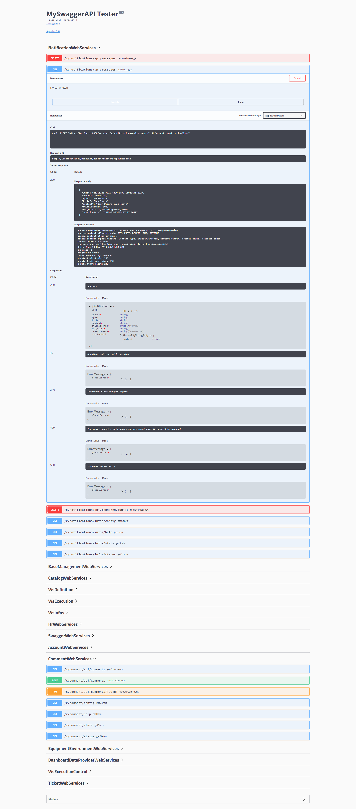

# WebServices

Le module Vega de Vertigo permet la création simplifiée de WebServices REST donnant ainsi la possibilité à votre application de s'interconnecter facilement avec les écosystèmes applicatifs en proposant des services numériques sous forme d'API.

Ce module est également adapté à la création d'API REST consommées par les Single Page Applications.

Le format d'échange JSON a été privilégié pour sa popularité, mais également pour sa capacité à être facilement consommable par une myriade de technologies. L'objectif visé par Vega étant l'ouverture de l'application au monde, autant utiliser la lingua franca de l'échange de données pour l'ouvrir au plus grand nombre.

## Configuration

Afin d'utiliser les fonctionnalités de Vega il convient d'ajouter à la configuration de l'application ce module.
Pour plus de détail vous pouvez vous rapporter au chapitre dédié à la [configuration](/basic/configuration) de l'application.

Vega propose deux méthodes de fonctionnements :

- sous forme de filtre de servlet, dans le cas où l'application fonctionne dans un conteneur de servlet, par exemple (Tomcat)
- sous forme d'un serveur web interne (Jetty) dans le cas d'un Jar exécutable


### Cas du filtre de servlet

Voici une configuration Yaml typique d'une application utilisant le module Vega et le connecteur vers Javalin

```yaml
modules
  io.vertigo.connectors.javalin.JavalinFeatures:
    features:
      - standalone:
  io.vertigo.datamodel.DataModelFeatures:
  io.vertigo.vega.VegaFeatures:
    features:
        - webservices:
    featuresConfig:
        - webservices.javalin:
            apiPrefix: /api
        - webservices.security:
        - webservices.swagger:
```

D'autre part voici le filtre à ajouter dans la servlet dans ce cas de figure :

```xml
<filter>
		<filter-name>VegaJavalinFilter</filter-name>
		<filter-class>io.vertigo.vega.plugins.webservice.webserver.javalin.VegaJavalinFilter</filter-class>
	</filter>
<filter-mapping>
	<filter-name>VegaJavalinFilter</filter-name>
	<url-pattern>/api/*</url-pattern>
</filter-mapping>
```

!> Ici nous avons choisi d'utiliser un préfix pour l'ensemble des routes de webservices `/api`. C'est une pratique que nous encourageons car elle permet d'éviter des conflits de nommage.

### Cas du serveur web embarqué

Voici une configuration Yaml typique d'une application utilisant le module Vega avec le mode serveur embarqué

```yaml
modules
  io.vertigo.connectors.javalin.JavalinFeatures:
    features:
      - embeddedServer:
          - port : 8080
  io.vertigo.datamodel.DataModelFeatures:
  io.vertigo.vega.VegaFeatures:
    features:
        - webservices:
    featuresConfig:
        - webservices.javalin:
            apiPrefix: /api
        - webservices.security:
        - webservices.swagger:
```


> Pour connaitre l'intégralité des fonctionnalités disponibles se rapporter au chapitre dédié à [Vega](/advanced/vega)

## Création d'un WebService

Un webservice est un moyen de mettre à disposition des données ou un service métier via une interface web.

Vega permet d'exposer sur le web une méthode Java et de définir le comportement de ce 'endpoint' via des annotations.

> Dans vertigo nous privilégions la création de composants de type 'WebServices' qui regroupe dans une même classe les webservices offerts sur un même domaine métier ou fonctionnel.

Dans Vertigo, tout objet qui propose des services est un composant. Un webservice n'échappe pas à la règle, c'est donc un composant, mais avec ses spécificités.  

Ainsi, avant toute chose, la lecture du [chapitre](/basic/composants) dédié au composant est utile.

Un webservices est un composant qui doit implémenter l'interface `io.vertigo.vega.webservice.WebServices`

Ce marqueur en plus de permettre au développeur de différencier les composants selon leurs fonctionnalités et leurs usages, il permet au module Vega d'identifier les composants dont les méthodes doivent être analysées pour être converties en WebServices.

Pour créer un webservice commençons par créer le composant qui accueillera les méthodes à publier :

```java

public class HelloWebServices implements WebServices {
	// methods will go there
	
}
```

Ensuite ajoutons la méthode qui va être exposée :

```java
public class HelloWebServices implements WebServices {

	@AnonymousAccessAllowed
	@GET("/hello")
	public String hello() {
		return "hello world";
	}

}
```

La méthode `hello` ne prend aucun argument et retourne une chaine de caractère. Il s'agit donc d'un exemple minimal en guise de démonstration.

L'annotation `@GET` permet de spécifier 

 -  la route qui sera utilisée : ici */hello*
 -  le VERB HTTP qui sera utilisé : ici *GET*

Il existe des annotations similaires pour les différents verb HTTP : `@POST`, `@PUT`, `@DELETE`, `@PATCH`

> Pour en savoir plus sur le routes et les verb vous pouvez vous référer à des bonnes pratiques que nous proposons [ici](https://github.com/KleeGroup/vertigo/wiki/routes).

Par souci de simplicité et de concision il est possible d'ajouter un préfix à toutes les routes des méthodes d'une même classe en utilisant l'annotation `@PathPrefix` sur la classe.

!> Ici l'annotation `@AnonymousAccessAllowed` permet l'accès du webservices sans authentification. Ce comportement n'est pas à utiliser en production.

## Utilisation de paramètres

Afin d'aller plus loin dans la création d'un WebService, il est évidemment possible de complexifier les signatures de méthode et ainsi prendre en entrée des paramètres et retourner des objets et des collections d'objets.

Concernant les paramètres d'entrée et de sortie ils peuvent être de différentes natures

- Des primitives Java

- Des objets

- Des collections d'objets 


Concernant les paramètres d'entrée il est possible de les récupérer depuis : 

- l'url : via l'annotation `@PathParam`
- les paramètres d'url : via l'annotation `@QueryParam`
- le corps de la requête (au format JSON) : via l'annotation `@InnerBodyParam`
- un header : via l'annotation `@HeaderParam`

Concernant les paramètres de retour ces derniers seront automatiquement sérialisés (convertit) en format JSON.

Ainsi il est possible d'écrire par exemple d'écrire les webservices suivant :

```java
@PUT("/movies/{id}")
public Movie updateMovie(final @PathParam("id") long id, final Movie movie) {
    movieServices.saveMovie(movie);
	return movieServices.getMovie(id);
}
```

```java
@POST("/movies/_search")
public FacetedQueryResult search(
    @InnerBodyParam("criteria") final String criteria,
	@InnerBodyParam("facets") final SelectedFacetValues selectedFacetValues,
	@InnerBodyParam("group") final Optional<String> clusteringFacetName,
    final DtListState dtListState) {
		return movieServices.searchMovies(criteria, selectedFacetValues, dtListState,
				clusteringFacetName);
}
```


## Sécurisation du WebService

Il est absolument indispensable de sécuriser les appels de webservices.

Afin de répondre à cet enjeu de sécurité de nombreux mécanismes sont disponibles dans Vega.

Par défaut l'ensemble des WebServices sont accessibles uniquement à utilisateur authentifié. Il s'agit du premier niveau de sécurisation. Evidemment celui-ci est **nécessaire** mais **non suffisant**.

Pour aller plus loin il est possible d'utiliser les fonctionnalités issues du module Vertigo-Account qui propose un modèle de sécurité qu'il est possible d'appliquer aux WebServices.

Il est ainsi possible de vérifier lors d'un appel de WebService :

- Que l'utilisateur authentifié possède un droit parmi les droits nécessaire pour être autorisé à l'appeler
- Que les entités (objets métiers au sens Vertigo) sont manipulables par l'utilisateur authentifié

```java
@Secured("CONTACT$READ")
@GET("/{conId}")
public Contact read(@PathParam("conId") final long conId) {
	final Contact contact = contactDao.get(conId);
	return contact;
}
```

> Ici on vérifie que utilisateur connecté possède le droit CONTACT$READ donc la capacité à lire des contacts

```java
@PUT("/contactView")
public ContactView updateContactView(
    @SecuredOperation("WRITE") final ContactView contactView) {
		return contactView;
}
```

> Ici on vérifie que utilisateur connecté possède autorisation d'écriture sur l'entité ContactView. Ce contrôle de sécurité dépend des à la fois des attributs de l'utilisateur et du Contact. Il s'agit donc d'une contrôle de sécurité très fin.

## SwaggerApi

L'api ainsi crée avec ce module est exposée au format standard Swagger. Vertigo inclus la mise à disposition de l'Api via l'UI standard de Swagger.
Il suffit d'ajouter la facade webService : `io.vertigo.vega.impl.webservice.catalog.SwaggerWebServices`



## Pour aller plus loin

Il est possible d'enrichir le comportement d'un Webservice à l'aide de Vega en utilisant les fonctionnalités offertes suivantes :

- **rate-limiting** : Limitation du nombre d'appel autorisé sur une fenêtre de temps glissante
- **tokens** : generation et consommation de tokens pour sécuriser des opérations critiques
- **server-side** : conservation d'un état côté serveur pour gérer efficacement certains traitements
- **etc...**

L'ensemble de ces fonctionnalités et leurs API sont disponibles dans [ce](/extensions/vega) chapitre