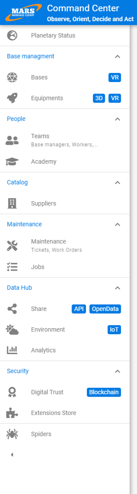
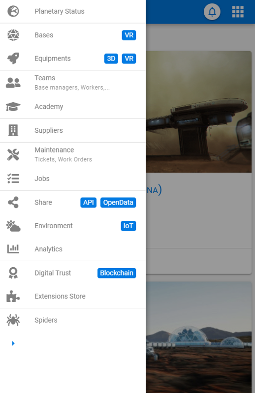

# Menu

Le menu est le moyen principal de navigation principal dans une application.
Il permet d'accéder aux différents éléments d'un même niveau logique.

Ce dernier doit permettre deux choses : 

- à un nouvel utilisateur de trouver ses marques rapidement
- à un utilisateur régulier d'accéder rapidement aux fonctions sans empieter sur son espace de travail

Les entrées du menus peuvent être regroupés par grandes familles dans des groupes.

Pour répondre à ces deux enjeux nous préconisons un menu dont les entrées sont constituées d'une icone et d'un libéllé.
Par défaut le menu est en mode déplié l'icone et le libellé sont affichés.
Sur demande de l'utilisateur le menu peut être replié (ce choix doit etre conservé) et seulement l'icone s'affiche (le libellé uniquement au survol) afin de maximiser la zone de travail

Sur mobile le menu est placé dans un panneau latéral à gauche qui s'ouvre par un appui sur un bouton ou par un geste horizontal

# Bonnes pratiques

- Personnalisez le menu en fonction des profils utilisateur pour mettre en avant les éléments les plus pertinents
- Limitez à une vingtaine le nombre d'éléments du menu
- Utilisez un libéllé succint et précis
- Utilisez une icone représentative de la fonctionnalité sous-jacente
- Triez les élements du menu par ordre d'importance

# Design

## Menu déplié

 

## Menu replié

 

## Menu mobile

 