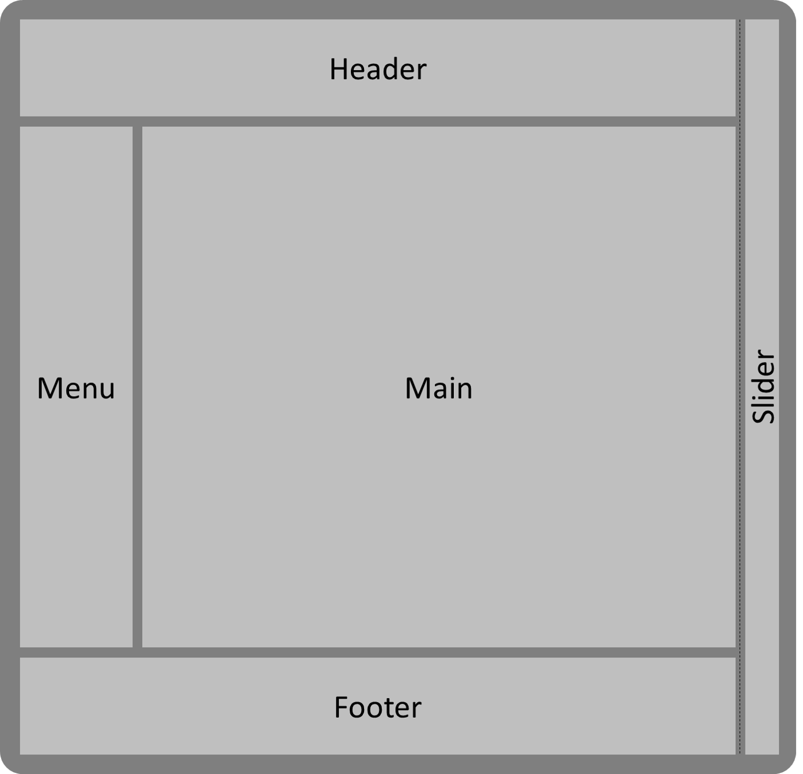
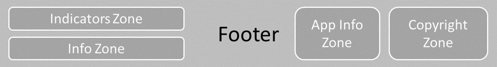

# Structure générale

Pour les applications de gestions "classiques" nous sommes convaincus que la structure générale des pages doit être familière au plus grand nombre pour que l'ensemble des utilisateurs se l'approprie rapidement.
Ainsi nous nous sommes inspirés des standards du web actuel qui sont le resultat d'une longue et riche évolution.

Cette structure doit être suffisament riche pour y placer tous les éléments nécessaires mais bien segmentée pour guider l'utilisateur au mieux.

D'autre part les choix que nous avons fait dans ce domaine facilite le passage de l'application en mode mobile avec support des gestes.

Il est important de gardez une zone de travail pour l'utilisateur la plus grande possible et avec une position stable d'un écran à l'autre. Cette zone de travail contiendra des listes, des champs de saisie, des graphiques, des cartographies etc...

# Bonnes pratiques

- Placer en haut à gauche les éléments qui concernent l'application (nom, visuel, etc...)
- Placer en haut à droite les éléments qui concernent l'utilisateur connecté et les autres applications que l'utilisateur est suspectible de vouloir consulter
- Placer en bas à droite les informations de copyright
- Privilégiez un bandeau fixe en haut de page, cela simplifiera le placement des autres éléments
- Priviligiez un panneau glissant sur la hauteur complète de la page et sur un seul côté (droit) et évitez que plusieurs se recouvrent.

# Design

## Page complète

 

## Header

 

## Footer

 