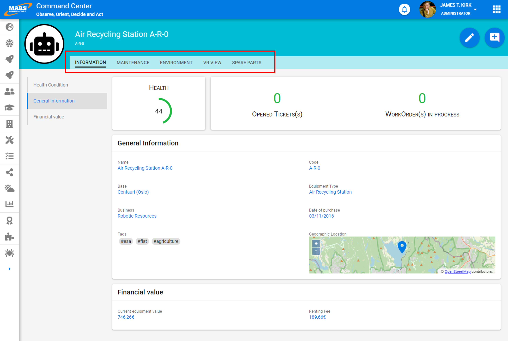

# Onglets

Les onglets organisent le contenu en plusieurs sections et permettent aux utilisateurs de naviguer entre elles. Le contenu sous chaque onglet doit être lié et former un ensemble cohérent.

Ce système est idéal pour structurer les informations associées à un concept métier très complexe. Il est préférable de faire apparaitre ce découpage logique plutôt que des faire des pages très hautes (engendrant beaucoup de scroll) qui donnent une impression de fourre-tout.

D'autre part cette structuration plus forte sécurise davantage les applications puisqu'il est possible de bloquer au plus tôt l'accès complet à une page qui regrouperait des données sensibles, ce qui limite la fuite potentielle d'informations.

# Bonnes pratiques

- Un onglet ou une page ne doit pas contenir plus de 7 blocs.
- Veuillez à indiquer de manière visuelle l'onglet actuellement actif
- Le titre d'un onglet doit etre le plus concis et précis possible. Il s'agit la plupart du temps d'un nom commun.

# Design

 