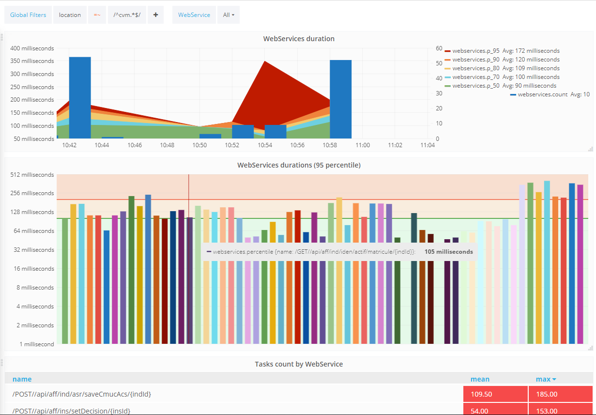
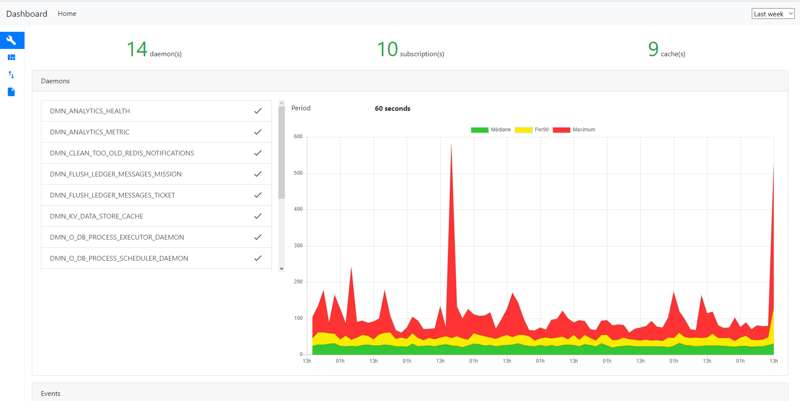

# Analytics

## Data Collection

Performance monitoring is a major concern in information systems. Poor performance is one of the primary causes of application rejection by users, making it important to anticipate potential performance issues as much as possible.
Vertigo natively integrates an Analytics component that sends call traces to a dedicated server for calculating performance indicators.

The probes natively included in Vertigo are placed at strategic locations enabling fine system understanding and early detection of potential performance issues during development. Placement locations are:

- Vega WebService call
- Vertigo-Ui page call
- Database call
- Search engine call
- Daemon execution

> Obviously, it is possible to place additional checkpoints if needed.

### Configuration

Data collection is not optional in a Vertigo application because its impact is extremely low. However, consumption of collected data is configurable.

There are Analytics *Plugins* that can be connected to data collection. These *Plugins* receive collected data and process it. You can configure as many *Plugins* as needed to suit project requirements.

The connectors included in Vertigo are:

- `SmartLoggerAnalyticsConnectorPlugin`: Logs information intelligently, notably for developers. This connector makes it very easy to know the number of database calls for each webservice or screen call.
- `SocketLoggerAnalyticsConnectorPlugin`: Transmits data to the Vertigo analytics server. This analytics server ([vertigo-analytics-server](https://github.com/vertigo-io/vertigo-analytics-server)) can aggregate data collected from multiple servers of the same application or even multiple applications for exploitation. Standard usage stores data in an InfluxDB database for visualization via vertigo-dashboard or Grafana.

To activate these connectors, here is a YAML configuration excerpt to include in your application:

```yaml
boot:
  plugins:
    - io.vertigo.core.plugins.analytics.log.SmartLoggerAnalyticsConnectorPlugin:
        aggregatedBy: sql
    - io.vertigo.core.plugins.analytics.log.SocketLoggerAnalyticsConnectorPlugin:
        appName: YourApp
        hostName: ${boot.analyticsHost}
```

## Displaying Results

Collected data can be displayed through various methods since data is stored in an InfluxDB time-series database.

These data can therefore be used to build dashboards from various market tools. Such as:

- ~~Chronograf from the InfluxData TICK stack (deprecated): https://www.influxdata.com/time-series-platform/chronograf/~~
- Grafana: https://grafana.com

Here is an example dashboard built on Grafana:




### Vertigo-dashboard

The **vertigo-dashboard** extension allows directly embedding preconfigured dashboards into the application without dependency on third-party products.

It is configured by adding the following module to your YAML configuration:

```yaml
io.vertigo.dashboard.DashboardFeatures:
    features:
      - analytics:
```

By navigating to the */dashboard* URL on your web application, you will find dashboards presenting the different modules of your application, giving precise indications about the health and usage of the application. These valuable data points are important for continuous system improvement, whether in development or production.

Dedicated screens exist for the following modules: **vertigo-commons**, **vertigo-datastore**, **vertigo-vega**, **vertigo-ui**, presenting key elements related to these modules.

Here is an example dashboard dedicated to **vertigo-commons** from vertigo-dashboard, detailing the application's daemons and their execution duration:


