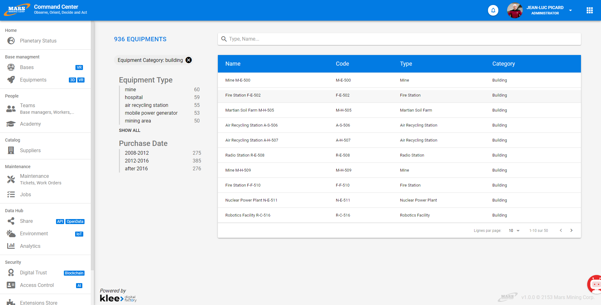

# Search

In Vertigo projects, integration of a powerful search engine is simplified and made sustainable through the **vertigo-datafactory** module.

## General Principle

Search engine integration has become standard in projects due to its undeniable value.

The Vertigo search module provides:

- a **rich and performant** search functionality (facets, full-text search, phonetic search, result counters, relevance sorting, etc., all with response times of a few milliseconds: incomparable with SQL queries)
- placing the **search at the center**: all key entities can be indexed and searched by users. It is a privileged access point: you enter through search, you navigate through search. Criteria remain simple and you refine through facets.
- making information **accessible**: the user is either a novice or self-trained. The proposed search follows current web standards and allows quick adoption.
- allowing the **developer to parameterize the search mechanism**. Configuration opens up possibilities while providing tools and stabilizing underlying technical components.
- **generating call facades for parameterized searches** during MDA. Search engine usage is therefore decoupled from the search configuration made available.

The Vertigo search module supports the three main use cases:

- searching for **a single element** based on **known information**
- searching for **a single element** without precisely **known information**
- building **a set** of elements for a global action through **successive steps**

!> Search is a filter: the more information the user provides, the more the result set is narrowed.

!> The most common search is called *plain text*, which means: "find a document containing a word that starts with", *it does not mean "contains"*. <br/>
Engine performance is ensured by an index of document words (like in a book); you always need the beginning of a word to find it in the index: no search like `*oitur*`

**Search Engine Used**

[ElasticSearch](https://www.elastic.co/products/elasticsearch) & [Lucene](https://lucene.apache.org/).<br/>
The search mechanism is [QueryStringQuery](https://www.elastic.co/guide/en/elasticsearch/reference/current/query-dsl-query-string-query.html)<br/>

ElasticSearch is a search engine based on the Lucene Java library.<br/>
This engine is maintained by Elastic and is actively and regularly updated. The main consequence of this activity is a certain API volatility (there are regular breaking changes).<br/>
One benefit of the Vertigo module is that most of these changes can be absorbed by the module, simplifying version upgrades for projects.<br/>
Vertigo maintains two versions of the ElasticSearch plugin: the current version and the previous version.

*Equipment search screen in the demo application [Mars](https://github.com/vertigo-io/vertigo-mars/tree/master)*


## Configuration

### Activating the Module

First, you need to activate the **vertigo-datafactory** module and the **vertigo-elasticsearch-connector** connector.<br/>
The module offers two operating modes:
- *standard* mode using a remote ElasticSearch server
- *embedded* mode using a local ElasticSearch server, started alongside the application (useful for testing)

!> Embedded mode has been deprecated by ElasticSearch since version 5.

Configuration example for Standard mode:
```yaml
modules:
  io.vertigo.datafactory.DataFactoryFeatures:
    features:
      - search:
    featuresConfig:
      - search.elasticsearch.restHL:
          envIndexPrefix: mars
          rowsPerQuery: 50
          config.file: search/elasticsearch.yml
```

Configuration example for Embedded mode:
```yaml
modules:
  io.vertigo.connectors.elasticsearch.ElasticSearchFeatures:
    features:
      - restHL:
          servers.names: ${esHost}
  io.vertigo.datafactory.DataFactoryFeatures:
    features:
      - search:
    featuresConfig:
      - collections.luceneIndex:
      - search.elasticsearch.restHL:
          envIndexPrefix: mars
          rowsPerQuery: 50
          config.file: search/elasticsearch.yml
```

> Note that the `envIndexPrefix` parameter allows specifying an index prefix for an application environment, so the same ElasticSearch server can be used for different environments.
> Newer versions of ElasticSearch enforce a single document type per index.

### ElasticSearch Configuration

The elasticsearch.yml file provides ElasticSearch index configuration. It configures the types of analyzers used by the application and associated with model Domains.
This configuration is sent by the application to the ElasticSearch server at startup.

Analyzer configuration example (this configuration will work for most projects):
```yaml
index :
    analysis :
        normalizer :
            code :
                type : custom
            sortable :
                type : custom
                filter : [lowercase, asciifolding]
        analyzer :
            multiple_code :
                tokenizer : piped_keywords
                filter : []
            text_fr :
                tokenizer : standard
                filter : [lowercase, asciifolding, snowball, elision]
        tokenizer :
            piped_keywords :
                type : pattern
                pattern : '([|,;] *)'
        filter :
            snowball:
                type : snowball
                language: French
            elision:
                type : elision
                articles: [l, m, t, qu, n, s, j, d]
```


### Identifying your **KeyConcept** *(key business entities)*
Either in your **KSP** files:
```json
alter DtDefinition DtEquipment {
  stereotype : "KeyConcept"
}
```

Or in your **OOM** file: <br/>
On your classes, set the **Stereotype**: `KeyConcept`

### Adding **a** DtObject representing your index data

Indexes are very powerful and manage **document** data. There is no relational model, so you must convert your cluster of objects starting from your **KeyConcept** into a **Document**.<br/>
Simply put, you create a DtObject that flattens the data.
```json
create DtDefinition DtEquipmentIndex {
  field equipmentId {domain: DoId label:"Id" cardinality: "1"}
  field name {domain: DoLabel label: "Name" }
  field code {domain: DoCode label: "Code" }
  field purchaseDate {domain: DoLocaldate label: "Date of purchase" }
  field description {domain: DoDescription label: "Description" }
  field tags {domain: DoTags label: "Tags" }
  field equipmentTypeName {domain: DoLabel label:"Type" }
  field equipmentCategoryName {domain: DoLabel label:"Category" }
  field equipmentValue {domain: DoCurrency label:"Current equipment value" }
  field baseId {domain: DoId label: "Base Id" }
  field baseName {domain: DoLabel label: "Base Name" }
  field geoLocation {domain: DoGeoPoint label:"Geographic Location" }

  /* Must contain security fields */
}
```

You can specify how data is indexed through the **indexType** property of the domain.<br/>
This property converts the basic **Vertigo Domain** into a more complex ElasticSearch type.<br/>
Its syntax is as follows:<br/>
``indexType : "myAnalyzer{:myDataType}{:stored|notStored}{:sortable{(mySortNormalizer)}|notSortable}{:facetable|notFacetable}"``

- `myAnalyzer`: defines the analyzer or normalizer used (in the `elasticsearch.yml` file)
- `myDataType` *(optional)*: specifies the data type in the ElasticSearch sense. It is necessary for **keyword** types (e.g.: `code:keyword`)
- `stored` *(optional, true by default)*: indicates the value is stored in the document. Saves space for large indexed but non-stored fields
- `sortable` *(optional, false by default)*: indicates the field should be sortable; this automatically adds a `keyword` version of the field
- `mySortNormalizer` *(optional)*: used with `sortable` fields, specifies the normalizer to use on the `keyword`
- `facetable` *(optional, false by default)*: indicates the field is a `fieldData` in the ElasticSearch sense. This is necessary to create facets on this field


> Fields with the `sortable` attribute are automatically doubled with a `keyword` version of the field.
> The pseudo `keyword` field allows proper field sorting. Vertigo uses it transparently for sorting and facets.
> Without it, sorting or facets are performed **after** tokenization.
> If a field is already `sortable`, `facetable` is not necessary since the `keyword` will be used.
> The `keyword` subfield can be used in queries:<br/>
> **Example:**<br/>
> ``field1.keyword:#query#``


Domain example:

```java
  @SmartTypeDefinition(String.class)
  @SmartTypeProperty(property = "indexType", value = "code:keyword")
  Code,

  @SmartTypeDefinition(String.class)
  @SmartTypeProperty(property = "indexType", value = "text_fr:sortable")
  Label,

  @SmartTypeDefinition(String.class)
  @SmartTypeProperty(property = "indexType", value = "text_fr:notStored")
  Description

  @SmartTypeDefinition(String.class)
  @SmartTypeProperty(property = "indexType", value = "multiple_code:facetable")
  Tags
```


### Defining Indexes

Indexes are declared as Vertigo **Definitions**. This can be done in Java or via DSL.<br/>
The simplest approach is through DSL, which is what is described here.

#### **IndexDefinition**

The **IndexDefinition** represents an Index. Only one is needed per KeyConcept.<br/>
*It is therefore sometimes necessary to create KeyConcepts that aggregate other KeyConcepts.*

**Properties**
- `keyConcept`*: Name of the KeyConcept Dt, used to track modifications and trigger reindexing
- `dtIndex`*: Name of the Dt representing the document, both search fields and returned fields
- `searchLoader`*: Name of a Vertigo component used to reload documents from a list of IDs (must implement the SearchLoader<keyConcept, dtIndex> interface)
- `indexCopyTo`: Adds a field aggregating a list of document fields, uses the engine's optimized *copy* function (the field must already exist in the DtIndex)
  - `from`: list of comma-separated fields

```javascript
create IndexDefinition IdxEquipment {
  keyConcept : DtEquipment
  dtIndex : DtEquipmentIndex
  indexCopyTo allText { from: "name,code,description,tags,equipmentTypeName,equipmentCategoryName,baseName" }
  loaderId : "EquipmentSearchLoader"
}
```
> The `loaderId` attribute points to a Vertigo component implementing the `SearchLoader<? extends DtObject>` interface adapted for the index object


#### **FacetDefinition**

The **FacetDefinition** represents a facet definition. There are three types:

**Properties**
- `dtDefinition`*: Name of the index Dt
- `fieldName`*: Name of the field carrying the facet
- `label`*: Label of the facet
- `order`: Changes the facet sorting mode: alpha, count (default for *terms*), definition (for ranges)
- `multiSelectable`: Boolean indicating facet values are multi-selectable (*false* by default)
- `range`: Adds a facet value (for **range** facets); the name is used as the code
  - `filter`*: search filter for this value. Uses the syntax of the search engine used (here ElasticSearch).
  - `label`*: label for this value
- `_innerWriteTo`: Used for **custom** facets with the Transport client, allows defining the serialized code to send *(we recommend using the simpler and more sustainable REST client)*

!> Warning: multiSelectable facets impact performance

* **term** facets, whose values are drawn dynamically from index data

```javascript
create FacetDefinition FctEquipmentEquipmentTypeName {
   dtDefinition:DtEquipmentIndex, fieldName:"equipmentTypeName", label:"Equipment Type"
}
```

* **range** facets, which are predefined and group a set of values within each facet

```javascript
create FacetDefinition FctEquipmentPurchaseDate {
   dtDefinition:DtEquipmentIndex, fieldName:"purchaseDate", label:"Purchase Date"
   range r1 { filter:"purchaseDate:[01/01/2008 TO 01/01/2012]", label:"2008-2012"},
   range r2 { filter:"purchaseDate:[01/01/2012 TO 01/01/2016]", label:"2012-2016"},
   range r3 { filter:"purchaseDate:[01/01/2016 TO *]", label:"after 2016"}
}
```

* **custom** facets allow directly passing the Json code to send to ElasticSearch (or Transport, but be careful)
They can be used for geoHash, sums, or other aggregation functions.
For aggregations returning numerical values, the `_decimalPrecision` attribute specifies the number of decimal places.

!> Only functions returning document groups (geoHash) or numerical values (sums, averages, ...) are supported

Example: facet performing a geoHash:
REST client version
```javascript
create FacetDefinition FctEquipmentGeoHash {
  dtDefinition:DtEquipmentIndex, fieldName:"geoLocation", label:"Location"
  params geohash_grid { value : "{\"field\" : \"geoLocation\", \"precision\" : #geoPrecision#}" }
}
```

Transport client version
```javascript
create FacetDefinition FctEquipmentGeoHash {
	dtDefinition:DtEquipmentIndex, fieldName:"geoLocation", label:"Location"
	params _innerWriteTo { value : "writeVInt(#geoPrecision#);writeVInt(1000);writeVInt(-1)" }
}
```

Example: facet performing a sum:
REST client version
```javascript
create FacetDefinition FctSumMontantEnCours {
    dtDefinition:DtFacturationIndex, fieldName:"montantEnCours", label:"Sum montantEnCours"
    params sum { value : "{\"field\" : \"montantEnCours\"}" }
    params _decimalPrecision { value : "2" }
}
```


#### **FacetedQueryDefinition**

The **FacetedQueryDefinition** represents a search query definition. Associated with a KeyConcept, it also specifies:

* The facets used
* The type of input criteria (by its **domain**)
* The *class* for building the query sent to the search engine
* The pattern for the search engine query

**Properties**
- `dtIndex`*: Name of the index Dt
- `domainCriteria`*: Name of the input criteria domain.
- `facets`*: List of facets activated in this search
- `listFilterBuilderClass`*: Name of the engine for translating the query (*io.vertigo.dynamox.search.DslListFilterBuilder* recommended)
- `listFilterBuilderQuery`*: Search query (see [VertigoSearchDSL](#vertigosearchdsl-syntax) syntax)
- `geoSearchQuery`: Allows completing (if needed) the query with a geographic filter (for map bounding boxes, for example)


```javascript
create FacetedQueryDefinition QryEquipment {
   keyConcept : DtEquipment
   facets : [FctEquipmentEquipmentTypeName, FctEquipmentPurchaseDate ]
   domainCriteria : DoLabel
    listFilterBuilderClass : "io.vertigo.datafactory.impl.search.dsl.DslListFilterBuilder"
   listFilterBuilderQuery : "allText:#+query*#"
   geoSearchQuery : "geoLocation: [#geoUpperLeft# to #geoLowerRight#]"
}
```

#### **Generated Code**

The [MDA](/en/basic/mda) module of Vertigo (*vertigo-studio*) uses this information to generate a method for each FacetedQueryDefinition in the DAO associated with the index Dt *(there can be multiple indexes per KeyConcept)*.

### Data Loading Service

Vertigo automatically updates the index when data is modified.<br/>
To do this, Vertigo monitors object modifications that go through your KeyConcept's DAO. If you perform an update outside this DAO or on an object other than the index's KeyConcept, you must indicate this by using readOneForUpdate **at the beginning** of the service performing the modification *(this places a lock)*.

For this operation, Vertigo needs the index data loading service:

```java
public interface SearchLoader<K extends KeyConcept, I extends DtObject> extends Component {
   /**
    * Load all data from a list of keyConcepts.
    */
   List<SearchIndex<K, I>> loadData(SearchChunk<K> searchChunk);

   /**
    * Create a chunk iterator to crawl all keyConcept data.
    */
   Iterable<SearchChunk<K>> chunk(final Class<K> keyConceptClass);
}
```

For standard cases, Vertigo provides an `AbstractSqlSearchLoader` to extend. You only need to implement loading a list of SearchIndex from a list of IDs.

Example:
```java
public final class EquipmentSearchLoader extends AbstractSqlSearchLoader<Long, Equipment, EquipmentIndex> {

   private final EquipmentServices myEquipmentServices;

   @Inject
   public EquipmentSearchLoader(final EquipmentServices equipmentServices, final TaskManager taskManager, final VTransactionManager transactionManager) {
      super(taskManager, transactionManager);
      myEquipmentServices = equipmentServices;
   }

   @Override
   public List<SearchIndex<Equipment, EquipmentIndex>> loadData(final SearchChunk<Equipment> searchChunk) {
      final SearchIndexDefinition indexDefinition = Home.getApp().getDefinitionSpace().resolve("IdxEquipment", SearchIndexDefinition.class);
      final List<Long> equipmentIds = new ArrayList<>();
      for (final UID<Equipment> uid : searchChunk.getAllUIDs()) {
         equipmentIds.add((Long) uid.getId());
      }
      final DtList<EquipmentIndex> equipmentIndexes = basemanagementPAO.loadEquipmentIndex(equipmentIds);
      final List<SearchIndex<Equipment, EquipmentIndex>> equipmentSearchIndexes = new ArrayList<>(searchChunk.getAllUIDs().size());
      for (final EquipmentIndex equipmentIndex : equipmentIndexes) {
         equipmentSearchIndexes.add(SearchIndex.<Equipment, EquipmentIndex> createIndex(indexDefinition,
               UID.of(indexDefinition.getKeyConceptDtDefinition(), equipmentIndex.getEquipmentId()), equipmentIndex));
      }
      return equipmentSearchIndexes;
   }
}
```

You can filter the list of KeyConcepts to index by overriding the `getSqlQueryFilter` method to specify a SQL filter:
```java
  /** {@inheritDoc} */
  @Override
  protected String getSqlQueryFilter() {
    //only index equipment with a purchaseDate
    return "PURCHASE_DATE is not null";
  }
```

### Retrieving the Object to Index

A SQL task for retrieving the object to index must be declared:
```json
create Task TkLoadEquipmentIndex {
   className : "io.vertigo.basics.task.TaskEngineSelect",
   request : "   select equ.EQUIPMENT_ID,
                  equ.NAME,
                  equ.CODE,
                  equ.PURCHASE_DATE,
                  equ.TAGS,
                  equipmentType.LABEL as EQUIPMENT_TYPE_NAME,
                  equipmentCategory.LABEL as EQUIPMENT_CATEGORY_NAME
            from EQUIPMENT equ
            join EQUIPMENT_TYPE equipmentType on equipmentType.equipment_type_id = equ.equipment_type_id
            join EQUIPMENT_CATEGORY equipmentCategory on equipmentCategory.equipment_category_id = equipmentType.equipment_category_id
            where EQUIPMENT_ID in (#equipmentIds.rownum#);"
   in equipmentIds {domain : DoLong             cardinality:"*"}
   out dtcIndex    {domain : DoDtEquipmentIndex cardinality:"*"}
}

```

### Launching Indexing

Now that everything is configured, you need to launch the first indexing.
Nothing simpler: just create a service that calls the `reindexAll` method of `SearchManager`

Example:
```java
  /** {@inheritDoc} */
  @Override
  public void reindexAllEquipements() {
    searchManager.reindexAll(searchManager.findFirstIndexDefinitionByKeyConcept(Equipement.class));
  }
```

### Launching a Search

To launch a search, Vertigo has generated code in the SearchClient of the index. First, create a SearchQuery and execute it through the SearchClient.

Example:
```java
    public FacetedQueryResult<EquipmentIndex, SearchQuery> searchEquipments(final String criteria, final SelectedFacetValues selectedFacetValues, final DtListState dtListState) {
      final SearchQuery searchQuery = equipmentIndexSearchClient.createSearchQueryBuilderEquipment(criteria, selectedFacetValues)
	     .build();
	  return equipmentIndexSearchClient.loadList(searchQuery, dtListState);
	}
```

The result object `FacetedQueryResult` provides many useful pieces of information for display:

* list of matching documents
* facets (and for each facet, the number of documents per facet value)
* highlights (if enabled)
* the source searchQuery of the request

### Adding Facet Selection

The method generated in the SearchClient takes a `SelectedFacetValues` parameter.
Vertigo provides a bridge between this object and the UI frameworks used (WebServices, SpringMVC, or Struts2)


## VertigoSearchDSL Syntax

DslListFilterBuilder aims to build Lucene queries in the most intuitive way possible for the developer:
See [Lucene QueryParser](https://lucene.apache.org/core/8_0_0/queryparser/org/apache/lucene/queryparser/classic/package-summary.html#package.description)

* The expression undergoes minimal modification
* Criteria are set by wrapping them in `#` (e.g.: `#query#`)
* With null value criteria, either the complete expression is removed, or the criteria is replaced by the declared default value.
* Operators placed inside the `#` will be replicated for each word; operators outside are replicated around the complete criteria.
* Criteria and words are *optional* by default (you must specify the mandatory nature of criteria/words with the `+` prefix)
* Advanced users can override the document field being searched, add parentheses, or change operators (OR, AND, +, -, ...)

### Basic Syntax

> A key feature of the search syntax is that criteria are independent: there is no OR and AND notion as in SQL. The principle is that each criteria carries its own *Mandatory* or *Optional* nature.
> This principle is advantageous because it simplifies the syntax (especially when the query is manipulated dynamically) and prevents malicious users from altering mandatory filtering criteria set by the developer.

#### Fields
* `#query#`: criteria.toString() *(Use when criteria is directly the user input string)*
* `#myField#`: criteria.myField
* `#myField#!(myDefault)`: criteria.myField!=null?criteria.myField:myDefault

* `field1:#query#`: field `field1` must contain one of the query words, OR'd with other criteria
* `+field1:#query#`: same but this criteria is mandatory
* `-field1:#query#`: same but this criteria is forbidden
* `field1:#query#!(inactif)`: if the criteria is null, search for documents where `field1` contains "inactif"<br/><br/>

* `field1:"#query#"`: field `field1` must contain the exact query string
* `field1:#+query#`: field `field1` must contain all words from the query
* `field1:#-query#`: no word from the query should be in field `field1` of the index
* `+field1:(#+nom# #+prenom#)`: field `field1` must contain all words from both the `nom` and `prenom` criteria
* `field1:#query*#`: field `field1` must have a word starting with one of the query prefixes
* `field1:#query#^2`: field `field1` has a weight of 2
* `field1:#query~2#`: field `field1` must contain one of the query words with a Levenshtein distance of 2 (max 2). **Warning: low performance**.<br/><br/>

* `+field1:(#+nom*# #+prenom*#)`: field `field1` must contain words with all prefixes from the `nom` criteria and those from the `prenom` criteria

#### User Input Escaping Modes

By default, user input is minimally escaped. Users are even allowed to perform advanced searches using Lucene syntax themselves.
They can add weights or *fuzzy* matching, do exact matching with " ", add OR (or AND) searches between two terms, and even search another field in the index with myOtherField:(my keywords).
This feature is allowed because it targets advanced users and does not allow breaking out of security-permitted boundaries.

In all cases, incomplete user syntax will be escaped: unclosed ( ), { } or [ ], or misused AND OR.

However, the developer can control the escaping mode during query writing by using a suffix on the field declaration:

* `removeReserved`: Reserved characters are simply removed (syntax: myField1:#+query*#removeReserved)
* `escapeReserved`: Reserved characters are escaped (syntax: myField1:#+query*#escapeReserved)

This can be useful when searched values contain reserved characters (e.g., IP address search: 192.168.0.456)

> Reserved characters are:
> `+ - = & | > < ! ( ) { } [ ] ^\" ~ * ? : / OR AND`

#### Range

**Range** criteria follow Lucene syntax.<br/>
Bounds use [ or { to indicate inclusiveness.<br/>
The asterisk `*` represents infinity.<br/>
Dates support the keyword `now` and "+ or - a duration" operations

* `+date_creation:[#critDateDebut# to #critDateFin#]`: creation date between two dates. If a criteria is null, it will be replaced by *.
* `+date_debut:[* to #critDateFin#} +date_fin:{#critDateDebut# to *]`: A document with an activity period is searched on intersection with the criteria period. In our example, the bounds are exclusive.
* `+date_creation:[now-6M to *]`: creation date less than 6 months ago

> Accepted date formats are: dd/MM/yyyy | strict_date_optional_time | epoch_second

#### Field Weights:
`+(title:#query#^2 content:#query#)`: Search in title and content. The title has a weight of 2 relative to content regarding relevance.

#### Multi-mode Search:
`+(content:#query#^4 content:#query*#^2 contentPhonetic:#query#)`: We search for the maximum number of words in *content* with varying weights depending on the case.

#### Multi-field Search:
The Lucene recommendation is to create a field concatenating all searchable data (e.g., `nomPrenom`, `codePostalCommune`, etc.)<br/>
The `indexCopyTo` property of IndexDefinition is used for this.

* `+_all:#+query*#`: search in all fields. This is the Lucene recommendation: create a field concatenating search fields. This field is configurable.
* `+[codePostal,commune]:#+query*#`: search criteria in postal code and city.
* `+[field1,field2]:#+query*#`: All query prefixes must be present either in `field1` or in `field2`
* `+[field1^2,field2]:#+query*#`: Same, but `field1` has a weight of 2

!> Multi-field search [field1, field2] is less performant and unsuitable when the user enters many words (they are multiplied by the number of fields)


## Building Your Search Well

A user search is based on combining user criteria, **contextual system filtering criteria, and a security filter**

For better usability, it is best to propose behavior similar to public website searches (Google, for instance).<br/>
Based on the understanding that:
* Search is a filter: the more information given, the more the result set is narrowed.
* The indexed KeyConcept can be split across multiple fields.
* Keywords provided by the user may not all be in the same field.

### Problem Statement

Overall, multi-field search corresponds to user expectations; they want to find their entity regardless of the index structure choices they may not even know about.<br/>
The problem is explained on the ElasticSearch site [HERE](https://www.elastic.co/guide/en/elasticsearch/guide/master/multi-field-search.html)<br/>
The most intuitive techniques do not yield good results:

Searching across different fields, with words joined by OR:
`+(field1:#query*# field2:#query*#)` <br/>
**FAIL**: words are `Optional` and entered words may be absent from results.

Searching across different fields, with words joined by AND:
`+(field1:#+query*# field2:#+query*#)` <br/>
**FAIL**: words are `Mandatory` and all entered words must be present in the same field.

### Solution

#### Custom copyTo field

?> This is the recommended solution

ElasticSearch offers custom fields that are the assembly of multiple index fields. For example, the `_all` field is native and contains all tokenized fields.<br/>
This follows the Lucene recommendation by creating fields that concatenate all searchable data (e.g., `nomPrenom`, `codePostalCommune`, etc.)

ElasticSearch adds the ability to configure these fields through the `copy_to` functionality. (ElasticSearch doc [here](https://www.elastic.co/guide/en/elasticsearch/guide/master/custom-all.html))

In Vertigo, you must declare `indexCopyTo` instructions in the index definition. You indicate that one of the index fields is a copy of one or more other index fields.<br/>
This copy is performed on the ElasticSearch side and is more efficient than a Java or SQL copy.

KSP example:

```json
create IndexDefinition IdxCar {
    keyConcept : DtCar
    dtIndex : DtCar
    indexCopyTo allText { from: "make,model,description,year,kilo,price,motorType" },
    indexCopyTo modelPhonetic { from: "model" },
    loaderId : "CarSearchLoader"
}
```

This function creates multi-field search fields but can also be used to populate fields using an analyzer different from the main field (for sorting or phonetics, for example).

To use ``copy_to`` fields, the field must exist in the index Dt and the fields copied into it must all have an indexType.<br/>
For this, we recommend adding computed fields:
```json
computed modelPhonetic { domain:DoPhonetic label:"model sort" expression:"throw new io.vertigo.lang.VSystemException(\"Can't use index copyTo field\");"}
computed allText { domain:DoFullText label:"index all" expression:"throw new io.vertigo.lang.VSystemException(\"Can't use index copyTo field\");"}
```

For primitive type indexType, we recommend defining the standard indexType:

```json
create Domain DoVisitCount {
    dataType: Integer
    indexType: "standard:integer"
}
```

#### Variant: Mixed Approach

!> This solution does not fit all cases, but it can be used to test search evolutions before adding a custom field.

DslListFilterBuilder allows searching across multiple fields:
`+[codePostal,commune]:#+query*#`: search criteria in postal code and city.

This syntax is resolved by Vertigo and reproduces ElasticSearch's cross-field mechanism (without using it). Coupled with the custom fields described above, it is possible to limit the complexity of resulting queries.

Compared to custom fields, this syntax allows different behavior per field: tokenizer used and different weights.

*Example:*

`+[commune,annee,titre^5]:#+query*#`: The year is a number and the title has a weight of 5 relative to the others.

!> Warning: Use this syntax on a limited number of fields, as its name suggests, it performs a cross-join of fields with entered words. ElasticSearch is very performant with this type of search, but there is no point in pushing it to its limits.

*Example:*

`+[codePostal,commune]:#+query*#`
with keywords ==92350 Le plessis robinson== becomes:
```
+( +(codePostal:92350* commune:92350*)
   +(codePostal:Le* commune:Le*)
   +(codePostal:plessis* commune:plessis*)
   +(codePostal:robinson* commune:robinson*) )
```

#### Multi-field Search:

?> *(simpler, but to test)*

A solution to consider is mixing the two solutions presented above:<br/>
First check for the presence of user-entered keywords in `_all`, then assign weights to certain fields with OR.

```java
+_all:#+query*# //_all mandatory contains all words entered by the user
+titre:#query*#^5 //the title is boosted with words in Optional mode; it is not required to contain all terms
```


## Security Filter

The security filter is intended to be stored in the session and added to every search.<br/>
Vertigo's security module can generate the filter in various languages (including Lucene) from a unified declaration of security rules.

It is set with the following code:
```java
searchQueryBuilder.withSecurityFilter(session.getSearchSecurityFilter())
```

It corresponds to a search expression that will be directly added to the search in mandatory mode. (with `+()`)
User input cannot disable this filter: there are not only escapes, but it is also isolated in a separate sub-query.

It is also possible to add a filter for a specific action:

```java
final ListFilter securityListFilter = ListFilter.of(authorizationManager.getSearchSecurity(Equipment.class, SecuredEntities.EquipmentOperations.read));
final SearchQuery searchQuery = equipmentIndexSearchClient.createSearchQueryBuilderEquipment(criteria, selectedFacetValues)
    .withSecurityFilter(securityListFilter)
	.build();
```
