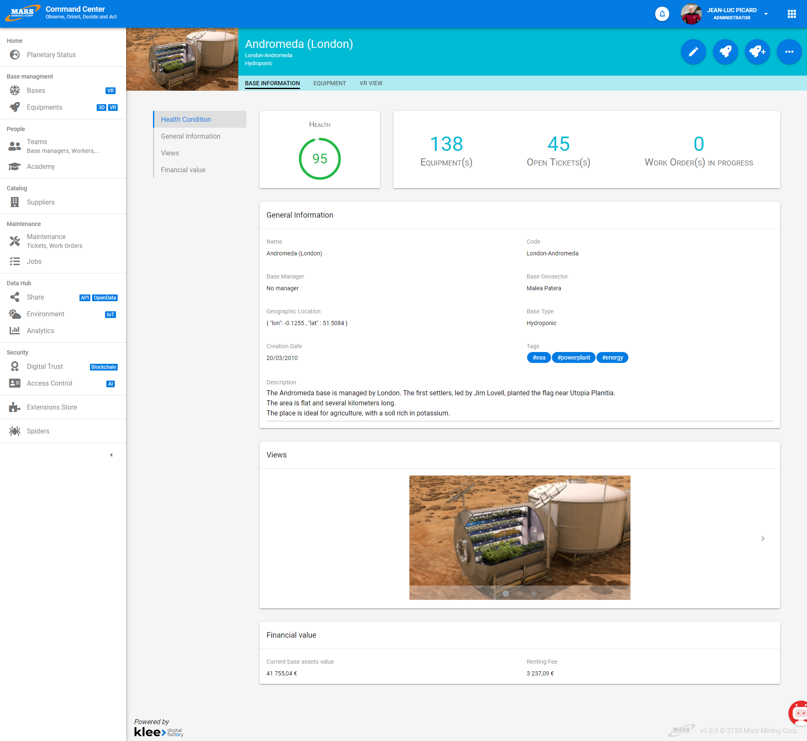
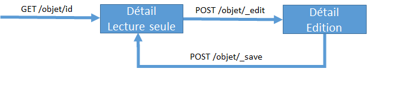
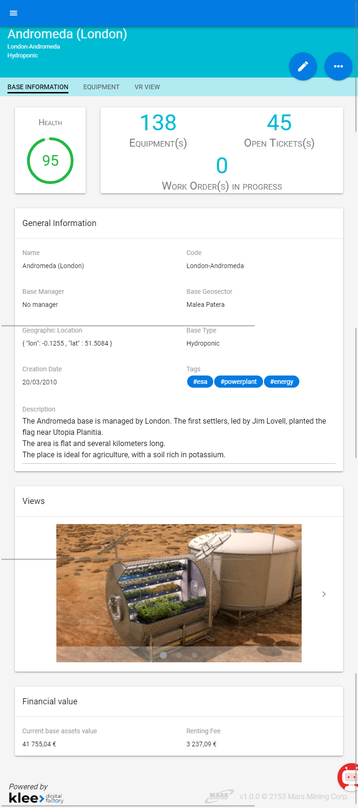

# UI

The vertigo-ui extension enables the creation of rich screens, simply and securely.

It relies on two market frameworks (SpringMVC and Vue.js), adding Vertigo's philosophy: simplicity and robustness.

*Base detail screen in the demo application [Mars](https://github.com/vertigo-io/vertigo-mars/tree/master)*


## General Principle

Vertigo offers screens and user interfaces using the MPA or Multiple Page Application paradigm, following the MVC pattern.

This choice is explained by the following main reasons:

- Use of native web features, for greater compatibility and simpler adoption by a wide variety of users
- Better security of information and the application
- Development simplicity
- Ability to focus efforts on high-value screens

To achieve this simple creation of ergonomic, reliable screens perfectly adapted to user needs, we propose a construction method using a view state, or ViewState.

The underlying idea is:

- In a classic MPA application, screens have no lifecycle, no "memory"; once displayed, they no longer exist
- In an SPA (Single Page Application) type application, screens have an "infinite" lifespan; the user is always on the same "screen" throughout their journey
- What we propose is an intermediate approach where screens are independent of each other but have "memory" enabling strong user interactivity

For the *controller* part, we use **SpringMVC**, to which we have added useful features and ViewContext support (called ViewContext in vertigo-ui).

For the *model* part, we use Vertigo's ViewContext, responsible for data retention for view availability.

For the *view* part, we use:

- **Thymeleaf** as the server rendering engine
- **Vue.js** as the client rendering library
- **Quasar** as the graphic component library

?> Configuration, Controller Creation, and View Creation sections describe the vertigo-ui approach with SpringMVC. For Vega/Javalin applications, the vertigo-ui module works complementarily via vu: components.

## Configuration

Configuration of the vertigo-ui module is limited to configuring a standard SpringMVC application through provided mechanisms.

To simplify configuration and easily link Vertigo and SpringMVC, we provide two classes:

- `io.vertigo.ui.impl.springmvc.config.VSpringWebConfig`: class to extend, providing required configuration elements
- `io.vertigo.ui.impl.springmvc.config.AbstractVSpringMvcWebApplicationInitializer`: class to extend and place in the project to programmatically initialize the webapp via the servlet 3.0+ standard.

Thus, to configure the project *MyProject* with vertigo-ui, simply create the following two classes:

**MyProjectVSpringWebConfig**

```java
@ComponentScan({
		//place here your controller packages for spring component scanning  })
public class MarsVSpringWebConfig extends VSpringWebConfig {
	// nothing basic config is enough

}
```


**MyProjectVSpringWebApplicationInitializer**

```java
import io.vertigo.ui.impl.springmvc.config.AbstractVSpringMvcWebApplicationInitializer;

public class MyProjectVSpringWebApplicationInitializer extends AbstractVSpringMvcWebApplicationInitializer {

	@Override
	protected Class<?>[] getServletConfigClasses() {
		return new Class[] { MyProjectVSpringWebConfig.class };
	}
}

```

## Controller Creation

To take advantage of vertigo-ui features, *controllers* must inherit from the `io.vertigo.ui.impl.springmvc.controller.AbstractVSpringMvcController` class.

To create a controller displaying the detail of an object, for example *Person*, create the class `PersonDetailController`

```java
@Controller
@RequestMapping("/person")
public class PersonDetailController extends AbstractVSpringMvcController {

	private static final ViewContextKey<Person> personKey = ViewContextKey.of("person");

	@Inject
	private PersonServices personServices;

	@GetMapping("/{perId}")
	public void initContext(final ViewContext viewContext, @PathVariable("perId") final Long personId) {
		viewContext.publishDto(personKey, personServices.getPerson(personId));
		toModeReadOnly();
	}

	@GetMapping("/new")
	public void initContext(final ViewContext viewContext) {
		viewContext.publishDto(personKey, personServices.initPerson());
		toModeCreate();
	}

	@PostMapping("/_edit")
	public void doEdit() {
		toModeEdit();
	}

	@PostMapping("/_create")
	public String doCreate(@ViewAttribute("person") final Person person) {
		personServices.createPerson(person);
		if (personPictureFile.isPresent()) {
			personServices.savePersonPicture(person.getPersonId(), personPictureFile.get());
		}
		return "redirect:/person/" + person.getPersonId();
	}

	@PostMapping("/_save")
	public String doSave(@ViewAttribute("person") final Person person) {
		personServices.updatePerson(person);
		return "redirect:/person/" + person.getPersonId();
	}


}
```


This controller offers several functions:

- Displaying the detail of an existing person via a `GET` call on the URL `/person/{perId}`
- Displaying a screen for creating a new person via a `GET` call on the URL `/person/new`
- Switching to edit mode via a `POST` call on the URL `/person/_edit`
- Saving a new person via a `POST` call on the URL `/person/_create`
- Saving an existing person via a `POST` call on the URL `/person/_save`

Grouping all these functions in a single controller is possible through the transparent use of ViewContext, which preserves information from the previous call for each request. Thus, the `doSave` method can retrieve the Person object from the ViewContext (updated via parameters in the POST call) using the vertigo-ui `@ViewAttribute` annotation and call the appropriate business service.

> An HTTP `GET` call results in the creation of an empty ViewContext
>
> An HTTP `POST` call allows retrieval of an already initialized ViewContext containing information placed by the developer and enriched with each user interaction.

Thus, the typical workflow of a detail screen is as follows:



> It is important to note here that the URLs are **suggestions** based on experience and best practices. These URLs are directly modifiable by the developer.

> It is also possible to add as many user interactions as necessary by adding new methods to the controller.

Once this controller is created, all that remains is to create the corresponding view.

## View Creation

To limit code verbosity, we prefer a *Convention Over Configuration* approach when appropriate.

The association between a controller and its corresponding view is done by default via a naming convention. A controller whose class is `projectroot.my.package.controller.MyObjectDetailController.java` will be automatically associated with the following view `WEB-INF/views/my/package/myObjectDetail.html`

> If needed, the developer can specify their chosen view name using SpringMVC's standard mechanism

For our detail screen, let's create the following view:

```html
<!DOCTYPE html>
<html
	xmlns:th="http://www.thymeleaf.org"
  	xmlns:vu="http://www.morphbit.com/thymeleaf/component">
	<head>
	    <vu:head-meta/>
	    <meta charset="utf-8"/>
	    <meta http-equiv="X-UA-Compatible" content="IE=edge"/>
	    <meta name="viewport" content="width=device-width, initial-scale=1.0"/>
	    <title>Person detail</title>
	</head>

	<body class="desktop">
		<vu:page>
			<div id="page" v-cloak>
				<vu:form>
					<div>
						<vu:button-link th:if="${model.modeEdit}"  url="@{/person/} + ${model.person.personId}" :round size="lg" color="primary" icon="fas fa-ban" :flat ariaLabel="Cancel"   />
						<vu:button-submit th:if="${model.modeReadOnly}" action="@{_edit}" :round size="lg" color="primary" icon="edit" ariaLabel="Edit" />
					</div>
					<div>
						<vu:block title="Information">
								<vu:text-field object="person" field="firstName" />
								<vu:text-field object="person" field="lastName" />
								<vu:text-field object="person" field="email" />
						</vu:block>
						<div>
							<vu:button-submit th:if="${model.modeEdit}"   icon="save" label="Save" action="@{_save}" size="lg" color="primary" />
							<vu:button-submit th:if="${model.modeCreate}" icon="save" label="Create" action="@{_create}" size="lg" color="primary"/>
						</div>
					</div>
				</vu:form>
			</div>
	    </vu:page>
	</body>
</html>
```

We can see here that:

- the view is a standard Thymeleaf HTML template
- the view uses components with the `vu:` prefix, which are components provided by vertigo-ui covering main needs
- The `vu:head-meta`, `vu:page`, and `vu:form` components handle technical code at page initialization, JavaScript file imports, Vue.js instance initialization, and must be present on the page. This technical code can be abstracted through *layouts* (see [here](/en/extensions/ui))
- The same view is used for both editing and viewing, ensuring maximum consistency while also simplifying development

The page is actually a Vue.js template that will be interpreted client-side. The Vue.js instance of each page is accessible simply via the *VUiPage* variable.

## vertigo-ui Components

The HTML body of a vertigo-ui screen is a Vue.js template that will be interpreted and rendered reactively by Vue.js.

vertigo-ui components encapsulate Quasar component library Vue.js components.

The ViewContext is made available to Vue.js components via the `vueData` key of the Vue instance.

!> To maximize application security, only data requested by the server-side template is available in the `vueData` variable. You can request data inclusion on the client side either by including a high-level component (for example, `vu:text-field` natively includes the concerned object's field for client transfer) or through the `vu:include-data` component, which allows specifying the context key to include.

The list of available components in vertigo-ui is available in the chapter dedicated to [vertigo-ui](/en/extensions/ui)

## Dynamism

With vertigo-ui, it is possible to simply create dynamic pages using the power of Vue.js and its reactive rendering.

It is possible to call controller methods via POST XHR requests that act on the ViewContext. The controller method then only needs to return the ViewContext, which will be automatically serialized to JSON, updating the page's `vueData` in the Vue.js instance.

> Calling the `httpPostAjax(url, params)` method made available on the *VUiPage* instance, for example following a Vue.js event (@change etc.) from a Vue.js component, further simplifies this workflow by handling the XHR call and response processing for `vueData` update.

## Responsive

Vertigo UI enables creating responsive applications (that adapt to screen size).

*Base detail screen in the demo application [Mars](https://github.com/vertigo-io/vertigo-mars/tree/master) in mobile mode*

