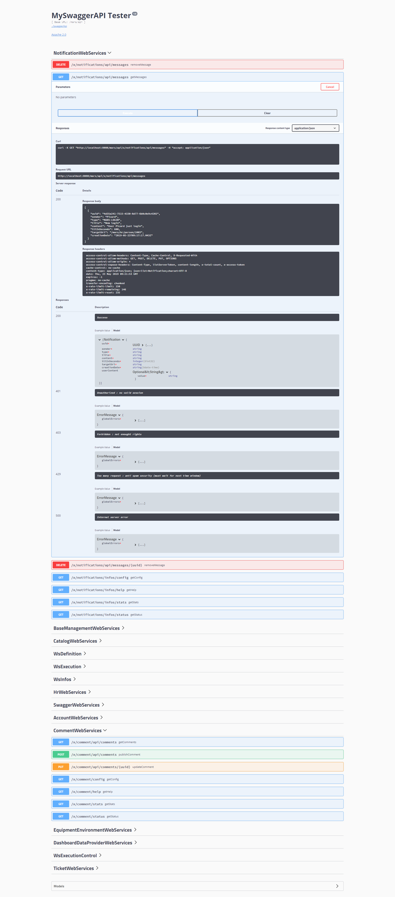

# WebServices

Vertigo's Vega module simplifies the creation of REST WebServices, enabling your application to easily interconnect with application ecosystems by offering digital services as APIs.

This module is also suited for creating REST APIs consumed by Single Page Applications.

The JSON exchange format was preferred for its popularity, but also for its ability to be easily consumed by many technologies. Vega's goal being to open the application to the world, it makes sense to use the most widely adopted exchange format to reach the largest possible audience.

## Configuration

To use Vega's features, this module must be added to the application configuration.
For more details, refer to the chapter dedicated to application [configuration](/en/basic/configuration).

Vega offers two operating modes:

- as a servlet filter, when the application runs in a servlet container (e.g., Tomcat)
- as an embedded web server (Jetty) for executable JARs


### Servlet Filter Case

Here is a typical YAML configuration for an application using the Vega module and the Javalin connector:

```yaml
modules:
  io.vertigo.connectors.javalin.JavalinFeatures:
    features:
      - standalone:
  io.vertigo.datamodel.DataModelFeatures:
  io.vertigo.vega.VegaFeatures:
    features:
        - webservices:
    featuresConfig:
        - webservices.javalin:
            apiPrefix: /api
        - webservices.security:
        - webservices.swagger:
```

Additionally, here is the filter to add to the container configuration (web.xml) for this case:

```xml
<filter>
		<filter-name>VegaJavalinFilter</filter-name>
		<filter-class>io.vertigo.vega.plugins.webservice.webserver.javalin.VegaJavalinFilter</filter-class>
	</filter>
<filter-mapping>
	<filter-name>VegaJavalinFilter</filter-name>
	<url-pattern>/api/*</url-pattern>
</filter-mapping>
```

!> Here we chose to use a prefix for all webservice routes `/api`. This is a practice we encourage as it avoids naming conflicts.

#### AbstractFilter

Any filter derived from `AbstractFilter` supports two URL filtering parameters:

- `url-include-pattern`: restricts the filter to URLs matching the pattern
- `url-exclude-pattern`: excludes URLs matching the pattern

### Embedded Web Server Case

Here is a typical YAML configuration for an application using the Vega module in embedded server mode:

```yaml
modules:
  io.vertigo.connectors.javalin.JavalinFeatures:
    features:
      - embeddedServer:
          port: 8080
  io.vertigo.datamodel.DataModelFeatures:
  io.vertigo.vega.VegaFeatures:
    features:
        - webservices:
    featuresConfig:
        - webservices.javalin:
            apiPrefix: /api
        - webservices.security:
        - webservices.swagger:
```


> For the complete list of available features, refer to the chapter dedicated to [Vega](/en/extensions/vega)

## Creating a WebService

A webservice is a way to make data or a business service available through a web interface.

Vega allows exposing a Java method on the web and defining the behavior of this 'endpoint' through annotations.

> In Vertigo, we prefer creating 'WebServices' type components that group together, within a single class, the webservices offered on the same business or functional domain.

In Vertigo, any object offering services is a component. A webservice is no exception: it is a component, but with its own specifics.  

Therefore, first of all, reading the [components](/en/basic/composants) chapter is recommended.

A webservice is a component that must implement the `io.vertigo.vega.webservice.WebServices` interface

This marker, in addition to allowing the developer to differentiate components by their features and usages, enables the Vega module to identify the components whose methods must be analyzed and converted into WebServices.

To create a webservice, let's start by creating the component that will host the methods to publish:

```java

public class HelloWebServices implements WebServices {
	// methods will go there
	
}
```

Then, let's add the method to be exposed:

```java
public class HelloWebServices implements WebServices {

	@AnonymousAccessAllowed
	@GET("/hello")
	public String hello() {
		return "hello world";
	}

}
```

The `hello` method takes no arguments and returns a string. This is a minimal example for demonstration purposes.

The `@GET` annotation allows specifying

  - the route to be used: here */hello*
  - the HTTP verb to be used: here *GET*

Similar annotations exist for the different HTTP verbs: `@POST`, `@PUT`, `@DELETE`, `@PATCH`

> To learn more about routes and verbs, you can refer to the best practices we propose [here](https://github.com/vertigo-io/vertigo-core/wiki/routes).

For simplicity and conciseness, it is possible to add a prefix to all routes of the methods in the same class by using the `@PathPrefix` annotation on the class.

!> Here the `@AnonymousAccessAllowed` annotation allows webservice access without authentication. Legitimate public endpoints (services exposed to the general public, token-based access) may use it intentionally: use it **with caution** in that case, staying aware of the webservice exposure.

## Using Parameters

To go further in creating a WebService, it is of course possible to complicate method signatures and thus accept input parameters while returning objects and collections of objects.

Regarding input and output parameters, they can be of different kinds:

- Java primitives

- Objects

- Collections of objects


Regarding input parameters, they can be retrieved from:

- the URL: via the `@PathParam` annotation
- URL parameters: via the `@QueryParam` annotation
- the request body (in JSON format): via the `@InnerBodyParam` annotation
- a header: via the `@HeaderParam` annotation

Regarding return parameters, these will be automatically serialized (converted) to JSON format.

Thus, it is possible to write, for example, the following webservices:

```java
@PUT("/movies/{id}")
public Movie updateMovie(final @PathParam("id") long id, final Movie movie) {
    movieServices.saveMovie(movie);
	return movieServices.getMovie(id);
}
```

```java
@POST("/movies/_search")
public FacetedQueryResult search(
    @InnerBodyParam("criteria") final String criteria,
	@InnerBodyParam("facets") final SelectedFacetValues selectedFacetValues,
	@InnerBodyParam("group") final Optional<String> clusteringFacetName,
    final DtListState dtListState) {
		return movieServices.searchMovies(criteria, selectedFacetValues, dtListState,
				clusteringFacetName);
}
```


## Securing the WebService

It is absolutely essential to secure webservice calls.

To address this security concern, many mechanisms are available in Vega.

By default, all WebServices are accessible only to an authenticated user. This is the first level of security. Obviously, it is **necessary** but **not sufficient**.

!> **Never declare `ComponentCmdWebServices` in production**: this introspection webservice exposes `GET /vertigo/components`, which returns the full NodeConfig **including its parameters** (LDAP passwords, connection secrets...), all with `@AnonymousAccessAllowed`. It is enabled by **no** feature: it is only present if it has been explicitly declared in the configuration — make sure it is not declared on production environments. Likewise, restrict the `webservices.swagger` and `webservices.catalog` features to development/staging environments unless they are truly needed: they disclose the full API surface.

To go further, you can use features from the Vertigo-Account module, which provides a security model that can be applied to WebServices.

Thus, during a Webservice call, you can verify:

- That the authenticated user has one of the rights required to be authorized to call it
- That entities (business objects in the Vertigo sense) can be manipulated by the authenticated user

```java
@Secured("Contact$read")
@GET("/{conId}")
public Contact read(@PathParam("conId") final long conId) {
	final Contact contact = contactDao.get(conId);
	return contact;
}
```

> Here we check that the connected user has the **Contact$read** right, meaning the ability to read contacts

> The `@Secured` annotation automatically applies the `Atz` prefix to the checked right: the name actually controlled is therefore `AtzContact$read`. The given value is the operation authorization name `EntityCamelCase$operation`, the operation being as declared in the security configuration (typically lowercase: `read`, `write`, `delete`...).
> <!-- source : AuthorizationAspect.java:L57-78, Authorization.java:L98 -->

```java
@PUT("/contactView")
public ContactView updateContactView(
    @SecuredOperation("write") final ContactView contactView) {
		return contactView;
}
```

> Here we check that the connected user has write authorization on the ContactView entity: the operation name is `write`, as declared in the security configuration. This security check depends on both the user's attributes and the Contact's attributes. It is therefore a very fine-grained security check.

> The `@SecuredOperation` annotation carries the operation name **without prefix**: it is an `OperationName`, not an `Atz...` authorization name. The annotated parameter must be an entity (Entity).
> <!-- source : AuthorizationAspect.java:L66-78 -->

### `@SessionLess`

The `@SessionLess` annotation (`io.vertigo.vega.webservice.stereotype.SessionLess`) applies to a webservice **method** and carries no member.
<!-- source : SessionLess.java:L32-35 -->

Its effect: **no HTTP session is created nor bound** for this webservice. The Vertigo session is still created for security, but without binding to the `HttpSession`; if an `HttpSession` already exists, it is reused. It is designed for anonymous services or services with low resource consumption.
<!-- source : SessionLess.java:L27-30 -->

Concretely, the scanner sets `needSession = false` on the webservice and, at runtime, the session handler `SessionWebServiceHandlerPlugin` (stack index 60) no longer applies to this webservice.
<!-- source : AnnotationsWebServiceScannerUtil.java:L141-142 -->
<!-- source : SessionWebServiceHandlerPlugin.java:L64 -->

> `@SessionLess` is **incompatible with `@ServerSideSave`**: the assertion "Session mandatory for serverSideState" is raised.
> <!-- source : WebServiceDefinition.java:L121-122 -->

## CORS (Cross-Origin Resource Sharing)

The `CorsAllowerWebServiceHandlerPlugin` plugin manages cross-origin requests. It is enabled via the `webservices.cors` feature.

The configuration parameters are:

- `originCORSFilter` (required): filters allowed origins
- `methodCORSFilter` (optional): filters allowed HTTP methods, default `GET, POST, DELETE, PUT, OPTIONS`

URI validation is strict: only complete URIs without path or query string are accepted.

## OIDC (OpenID Connect)

Vega supports OIDC authentication through the following interfaces and classes:

- `AppLoginHandler<T>`: application login handler interface
- `OIDCAppLoginHandler`: marker for an OIDC login handler
- `WebAuthenticationPlugin<T>`: generic web authentication plugin
- `OIDCWebAuthenticationPlugin`: OIDC authentication plugin with the following parameters:
   - `scopes`: OIDC scopes to request
   - `urlPrefix`: URL prefix
   - `urlHandlerPrefix`: URL prefix for handlers
   - `externalUrl`: external URL of the application
   - `connectorName`: OIDC connector name

### Wiring Up the Application Login Handler (feature `authentication`)

In 4.4, the `SecurityFilter` injects an `Optional<WebAuthenticationManager>`: if the `authentication` feature is active, the security chain (login page, login, logout) is driven by this component; otherwise the classic behavior applies, returning **401** if the user is not authenticated. The previous mechanism — a web.xml init-param `delegate-authentication-handler-component` read by the `LegacySecurityFilter` filter from 3.x — disappeared with that filter as of 4.0 (removed at commit `65db5ab049`, contained in tag `vertigo-4.0.0`); the `DelegateAuthenticationFilterHandler` interface, now obsolete and unused, remains as a trace in the code. The replacement is the `authentication` feature + `appLoginHandler`.
<!-- source : SecurityFilter.java:L59-60, L96-121 -->

The `authentication` feature (method `withWebAuthentication(Param...)`) enables the `WebAuthenticationManager` component (implementation `WebAuthenticationManagerImpl`) and exposes the parameter:
<!-- source : VegaFeatures.java:L194-199 -->

- `appLoginHandler` (String): name of the application component to be resolved as an `AppLoginHandler` via `Node.getNode().getComponentSpace().resolve(appLoginHandler, AppLoginHandler.class)`
<!-- source : WebAuthenticationManagerImpl.java:L63, L172, L183 -->

`AppLoginHandler<T>` is a **generic interface**:
<!-- source : AppLoginHandler.java:L28-62 -->

- `String doLogin(HttpServletRequest, Map<String, Object> claims, T rawResult, Optional<String> requestedUrl)`: to implement — returns the redirection page after a successful login
- `default Optional<String> doLogout(HttpServletRequest)`: redirection page after logout (empty by default)
- `default void loginFailed(HttpServletRequest, HttpServletResponse)`: called when the login fails — returns **403** by default

This component drives the application login page: OIDC, SAML, and local logins go through it.

Configuration example:

```yaml
modules:
  io.vertigo.vega.VegaFeatures:
    features:
        - webservices:
        - authentication:
            appLoginHandler: monComposantLogin
```

## SwaggerApi

The API created with this module is exposed in the standard Swagger **2.0** format. Vertigo includes making the API available through the standard Swagger UI.
Simply add the webservice facade: `io.vertigo.vega.impl.webservice.catalog.SwaggerWebServices`



The `SwaggerApi` object is represented as a `LinkedHashMap<String, Object>`.

Rules for constructing Swagger definition names:

- The `$` character in the webservice definition name (`webServiceDefinition.getName()`) acts as a separator to structure nested definitions
- Multiple underscore sequences are reduced to a single `_` (e.g., `__` → `_`)
- There is **no** automatic replacement of `$` by `_`

The `FacetedQueryResult` facets JSON exposes the `isMultiSelectable` attribute on each facet. `FacetedQueryResultJsonSerializerV5` is the **default** serializer.

## LogExceptionsHandlerPlugin

The `LogExceptionsHandlerPlugin` plugin is enabled by default, with no configuration parameter. It is always active and generates an error log (status, verb, path, path params) for any HTTP response with a code between 500 and 599.

## Rate Limiting

Rate limiting allows limiting the number of allowed calls within a sliding time window.

The localhost addresses (`127.0.0.1`, `[0:0:0:0:0:0:0:1]`) are part of the `USER_EXCLUDED_IPS` set: they are ignored when read from headers (`X-Forwarded-For` / custom header) — protection against spoofing. This is **not** an exemption from rate limiting.
<!-- source : RateLimitingManagerImpl.java:L66 — USER_EXCLUDED_IPS, utilisé uniquement dans obtainUserIpFromHeader -->

Two distinct features are available:

- `webservices.rateLimiting`: enables the `RateLimitingWebServiceHandlerPlugin` handler (stack index 100, in-memory counter) with the parameters `windowSeconds` (default `300`) and `limitValue` (default `150`)
- `rateLimiting`: enables the `RateLimitingManager` component (implementation `RateLimitingManagerImpl`) with the parameters in the table below
<!-- source : RateLimitingWebServiceHandlerPlugin.java:L53, L55-56, L83-95 -->
<!-- source : VegaFeatures.java:L89-94 -->

### Parameters of the `rateLimiting` feature

| Parameter | Type | Default |
|---|---|---|
| `windowSeconds` | `Optional<Integer>` | `300` |
| `maxRequests` | `Optional<Long>` | `150` |
| `maxDayRequests` | `Optional<Long>` | — (must be ≥ `maxRequests`) |
| `errorCode` | `Optional<Integer>` | `429` |
| `overRateLimitMode` | `Optional<String>` | `reject` (values: `nothing` / `logOnly` / `reject` / `banish`) |
| `insertHeaders` | `Optional<Boolean>` | `true` (sets the headers `X-Rate-Limit-Limit` / `X-Rate-Limit-Remaining` / `X-Rate-Limit-Reset`) |
| `useForwardedFor` | `Optional<Boolean>` | `false` |
| `useHeaderUserIp` | `Optional<String>` | — (name of a custom header, type `True-Client-Ip`) |
| `useUserIp` | `Optional<Boolean>` | `true` (otherwise `sessionId`, otherwise `anonymous`) |
| `logEveryXRequests` | `Optional<Integer>` | `100` |
| `banishSeconds` | `Optional<Long>` | `1800` |
| `banishRepeaterMult` | `Optional<Double>` | `2` |
| `maxBanishSeconds` | `Optional<Long>` | `604800` |
| `banishMessage` | `Optional<String>` | computed ("N requests/min…") |
| `whiteListUsers` | `Optional<String>` | — (IPs separated by `,` or `;`, max 100,000) |

<!-- source : RateLimitingManagerImpl.java:L130-184 -->

The storage backend of the `rateLimiting` feature is provided by one of the associated store features: `rateLimiting.redis` (Redis, cluster compatible) or `rateLimiting.mem` (local memory) — see the *RateLimiting* section in the *For Experts* part.
<!-- source : VegaFeatures.java:L96-108 -->

## For Experts

### Security Plugins

| Plugin | Feature | Stack Index | Description |
|---|---|---|---|
| `AccessTokenWebServiceHandlerPlugin` | `webservices.token` | 90 | Generation and verification of one-time tokens for sensitive actions |
| `ApiKeyWebServiceHandlerPlugin` | `webservices.auth.apiKey` | 45 | API key authentication. Parameters: `apiKey` (String), `headerName` (Optional<String>) |

### System Services

| Service | Feature | Route | Description |
|---|---|---|---|
| `HealthcheckWebServices` | `webservices.healthcheck` | Auto-generated | Platform monitoring endpoint |
| `CatalogWebServices` | `webservices.catalog` | Auto-generated | Webservice catalog (metadata, definitions) |

### WebServiceClient (Proxy)

The `webservices.proxyclient` feature enables the `AmplifierMethod` `WebServiceClientAmplifierMethod` which dynamically generates Java proxies from a `WebServiceDefinition`. The proxy uses an internal `HttpRequestBuilder` to build HTTP requests (method, URL, headers, JSON body) and a `JsonEngine` (default implementation `GoogleJsonEngine`/Gson, injected) for JSON reading/writing.

### HandlerChain — Internal Architecture

Vega processes each HTTP request through a chain of plugins (`WebServiceHandlerPlugin`) sorted by `getStackIndex()`. The `HandlerChain` iterates over the active handlers and calls `accept(WebServiceDefinition)` to determine whether a handler applies to this webservice. The first one that accepts executes `handle()` and passes to the next via `chain.handle()`. If the last handler does not produce a body, an `IllegalStateException` is thrown.

The maximum number of handlers in a chain is 50 (infinite loop detection via `MAX_NB_HANDLERS`).

#### Handler Order

| Index | Handler | Enabled by |
|---|---|---|
| 5 | `LogExceptionsHandlerPlugin` | Always active |
| 10 | `ExceptionWebServiceHandlerPlugin` | Always active |
| 20 | `CorsAllowerWebServiceHandlerPlugin` | `webservices.cors` |
| 30 | `AnalyticsWebServiceHandlerPlugin` | Always active |
| 40 | `JsonConverterWebServiceHandlerPlugin` | Always active |
| 45 | `ApiKeyWebServiceHandlerPlugin` | `webservices.auth.apiKey` |
| 50 | `SessionInvalidateWebServiceHandlerPlugin` | `webservices.security` |
| 60 | `SessionWebServiceHandlerPlugin` | `webservices.security` |
| 70 | `SecurityWebServiceHandlerPlugin` | `webservices.security` |
| 80 | `ServerSideStateWebServiceHandlerPlugin` | `webservices.token` |
| 90 | `AccessTokenWebServiceHandlerPlugin` | `webservices.token` |
| 100 | `RateLimitingWebServiceHandlerPlugin` | `webservices.rateLimiting` |
| 110 | `ValidatorWebServiceHandlerPlugin` | Always active |
| **120** | `RestfulServiceWebServiceHandlerPlugin` | Always active ← **always last** |

A custom handler must have a `getStackIndex()` between 0 and 119. The last one (`RestfulServiceWebServiceHandlerPlugin`, index 120) is the one that executes the target Java method and returns the body.

### Servlet Filters vs HandlerChain

Servlet Filters execute **before** the HandlerChain and operate at the Servlet Spec level (not Vega). They do not filter by `WebServiceDefinition` but by URL pattern (`url-include-pattern` / `url-exclude-pattern` via `AbstractFilter`).

| Filter | Role |
|---|---|
| `SetCharsetEncodingFilter` | Forces the **request** charset (`request.setCharacterEncoding`), defined by the required init-param `charset` |
| `CompressionFilter` | Compresses the response in **gzip** (according to `Accept-Encoding`), based on the `compressionThreshold` threshold and the user-agent |
| `CacheControlFilter` | Sets the `Cache-Control` headers (private, max-age, no-cache) |
| `SecurityFilter` | Session/authentication filter: binds the application `UserSession` as an attribute of the J2EE session (`io.vertigo.Session`), returns **401** if the user is not authenticated; init-param `url-no-authentification` (URLs exempted from authentication). Sets **no** HTTP header at all |
| `ContentSecurityPolicyFilter` | Manages CSP headers |
| `HeaderControlFilter` | Controls input/output headers |
| `AuthorizationWebFilter` | Routes filter by authorization: each init-param is **named** after the `Atz`-prefixed authorization name(s) (separated by `;` = OR) and its **value** is the URL pattern(s); reserved init-params: `errorCode` (Integer, default 403), `url-include-pattern` / `url-exclude-pattern`; does not read `@Secured` |
| `RateLimitingFilter` | Rate limiting at the Servlet level (separate from the handler) |
| `AnalyticsFilter` | Collects metrics at the Servlet level |

!> **`SetCharsetEncodingFilter` must be declared first**, before any filter that may read the request parameters — its own javadoc states it: "Must be the first filter to be effective". The Servlet spec indeed requires `setCharacterEncoding` to be called **before** the parameters are first read, otherwise the call has no effect. Typical symptom of a wrong ordering: corrupted accented characters in user-entered search criteria.

> **Detail — `AuthorizationWebFilter`**: the filter declaration relies on the **name / value** semantics of init-params — the **name** of an init-param is an authorization name, its **value** is a URL pattern:
> <!-- source : AuthorizationWebFilter.java:L56-165 -->
>
> - **Name**: the name — or the names separated by `;` (**OR**) — of the controlled authorization, **with a mandatory `Atz` prefix** (an assertion is raised if the prefix is absent)
> - **Value**: the URL pattern — or the patterns separated by `;` (**OR**) — being controlled; conversion: `.` is escaped, `*` at the end of the pattern → `.*`, `*` in the middle of the pattern → `[^/]*`
> - **Reserved** init-params: `errorCode` (Integer, default **403**), `url-include-pattern` / `url-exclude-pattern` (inherited from `AbstractFilter`)
> <!-- source : AuthorizationWebFilter.java:L87-97 -->
> <!-- source : AbstractFilter.java:L84-94 -->
>
> The filter reads the `UserSession` from the HTTP session (attribute `io.vertigo.Session`), then the `UserAuthorizations` (attribute `vertigo.account.authorizations`); in the absence of a session or of the required rights, it issues `sendError(errorCode)` + `VSecurityException`. This filter does **not** read the `@Secured` annotation.

Declaration example (fictional authorization names and URLs):

```xml
<init-param>
	<param-name>AtzVoirSwagger</param-name>
	<param-value>/api/swagger*;/api/catalog*</param-value>
</init-param>
```

> The `devMode.authzLogOnly` parameter is **not an init-param** of the filter: it is a `ParamManager` parameter (resolved in the component space) which, in development mode, causes authorization refusals to be logged instead of returning the HTTP error.
> <!-- source : AuthorizationWebFilter.java:L58, L158-164 -->

### Lifecycle

1. **DefinitionSpace**: `AnnotationsWebServiceScannerPlugin` scans the components implementing `WebServices`, extracts the annotated methods (`@GET`, `@POST`, ...) and generates the `WebServiceDefinition`s
2. **ComponentSpace**: `WebServiceManager` assembles the `WebServiceDefinition`s and sorts the `WebServiceHandlerPlugin`s by `getStackIndex()`
3. **Runtime**: HTTP Request → Servlet Filter chain → HandlerChain → target Java method → JSON response

### Authentication Plugins

| Plugin | Feature | Description |
|---|---|---|
| `LocalWebAuthenticationPlugin` | `authentication.local` | Local authentication via form |
| `OIDCWebAuthenticationPlugin` | `authentication.oidc` | OpenID Connect |
| `SAML2WebAuthenticationPlugin` | `authentication.saml2` | SAML 2.0 |
| `AzureAdWebAuthenticationPlugin` | `authentication.aad` | Azure Active Directory |

### RateLimiting

The `RateLimitingWebServiceHandlerPlugin` implements rate limiting via a sliding window. The storage backend is configurable:

| Backend | Feature | Description |
|---|---|---|
| Local memory | `rateLimiting.mem` | Local storage, not persisted, not shared |
| Redis | `rateLimiting.redis` | Shared storage via Redis, cluster compatible |

The localhost addresses (`127.0.0.1`, `[0:0:0:0:0:0:0:1]`) are ignored as a **source of user IP read from headers** (`X-Forwarded-For` / custom header) — protection against spoofing; they are **not** exempted from rate limiting.
<!-- source : RateLimitingManagerImpl.java:L66 — USER_EXCLUDED_IPS, utilisé uniquement dans obtainUserIpFromHeader -->

### Debug

- Enable the logging of `WebServiceManager` to trace webservice loading and HandlerChain assembly
- The `LogExceptionsHandlerPlugin` automatically logs all 5xx responses (status, verb, path, path params)
- The `AnalyticsWebServiceHandlerPlugin` exposes performance metrics (execution time per webservice)
- To debug the handler order, verify that each `accept()` returns `true` only for the targeted webservices
