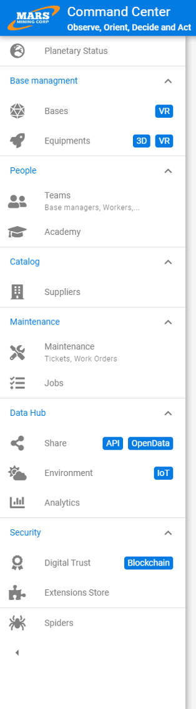
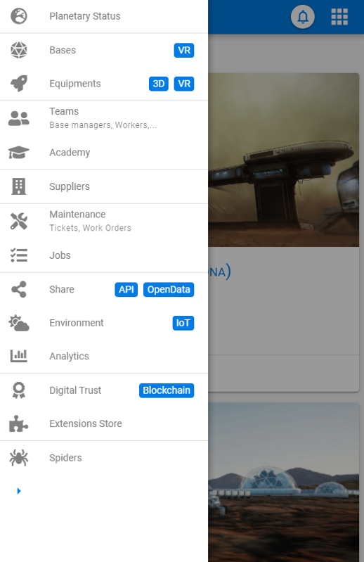

# Menu

The menu is the primary means of navigation in an application.
It provides access to the various elements at the same logical level.

It should accomplish two things:

- allow a new user to find their way around quickly
- allow a regular user to access functions efficiently without encroaching on their workspace

Menu entries can be grouped by major categories into groups.

To address these two challenges, we recommend a menu whose entries consist of an icon and a label.
By default, the menu is in expanded mode, displaying both the icon and the label.
At the user's request, the menu can be collapsed (this choice should be persisted), and in this case only the icon is displayed (the label only on hover) to maximize the workspace

On mobile, the menu is placed in a left side panel that opens by tapping a button or by a horizontal swipe

# Best Practices

- Customize the menu according to user profiles to highlight the most relevant elements
- Limit the menu to about twenty elements
- Use a concise and precise label
- Use an icon representative of the underlying functionality
- Sort menu items by order of importance

# Design

## Expanded menu

## Collapsed menu

## Mobile menu

