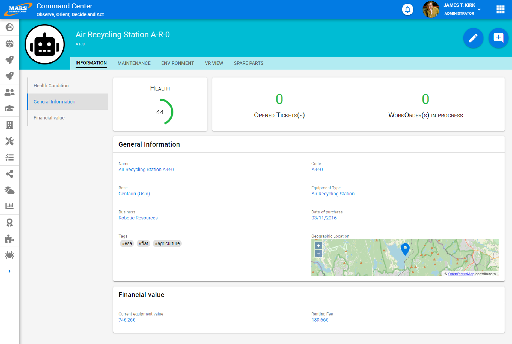
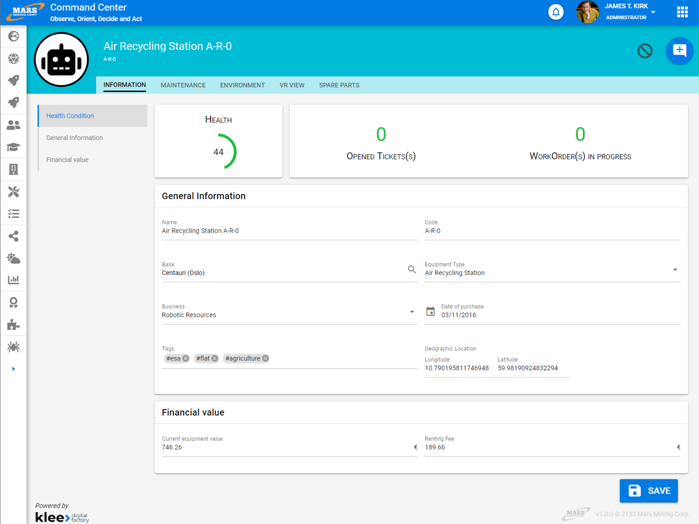

# Edit/View

All Vertigo molecules support two rendering modes: edit mode and view mode.

This means it is very easy to maintain great consistency between these two types of screens. This provides an extremely smooth journey for users because information they see in one place will be editable in the same place.
Furthermore, this is a genuine efficiency lever for typical screens, allowing a project to pay particular attention to the screens and features that make it unique.

Therefore, we favor a page template that fully leverages this principle.

An edit/view page is composed of:

- A header including:

  - an optional visual element on the left
  - a brief description of elements that should be available regardless of the active tab
  - a list of tabs when there are multiple
  - an action list: including the "Edit" action to switch the screen to edit mode when in view mode, and "Cancel" to return to view mode when in edit mode
- A workspace containing:

  - a "scrollspy" or dynamic anchor for quick access when the page contains between 5 and 7 blocks
  - the largest possible workspace
  - a floating "Save" button at the bottom right when in edit mode, allowing the user to save modified information and return to view mode. Being floating, this button will always be visible and clickable regardless of the user's position on the page

# Best Practices

- Information in the header (excluding actions) should ideally be identical for all tabs of the same concept
- A page should not contain more than 7 blocks: beyond that, prefer splitting into tabs
- The header should minimize on scroll to preserve a substantial workspace for the user
- Never place another element above the floating "Save" button
- Disable scrollspy on medium and small screens to maximize workspace

# Design

## View

## Edit
