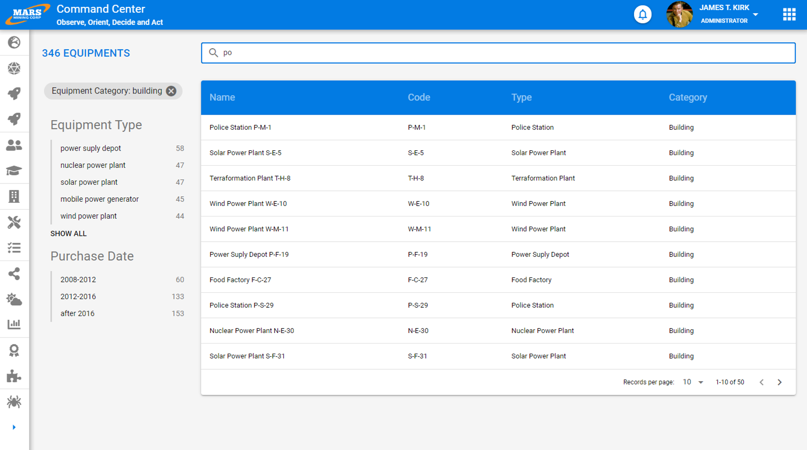

# Search

Faceted full-text search is an excellent way to access information. It is highly performant from a technical standpoint and also very ergonomic, which is why we encourage all application designers to use it.

This type of screen is encountered fairly frequently on public websites, and users are well accustomed to it.

This type of screen is composed of three main areas:

- a text search bar that allows the user to enter search criteria
- a list of facets that allow easy filtering of elements. This area presents both the selected criteria and those that can be added to narrow down the number of results and find the desired information
- the results themselves; see [here](/en/design-system/organismes/collections) for more information on possible representation types

This type of screen allows strong user interaction because results are automatically updated in real time as the user refines their search via text or facets.

# Best Practices

- Do not display all possible facet values, but only about ten; the rest should be available by clicking a "see more" type button
- Display at the top of the screen the total number of elements matching the applied search criteria, as this gives users a valuable indication to refine their search

# Design

