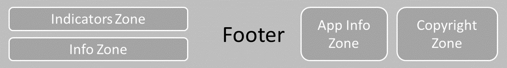

# General Structure

For "classic" management applications, we are convinced that the general page structure should be familiar to the widest possible audience so that all users can quickly get accustomed to it.
We therefore drew inspiration from current web standards, which are the result of a long and rich evolution.

This structure must be rich enough to accommodate all necessary elements, yet well-segmented to guide the user optimally.

Furthermore, the choices we have made in this area facilitate transitioning the application to mobile mode with gesture support.

It is important to keep the user's workspace as large as possible with a stabilized position from one screen to another. This workspace will contain lists, input fields, charts, maps, etc.

# Best Practices

- Place elements related to the application (name, visual, etc.) at the top left
- Place elements related to the logged-in user and other applications the user might want to consult at the top right
- Place copyright information at the bottom right
- Prefer a fixed header bar at the top of the page; this simplifies the placement of other elements
- Prefer a sliding panel spanning the full page height on a single side (right) and avoid multiple panels overlapping.

# Design

## Full page

## Header

## Footer

