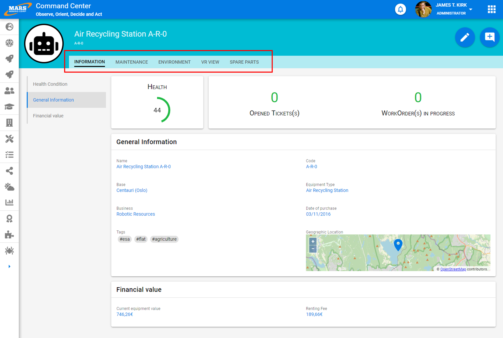

# Tabs

Tabs organize content into multiple sections and allow users to navigate between them. The content under each tab should be related and form a coherent whole.

This system is ideal for structuring information associated with a very complex business concept. It is preferable to use this logical breakdown rather than creating very tall pages (causing excessive scrolling) that give the impression of a jumble.

Furthermore, this stronger structure better secures applications because it is possible to block access to an entire page containing sensitive data at an earlier stage, limiting potential information leaks.

# Best Practices

- A tab or page should not contain more than 7 blocks.
- Make sure to visually indicate the currently active tab
- A tab title should be as concise and precise as possible. It is most often a common noun.

# Design

