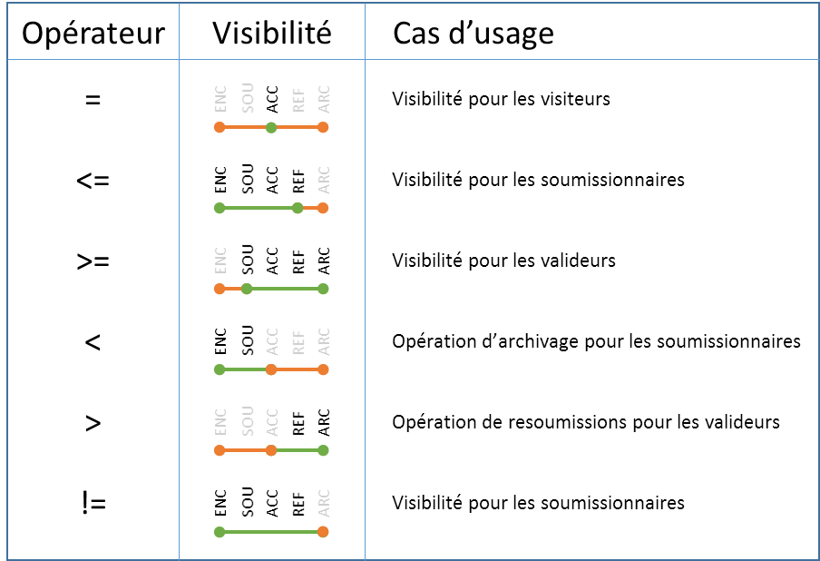
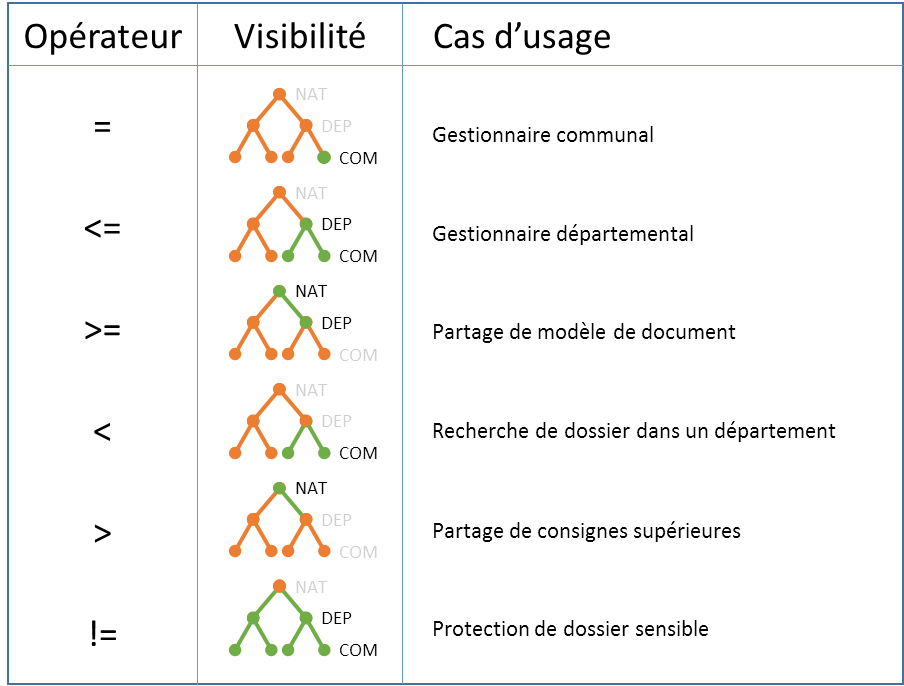

# Account

Vertigo's **Account** module simplifies user account management.
It primarily other modules with the cross-cutting concept of user account. This enables Vertigo extensions like **"notifications"** or **"comments"**.

The module offers user management features across three orthogonal axes:
- **Authentication**: Authentication management
- **Authorization**: Authorization management
- **Identity Provider**: Connection with identity providers

## Configuration

To use **Account** features, add this module to the application configuration.
For more details, refer to the [configuration](/en/basic/configuration) chapter.

Typical configuration for an application using the Account module:

```yaml

modules:
  io.vertigo.account.AccountFeatures:
    features:
      - security:
          userSessionClassName: io.mars.commons.MarsUserSession
      - account:
      - authentication:
      - authorization:
    featuresConfig:
      - account.store.store:
          userIdentityEntity: DtPerson
          groupIdentityEntity: DtGroups
          userAuthField: email
          photoFileInfo: FiFileInfoStd
          userToAccountMapping: 'id:personId, displayName:lastName, email:email, authToken:email, photo: picturefileId'
          groupToGroupAccountMapping: 'id:groupId, displayName:name'
      - authentication.text:
          filePath: /initdata/userAccounts.txt
```

### Available Features:
- **security**: Activates the module and the first security level (authenticated or not)
  - userSessionClassName: App session class name
- **account**: Activates user account features
- **authentication**: Activates authentication features
- **authorization**: Activates authorization features
- **identityProvider**: Activates identity provider features

### Feature Parameters

#### Account
- **account.store.store**: *Account* storage via *StoreManager*
  - userIdentityEntity: Entity name holding *Accounts*
  - groupIdentityEntity: Entity name holding *Account* groups (must have FK to *Account*)
  - userAuthField: Field linked to authentication *(authToken)*
  - photoFileInfo *(optional)*: *FileInfo* name for photo storage
  - userToAccountMapping: Entity field mapping to *Account*
  - groupToGroupAccountMapping: Group entity field mapping to *GroupAccount*
- **account.store.text**: *Account* storage via text file
  - accountFilePath: *Account* file path
  - accountFilePattern: Regex for reading the file (with [named](https://stackoverflow.com/a/415635/2273508) capture groups: id, displayName, email, authToken, photoUrl)
  - groupFilePath: *AccountGroup* file path
  - groupFilePattern: Regex for reading the file (with [named](https://stackoverflow.com/a/415635/2273508) capture groups: id, displayName, accountIds)
- **account.store.loader**: *Account* storage delegated to a specific loader *(implements [AccountLoader](https://github.com/vertigo-io/vertigo-libs/blob/master/vertigo-account/src/main/java/io/vertigo/account/plugins/account/store/loader/AccountLoader.java))*
- **account.cache.memory**: Activates memory cache (**Warning**: no automatic purge)
- **account.cache.redis**: Activates Redis cache via *RedisConnector* (**Warning**: no automatic purge)

#### Authorization
?> No specific configuration. Component behavior is driven by the [Authorizations](#authorizations) rules configuration file.

## Authentication

### Principle

Authentication in a business application is based on matching an Authentication method with an authentication source.

- **AuthenticationToken** represents the authentication method.
- **AuthenticationPlugin**s represent authentication sources authorized by the developer.

### Configuration

Vertigo provides two default authentication methods:
- **UsernameAuthenticationToken**: Single text field representing the user *Login*
- **UsernamePasswordAuthenticationToken**: Two text fields, *Login* / *Password*

Vertigo provides four authentication source types:
- **LdapAuthenticationPlugin**: Login/Password authentication against an LDAP.
  - On success, returns the Login.
- **StoreAuthenticationPlugin**: Login/Password or Login-only authentication against the database.
  - On success, can return another column from the table (e.g., for a security token)
  - Password must be salted and hashed by Vertigo's `PasswordHelper` (i.e., PBKDF2)
- **TextAuthenticationPlugin**: Login/Password or Login-only authentication from a text file.
  - On success, returns the account key
  - Password must be salted and hashed by Vertigo's `PasswordHelper` (i.e., PBKDF2)
- **MockAuthenticationPlugin**: Login/Password or Login authentication, for tests (all accounts authorized).

**Feature Configuration (Yaml)**

- **authentication.text**: Enables text file-based authentication
  - filePath: File path. (File format: accountKey    login    password    //comments)

?> Password hashing uses the [PBKDF2WithHmacSHA256](https://en.wikipedia.org/wiki/PBKDF2) algorithm

- **authentication.store**: Enables *StoreManager*-based authentication
  - userCredentialEntity: Entity name holding authentication
  - userLoginField: Field name
  - userPasswordField: Password field name
  - userTokenIdField: *authToken* field name (field used for *Account* link)

?> Password hashing uses the [PBKDF2WithHmacSHA256](https://en.wikipedia.org/wiki/PBKDF2) algorithm

- **authentication.ldap**: Enables LDAP-delegated authentication
  - userLoginTemplate: User DN template (contains {0} to merge login)
  - ldapServerHost: LDAP server name
  - ldapServerPort: LDAP server port

- **authentication.mock**: For tests, always succeeds

### Usage

Module usage is straightforward:
- Retrieve information from the controller
- Create a Token carrying these information
- Delegate authentication to `authenticationManager`
- If authentication succeeds, retrieve the user entity and perform specific processing (session association, rights retrieval, etc.)

Login is typically done in the business service:

```java
public void login(final String login, final String password) {
  final Optional<Account> loggedAccount = authenticationManager.login(new UsernamePasswordAuthenticationToken(login, password));
  if (!loggedAccount.isPresent()) {
    throw new VUserException("Login or Password invalid");
  }
  final Account account = loggedAccount.get();
  final Person person = personServices.getPerson(Long.valueOf(account.getId()));
  getUserSession().setLoggedPerson(person);

  //Load Profile and authorizations
  getUserSession().setCurrentProfile("Administrator");
}
```

## Authorization

### Principles

In a business application, typically not all users have access to everything. Vertigo provides a security mechanism to protect application elements that require it.

Technically, the mechanism secures fine-grained application elements (called *Resources*): pages, services, data, etc.
It can also abstract something like a **confidential** characteristic cross-cutting the application.<br/>
But for understandability, the developer configures the security mechanism to group *Resources* into *Authorizations* corresponding to application features
(*View files*, *Submit a file*, *Validate files*, ...)

Vertigo's security mechanism is *low-level*. Vertigo only knows the concept of **Authorization**: either global or carried by an entity (`SecuredEntity`).

It is up to the application to rationalize the model. For example, the application is advised to manage security at a higher level with *Profile* and *Perimeter* concepts.
The list of *Profiles* associated with a user is application-specific.
A *Profile* is a list of **Authorizations** attached to an application **Perimeter**.

**Note**<br/>
Best practice: if a user has multiple **Profiles**, only one should be active at a time (switchable during session),
to avoid security rule collisions that are hard to understand, implement performantly, and test.<br/>
In systems with centralized user management, user **Profile** can be managed by the centralized system (it provides the **Profile** per user per app).

### Security *context* concept

The above model already handles many cases. But larger clients have stronger organizational structures impacting application security.
Security must then be relative to a context. This context can be geographic, organizational, state-based, date-based, etc.<br/>
This *security context* is called a **Perimeter**.

Vertigo's mechanism enables this type of security generically in projects.
In Vertigo terms, *security context* is a concept:

- in which users and `SecuredEntities` are registered
- composed of axes (geographic, organizational, ...)
- each axis potentially hierarchical (e.g., continent, country, regions, departments, cities)

To remain compatible with Vertigo's mechanism, applications must follow some rules:

- User has exactly one active context at a time
- User context is cross-cutting to their rights
- Context hierarchy has no exceptions and is properly oriented (parent accesses all children, grandchildren...)

!>Exceptions must be handled specifically by the application.

### Authorization types

Two authorization types are available:
- **Global Authorizations**: Global authorizations for protecting application functions (screens, buttons, processes, ...)
  - name: Authorization code
  - label: Authorization label

- **Secured Entity Operations**: Authorizations for operations on a secured entity
  - entity: Protected entity name
  - securityFields: Fields participating in security constraints (i.e., filter criteria)
  - securityDimensions: Security dimensions (pseudo security fields derived from entity fields)
    - name: Dimension name
    - type: Dimension type (ENUM: for ordered enumeration, TREE: for hierarchical structure)
    - values *(Type:ENUM)*: Ordered list of possible values
    - fields *(Type:TREE)*: Ordered (flat) tree field list
  - operations: Possible operations on the entity
    - __comment: Place a comment in configuration
    - name: Operation code
    - label: Operation label
    - grants *(optional)*: Operations granted by this operation (i.e., a user with this operation also has grant operations)
    - overrides *(optional)*: Operations overridden by this operation (i.e., for a user with this operation, its rule overrides others)
    - rules: Security rule list.
      - SQL-like syntax: ( myField *operator* value (and|or)? )*
      - List rules are **OR**ed together
      - **${myParam}** for a user context property (perimeter property in user session)
      - Simple notation for **TREE** axes: GEO <= ${geo} : Selects `SecuredEntities` *below or equal* in the user's geographic perimeter (e.g., all departments or in a department manager's department)
      - Simple notation for **ENUM** axes: etaCd>=PUB AND etaCd<ARC (e.g., all `SecuredEntities` with state *greater or equal* to 'PUB'*lished* and *strictly less* than 'ARC'*hived*)

> Each **Secured Entity Operation** is associated with a generated authorization. This allows checking if a user has, as a preliminary, the right to perform an operation on an entity before examining the user's security context.
> Used notably for UI element display management.<br/>
> **Example:** Retrieving possible operations on an entity to determine menus to display

### Usage

Vertigo's security model allows a single model definition for use across multiple technologies, each with their own syntax and use cases.

#### API

`AuthorizationManager` API covers most use cases:

- **hasAuthorization(AuthorizationName...)**: Verifies the user has one of the passed authorizations
- **isAuthorized(Entity, OperationName)**: Verifies the user can perform the operation on the **entity** with active security context
- **getCriteriaSecurity(Class<Entity>, OperationName)**: Generates a [Criteria] valid for the logged user, entity type, and operation. Criteria enables many usages, see details below.
- **getSearchSecurity(Class<Entity>, OperationName)**: Generates security filter in ElasticSearch syntax for the logged user, entity type, and operation.
- **getAuthorizedOperations(Entity)**: Operations possible by the logged user on the passed entity (used by UI layer to adapt possible actions)

#### Criteria

Vertigo Criteria is a cross-cutting element representing a filter, translatable into multiple languages.

> Can be used directly in DAO.findAll

- **toPredicate**: Conversion to Java Predicate (for streams or localized test)
- **toSQL**: Conversion to WHERE clause for SQL queries (prefer DAO usage)

Applying to general DAO queries:
```Java
 final Criteria<Equipment> securityFilter = authorizationManager.getCriteriaSecurity(Equipment.class, SecuredEntities.EquipmentOperations.read);
 return equipmentDAO.findAll(securityFilter, dtListState);
```

Applying to specific DAO tasks:
Pass an AuthorizationCriteria via the Task IN parameters. It can then be translated to SQL directly in the SQL query.
```Java
return equipmentDAO.getLastPurchasedEquipmentsByBaseId(baseId,
			AuthorizationUtil.authorizationCriteria(Equipment.class, SecuredEntities.EquipmentOperations.read));
```
```
create Task TkGetLastPurchasedEquipmentsByBaseId {
    className : "io.vertigo.basics.task.TaskEngineSelect"
    request : "
            select
            	equ.*
			from (<%=securedEquipment.asSqlFrom("equipment", ctx)%>) equ
			where equ.base_id = #baseId#
			order by equ.purchase_date desc
			limit 50
             "
    in 	baseId           {domain : DoId         	cardinality: "1"}
    in  securedEquipment {domain : DoAuthorizationCriteria    cardinality: "1"}
    out equipments       {domain : DoDtEquipment	cardinality: "*"}
}
```
> Note: Passing the security filter as a from clause is efficient. It limits the data scope quickly before complex joins.

Applying to search engine queries:
```Java
 final ListFilter securityListFilter = ListFilter.of(authorizationManager.getSearchSecurity(Equipment.class, SecuredEntities.EquipmentOperations.read));
	final SearchQuery searchQuery = equipmentIndexSearchClient.createSearchQueryBuilderEquipment(criteria, selectedFacetValues)
			.withSecurityFilter(securityListFilter)
			.build();
 ```

#### AuthorizationUtil

This utility offers static methods easily usable for verifying user authorizations in business services.
It is better to perform checks as early as possible in processing for performance.
If the user lacks sufficient authorizations, an exception is thrown, rolling back the transaction and displaying an error.

- **assertAuthorizations(message*(optional)*, AuthorizationName...)**: Verifies the user has one of the passed authorizations and throws if not
- **assertOperations(Entity, OperationName, message*(optional)*)**: Verifies the user can perform the operation on the **entity** with active security context
- **assertOperationsOnOriginalEntity(Entity, OperationName, message*(optional)*)**: Like **assertOperations** but reloads the original object first for security control BEFORE applying user modifications
- **assertOr(BooleanSupplier...)**: Assembles multiple checks with OR
- **hasAuthorization(AuthorizationName...)**: Returns `BooleanSupplier` verifying the user has one of the passed authorizations
- **authorizationCriteria(Class\<Entity\>, OperationName)**: Builds criteria representing security filter for an operation type on an entity
- **assertOperationsWithLoadIfNeeded(StoreVAccessor, OperationName, message*(optional)*)**: Verifies the user can perform the operation on the **entity** carried by this accessor (FK); accessor will be loaded if needed

Example:
```Java
  // operation check on an entity
 AuthorizationUtil.assertOperations(baseDAO.get(baseId), SecuredEntities.BaseOperations.read);

  // FK utilities
  AuthorizationUtil.assertOperationsWithLoadIfNeeded(ticket.equipment(), SecuredEntities.EquipmentOperations.readTickets);
```

#### UiAuthorizationUtil

For page rendering, a utility validates that the user has global authorizations or authorizations for operations on an entity.
This disables button or link display in the UI.
Typically, checks are done in Thymeleaf with `th:if`:
```HTML
 th:if="${authz.hasAuthorization('AdmUser','ViewAcademy')}"
 ```

API:
- **hasAuthorization(AuthorizationName...)**: Verifies the user has one of the passed authorizations
- **hasOperation(UiObject, OperationName)**: Verifies the user can perform the operation on the **entity** with active security context

!> Disabling a button is not sufficient for minimum security. Authorization checks must primarily be performed server-side.

#### Aspect

!> Although convenient, aspect-based security control is not recommended due to its non-systematic nature (non-reentrancy). Reserved for experienced developers.

**Vertigo Authorization** proposes two annotations for AOP-based security control:

- **@Secured** (`{list of authorization names}`): Secures a single *method* or an entire *class* by verifying the user has one of the authorizations
- **@SecuredOperation** (`operation name`): Secures a `SecuredEntity` passed as parameter by verifying the user is authorized for this operation on the entity

> In these annotations, the `Atz` prefix is not required for authorization names

> `@SecuredOperation` requires the method to also be annotated with `@Secured`

!> Caution: annotations are checked by AOP, so this control mode is **non-reentrant**

!> Note: `@SecuredOperation` requires the entity, meaning it must already be loaded (before the security check)

### Loading

Authorizations are loaded via a DefinitionProvider in the application module Feature.<br/>

*Example:*
```java
  .addDefinitionProvider(DefinitionProviderConfig.builder(JsonSecurityDefinitionProvider.class)
    .addDefinitionResource("security", "mars-auth-config.json")
    .build())
```

### Security Rules Examples: ENUM and TREE

**ENUM**: Use case example for a file.<br/>
Possible states:
- (DRAFT) In progress
- (SUBM) Submitted
- (ACCP) Accepted
- (REFD) Rejected
- (ARCH) Archived



**TREE**: Use case example for a file.<br/>
Geographic tree:
- (NAT) National
- (DEP) Department
- (COM) Municipality



## Identity Providers

### Principle

Vertigo provides a high-level manager to simplify synchronizing application user accounts with an external identity source (**IdP** or **Id**entity **P**rovider).
The API retrieves users in the format of Entity managed locally:
  - user by user from their authentication token (retrieved by `AuthenticationManager`)
  - just the photo of a user
  - the complete list of users

### Configuration

Vertigo provides three default identity source types:

**IdentityProvider Feature Configuration (Yaml)**

- **identityProvider.store**: *Identity* provisioning from *StoreManager*
  - userIdentityEntity: Entity name holding *Identities*
  - userAuthField: Field linked to authentication *(authToken)*
  - photoIdField *(optional)*: FileInfo ID for photo storage
  - photoFileInfo *(optional)*: *FileInfo* name for photo storage
- **identityProvider.ldap**: *Identity* provisioning from LDAP
  - ldapServerHost: LDAP server name
  - ldapServerPort: LDAP server port (default: 389)
  - ldapAccountBaseDn: Account DN search base
  - ldapReaderLogin: LDAP reader login
  - ldapReaderPassword: LDAP reader password
  - ldapUserAuthAttribute: LDAP attribute for finding a user by *authToken*
  - userIdentityEntity: Entity name holding the identity (i.e., the User in application terms)
  - ldapUserAttributeMapping: LDAP field mapping to identity entity
- **identityProvider.text**: *Identity* provisioning from text file
  - identityFilePath: *Identity* file path
  - identityFilePattern: Regex for reading the file (with [named](https://stackoverflow.com/a/415635/2273508) capture groups)
  - userAuthField: Field linked to authentication *(authToken)*
  - userIdentityEntity: Entity name holding the identity (i.e., the User in application terms)

## For Experts

### Managers

| Manager | Role | Activated by |
|---|---|---|
| `VSecurityManager` | User session and session authentication management | `security` |
| `AuthenticationManager` | User authentication (login/password, token) | `authentication` |
| `AuthorizationManager` | Authorization control (global and secured entities) | `authorization` |
| `AccountManager` | Account and group management | `account` |
| `IdentityProviderManager` | External identity provider synchronization | `identityProvider` |

### Features (@Feature)

| Flag | Components |
|---|---|
| `security` | `VSecurityManagerImpl` — session, logged user |
| `authentication` | `AuthenticationManagerImpl` — authentication engine |
| `authentication.text` | `TextAuthenticationPlugin` — auth from text file (PBKDF2) |
| `authentication.store` | `StoreAuthenticationPlugin` — auth from database |
| `authentication.ldap` | `LdapAuthenticationPlugin` — auth from LDAP directory |
| `authentication.mock` | `MockAuthenticationPlugin` — mock auth for tests |
| `account` | `AccountManagerImpl`, `AccountDefinitionProvider` |
| `account.store.store` | `StoreAccountStorePlugin` — accounts persisted in database |
| `account.store.text` | `TextAccountStorePlugin` — accounts from text file |
| `account.store.loader` | `LoaderAccountStorePlugin` — accounts loaded by `AccountLoader`/`GroupLoader` |
| `account.cache.memory` | `MemoryAccountCachePlugin` — account memory cache |
| `account.cache.redis` | `RedisAccountCachePlugin` — Redis cache (`Base64File`, `PhotoCodec`) |
| `authorization` | `AuthorizationManagerImpl`, `AuthorizationAspect` |
| `identityProvider` | `IdentityProviderManagerImpl` |
| `identityProvider.store` | `StoreIdentityProviderPlugin` — identities from database |
| `identityProvider.ldap` | `LdapIdentityProviderPlugin` — identities from LDAP |
| `identityProvider.text` | `TextIdentityProviderPlugin` — identities from text file |

### Authentication Plugins

| Plugin | Description |
|---|---|
| `TextAuthenticationPlugin` | Login/password authentication from text file |
| `StoreAuthenticationPlugin` | Login/password authentication from database (via EntityStore) |
| `LdapAuthenticationPlugin` | LDAP binding authentication, returns login |
| `MockAuthenticationPlugin` | Always valid, for unit tests |

### Security Rules DSL

Rules are translated to three targets via `SecurityRuleTranslator`:

| Translator | Usage |
|---|---|
| `SqlSecurityRuleTranslator` | Translation to SQL `WHERE` clause for DAO queries |
| `SearchSecurityRuleTranslator` | Translation to Elasticsearch syntax for `SearchManager` |
| `CriteriaSecurityRuleTranslator` | Translation to Vertigo `Criteria` (cross-cutting filter) |

DSL elements: `DslSyntaxRules`, `DslParserUtil`, `DslExpressionRule`, `DslFixedQueryRule`, `DslOperatorRule`, `DslMultiExpressionRule`, `DslUserPropertyValueRule`.

### Authorization Loaders

| Class | Role |
|---|---|
| `JsonSecurityDefinitionProvider` | Rule loading from JSON file |
| `AuthorizationDeserializer` | Authorization definition deserialization |
| `SecuredEntityDeserializer` | Secured entity deserialization |
| `AdvancedSecurityConfiguration` | Advanced security configuration |

### Annotations

| Annotation | Target | Description |
|---|---|---|
| `@Secured` | Class/Method | Verifies global authorizations |
| `@SecuredOperation` | Parameter | Verifies operation on a SecuredEntity |

### Exceptions

| Exception | Role |
|---|---|
| `VSecurityException` | Thrown when authorization check fails |

### YAML Configuration

See [Configuration](#configuration) section for each Feature details and [Configuration](#configuration-1) for IdentityProvider configuration.
