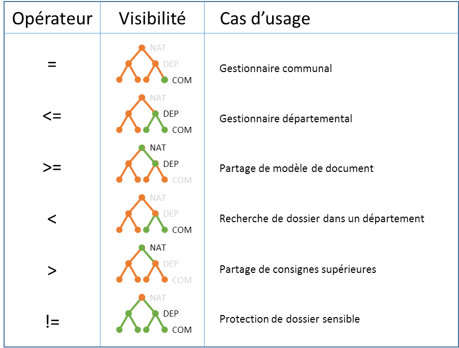

# Account

The Vertigo **Account** module provides simplified management of user accounts.
Above all, this module makes the cross-cutting notion of user account available to the other modules. This enables Vertigo to offer extensions such as **"notifications"** or **"comments"**.

The module offers user management features spread across three orthogonal axes:
- **Authentication**: Authentication management
- **Authorization**: Authorization management
- **Identity Provider**: Connection with identity providers


## Configuration

To use the features of **Account**, this module must be added to the application configuration.
For more details, refer to the chapter dedicated to application [configuration](/en/basic/configuration).


Here is a typical configuration for an application using the Account module.

```yaml

modules:
  io.vertigo.account.AccountFeatures:
    features:
      - security:
          userSessionClassName: io.gestionprojet.commons.GestionProjetUserSession
      - account:
      - authentication:
      - authorization:
    featuresConfig:
      - account.store.store:
          userIdentityEntity: DtPerson
          groupIdentityEntity: DtGroups
          userAuthField: email
          photoFileInfo: FiFileInfoStd
          userToAccountMapping: 'id:personId, displayName:lastName, email:email, authToken:email, photo: picturefileId'
          groupToGroupAccountMapping: 'id:groupId, displayName:name'
      - authentication.text:
          filePath: /initdata/userAccounts.txt
```


### Available Features
- **security**: Activates the module, and the first security level (authenticated or not)
  - userSessionClassName: Name of the application session class
- **account**: Activates the features around the user account notion
- **authentication**: Activates the authentication features
- **authorization**: Activates the authorization features
- **identityProvider**: Activates the identity provider features

### Feature Parameters

#### Account
- **account.store.store**: Storage of *Accounts* by the *StoreManager*
  - userIdentityEntity: Name of the entity carrying the *Accounts*
  - groupIdentityEntity: Name of the entity carrying the *Account* groups (must be linked to `userIdentityEntity` by a simple or N-N association; this association is looked up at boot and its absence prevents startup)
  - userAuthField: Name of the field linked to authentication *(authToken)*
  - photoFileInfo *(optional)*: Name of the *FileInfo* used for photo storage
  - userToAccountMapping: Mapping of the entity fields to *Account*
  - groupToGroupAccountMapping: Mapping of the Group entity fields to *AccountGroup*
- **account.store.text**: Storage of *Accounts* in a text file
  - accountFilePath: Path of the *Accounts* file
  - accountFilePattern: RegExp for reading the file (with **capture groups** [named](https://stackoverflow.com/a/415635/2273508): id, displayName, email, authToken, photoUrl)
  - groupFilePath: Path of the *AccountGroup* file
  - groupFilePattern: RegExp for reading the file (with **capture groups** [named](https://stackoverflow.com/a/415635/2273508): id, displayName, accountIds)
- **account.store.loader**: Storage of *Accounts* delegated to a specific loader *(implements [AccountLoader](https://github.com/vertigo-io/vertigo-libs/blob/master/vertigo-account/src/main/java/io/vertigo/account/plugins/account/store/loader/AccountLoader.java))*
  - accountLoaderName: Name of the `AccountLoader` component to use to load the accounts
  - groupLoaderName *(optional)*: Name of the [GroupLoader](https://github.com/vertigo-io/vertigo-libs/blob/master/vertigo-account/src/main/java/io/vertigo/account/plugins/account/store/loader/GroupLoader.java) component to use for the groups; **without a `GroupLoader`, any group operation throws `UnsupportedOperationException`**
- **account.cache.memory**: Activates the memory cache (**Warning**: no automatic purge)
- **account.cache.redis**: Activates the Redis cache via the *RedisConnector* (**Warning**: no automatic purge)
  - connectorName *(optional, default "main")*: Name of the `RedisConnector` to use (the plugin selects the connector by name among the injected `RedisConnector`s)

#### Authorization
?> No specific configuration. The behavior of this component is driven by the rules configuration file of [Authorizations](#authorizations).


## Authentication

### Principle

Authentication in a business application is based on matching a means of authentication with an authentication source.

- **AuthenticationToken** represents the means of authentication.
- The **AuthenticationPlugin**s represent the authentication sources authorized by the developer.

### Configuration

By default, Vertigo offers two types of means of authentication:
- **UsernameAuthenticationToken**: A single piece of text information representing the user's *Login*
- **UsernamePasswordAuthenticationToken**: Two pieces of text information, of type *Login* / *Password*

Vertigo offers four types of authentication source:
- **LdapAuthenticationPlugin**: Login/Password authentication against an LDAP.
  - If authenticated, returns the Login.
- **StoreAuthenticationPlugin**: Login/Password or Login-only authentication against the database.
  - If authenticated, can return another column of the table (for a security token, for example)
  - The Password must be salted and hashed by the Vertigo `PasswordHelper` (i.e., PBKDF2)
- **TextAuthenticationPlugin**: Login/Password or Login-only authentication from a text file.
  - If authenticated, returns the account key
  - The Password must be salted and hashed by the Vertigo `PasswordHelper` (i.e., PBKDF2)
- **MockAuthenticationPlugin**: Login/Password or Login authentication, used for tests (all accounts authorized).


**Configuration of the *Feature* (YAML)**

- **authentication.text**: Enables text file-based authentication
  - filePath: Path of the file. (File format: accountKey    login    password    //comments )

?> Password hashing uses the [PBKDF2WithHmacSHA256](https://en.wikipedia.org/wiki/PBKDF2) algorithm

- **authentication.store**: Enables *StoreManager*-based authentication
  - userCredentialEntity: Name of the entity carrying the authentication
  - userLoginField: Name of the field
  - userPasswordField: Name of the password field
  - userTokenIdField: Name of the *authToken* field (field used for the link to *Account*)

?> Password hashing uses the [PBKDF2WithHmacSHA256](https://en.wikipedia.org/wiki/PBKDF2) algorithm

- **authentication.ldap**: Enables Login/Password authentication against an LDAP
  - userLoginTemplate: User DN template (must contain {0} to merge the login)
  - connectorName *(optional, default "main")*: Name of the `LdapConnector` to use (the plugin selects the connector by name among the injected `LdapConnector`s)
  - The connection to the LDAP server is handled by the **connector** `LdapConnector` (module *vertigo-ldap-connector*):
    - name *(optional, default "main")*: Name of the connector
    - host: Host of the LDAP server
    - port: Port of the LDAP server
    - readerLogin *(optional)*: Read account of the LDAP server
    - readerPassword *(optional)*: Password of the read account (mandatory if `readerLogin` is present)

- **authentication.mock**: For tests, authentication always succeeds


### Usage

Using this module is quite simple:
- Retrieve the information from the controller
- Create a Token carrying this information
- Delegate the authentication to the `authenticationManager`
- If the authentication is successful, retrieve the user's entity and perform the specific processing (association in the session, retrieval of rights, etc...)

Overall, the login is done like this in the business service:

```java
public void login(final String login, final String password) {
  final Optional<Account> loggedAccount = authenticationManager.login(new UsernamePasswordAuthenticationToken(login, password));
  if (!loggedAccount.isPresent()) {
    throw new VUserException("Login or Password invalid");
  }
  final Account account = loggedAccount.get();
  final Person person = personServices.getPerson(Long.valueOf(account.getId()));
  getUserSession().setLoggedPerson(person);
  
  // Profil actif : les authorisations de ce profil sont ensuite accordées à la session
  // (obtainUserAuthorizations + addAuthorization) — cf. section « Accorder les droits à l'utilisateur »
  getUserSession().setCurrentProfile("Administrator");
}
```

## Authorizations

### Principles

In a business application, it is generally assumed that not all users will have access to everything. Vertigo offers a security mechanism that allows protecting the elements of the application that need it.

From a technical standpoint, the mechanism allows securing fine-grained elements of the application (called *Resource*): pages, services, data, or anything else.
It can also be something more abstract, such as a **confidential** attribute cross-cutting the application.<br/>
But to remain understandable, the developer configures the security mechanism to group these *Resources* into *Authorizations* that correspond to features offered by the application
(*Consult the dossiers*, *Submit a dossier*, *Validate the dossiers*, ...)

The Vertigo security mechanism is quite *low-level*. Vertigo only knows the notion of **Authorization**: either global, or carried by an entity (the `SecuredEntity`s).

It is left to the application to rationalize the model; for example, it is recommended that the application manages security at a more macro level, with a notion of *Profile* and of *Scope*.
The list of *Profiles* associated with a user is specific to the application and remains its responsibility.
A *Profile* is a list of **Authorizations** attached to an applicative **Scope**.

**Note**<br/>
The best practice in this area is that if a user has several **Profiles**, only one should be active at a time (the user can switch during their session),
in order to avoid collisions (intersections) of security rules that are difficult to understand, to implement in a performant way, and to test.<br/>
In a system where user management is centralized, the user **Profile** can be managed by the centralized system (it provides the **Profile** per user per application).

### Notion of *security context*

The model presented above already allows handling many cases. But the larger the clients, the stronger their organization, and the more their organization weighs on the application's security.
It then appears that security must be relative to a context. This context can be geographic, organizational, tied to a state, to a date, or something else, or even all of this at the same time. <br/>
This *security context* is called the security **Scope**.

The Vertigo mechanism makes it possible to ensure and to set up this type of security generically in projects.
In Vertigo terms, the *security context* is a notion:

- in which users and the `SecuredEntities` are enrolled
- which is composed of axes (geographic, organizational, ...)
- each axis of which can be hierarchical (e.g., continent, country, regions, municipalities, cities)

To remain compatible with the mechanism provided by Vertigo, the application must respect a few rules:

- The user has one and only one active context at a time
- The user's context is cross-cutting with respect to their rights
- The hierarchy of the context has no exceptions and is correctly oriented (a parent accesses all its children, grandchildren ...)

!> Exceptions must be handled specifically by the application.


### Authorization Types

Two types of authorizations are offered:
- **Global Authorizations**: Global authorizations used to protect functions of the application (screens, buttons, processes, ...)
  - name: Code of the authorization
  - label: Label of the authorization

- **Secured Entity Operations**: Authorizations for an operation on a secured entity
  - entity: Name of the protected entity
  - securityFields: List of the fields participating in the security constraints (i.e., filter criteria)
  - securityDimensions: List of security dimensions (pseudo-security fields derived from other fields of the entity)
    - name: Name of the dimension
    - type: Type of the dimension (SIMPLE: simple field, ENUM: for an ordered enumeration, TREE: for a hierarchical structure)
    - *(Type:SIMPLE)*: Simple field — no ordered values, no hierarchy
    - values *(Type:ENUM)*: Ordered list of the possible values (2 minimum, 0 `fields`)
    - fields *(Type:TREE)*: List of the ordered (and flat) fields of the tree (1 minimum, 0 `values`; the order of the fields is the order of the hierarchy)
  - operations: List of the possible operations on the entity
    - __comment: Allows placing a comment in the configuration
    - name: Code of the operation
    - label: Label of the operation
    - grants *(optional)*: List of operations granted by this operation (i.e., a user having this operation also has those of the grants)
    - overrides *(optional)*: List of operations overridden by this operation (i.e., for a user having this operation, the rule of this operation overrides those of the other overrides)
    - rules: List of security rules.
      - Syntax close to SQL ( myField *operator* value (and|or)? )*
      - The various rules of the list are considered as **OR**
      - **${myParam}** to place a property of the user context (scope property in the user session)
      - Simple notation for the **TREE** axes: GEO <= ${geo} : Selects the `SecuredEntities` *below or equal to* in the geographic scope of the user (e.g., all the municipalities or within the department of a department manager)
      - Simple notation for the **ENUM** axes: etaCd>=PUB AND etaCd<ARC (e.g., all the `SecuredEntities` whose state is *greater than or equal to* `PUB` (published) and *strictly lower than* `ARC` (archived))

> Each **Secured Entity Operation** is associated with a generated authorization. It is thus possible to check whether a user has, "a priori", the right to perform an operation on an entity, even before looking at the user's security context.
> This is used, in particular, to manage the displayed UI elements.<br/>
> **Example:** Retrieval of the possible operations on an entity to determine the menus to offer

In addition to the two types of authorization, the security model defines a 3rd element: the `Role`.

- **Role**: Named group of authorizations (prefix `R`)
  - name: Name of the role
  - description: Description of the role
  - authorizations: List of the authorizations contained in the role

The `Role` is a **building block** provided by Vertigo (compatibility inheritance from the ASC module): it is **not** declared in the JSON security configuration (which only contains `globalAuthorizations` and `securedEntities`), the roles are declared in code.

Usage via `UserAuthorizations`:
- **addRole(Role)**: Adds the role and all its authorizations in cascade
- **hasRole**: Checks that the user has the role
- **getRoles**: Returns the roles of the user
- **clearRoles**: Removes the roles of the user (also removes their authorizations)

### Usage

The strength of the Vertigo security model is to allow a single definition of the model for use in multiple technologies, each having its own syntax and its own use cases.

#### API

The API offered by the AuthorizationManager allows handling most of the use cases encountered.

- **obtainUserAuthorizations()**: Returns the authorization support of the current user (`UserAuthorizations`) — entry point for granting rights
- **hasAuthorization(AuthorizationName...)**: Checks that the user has one of the authorizations passed as parameter
- **isAuthorized(Entity, OperationName)**: Checks that the user can perform the operation on the **entity** with their active security context
- **getCriteriaSecurity(Class<Entity>, OperationName)**: Generates a [Criteria](#criteria) valid for the connected user, an entity type and an operation. The Criteria allows many uses, see details below.
- **getSearchSecurity(Class<Entity>, OperationName)**: Generates the security filter in Elasticsearch syntax applicable for the connected user, an entity type and an operation.
- **getPriorAuthorizations()**: Returns the "a priori" authorizations of the current user, without data context (`Set<String>`) — used by the UI layer to display/disable buttons
- **getAuthorizedOperations(Entity)**: List of the operations possible for the connected user on the entity passed as parameter (used by the UI layer to adapt the possible actions)

!> Without an active user session, the checks return neutral values (no exception is thrown): `hasAuthorization` and `isAuthorized` return `false`, `getCriteriaSecurity` returns an always-false criteria, `getSearchSecurity` returns the empty string, `getPriorAuthorizations` and `getAuthorizedOperations` return an empty set. Only `obtainUserAuthorizations()` throws an `IllegalArgumentException`.

#### Granting Rights to the User

After a successful authentication, it is the application that grants the user's rights to their session: the authorizations (global and operations on entities) and the scope keys (`securityKeys`) that parameterize the security rules.
The mechanism is intentionally low-level: Vertigo provides the building blocks, the policy (profiles, scopes) is left to the application, see [Security](/en/basic/securite) for the Profile/Scope concept.

Mechanics:
- **obtainUserAuthorizations()**: obtains the authorization support of the current user (`UserAuthorizations`), stored as an attribute of the `UserSession` — this is the entry point of the grant
- **Grant a global authorization**: `userAuthorizations.addAuthorization(authorization)` — the `Authorization` is the definition loaded from the security configuration; the names are prefixed with `Atz` (e.g., `AtzAdmProject`)
- **Grant an operation on an entity**: `userAuthorizations.addAuthorization(authorization)` with a name of the form `Atz<Entity>$<operation>` (e.g., `AtzProject$read`) — the `grants` of the operation are granted in cascade (recursive, with a loop guard)
- **Grant a role**: `userAuthorizations.addRole(role)` — adds the role **and** all its authorizations in cascade (the roles are declared in code, not in JSON: constructor `Role(name, description, authorizations)`)
- **Grant the scope keys**: `userAuthorizations.withSecurityKeys("key", value)`:
  - simple key: `withSecurityKeys("utiId", "A-123")`
  - **TREE** key (hierarchical dimension): an array representing the path in the hierarchy — `Serializable` values (String codes or numeric IDs, e.g., `Long`) — e.g., `withSecurityKeys("orga", new String[] { "D01", "D01-B12" })`
  - **partial path** (TREE): the elements of the array can be `null` — a `null` position marks the root of the subtree, the rule pivots on the last non-null level of the path, e.g., `withSecurityKeys("orga", new Long[] { 1L, 2L, null })`
  - **multi-values**: repeated calls on the same key (the values are combined with OR)
  - **`null` value**: the blank key and the **entire** `null` value are rejected by an Assertion; the `null` elements of a TREE array are, on the other hand, allowed (cf. "partial path")

```java
// Dans le service métier, après l'authentification réussie :
final DefinitionSpace definitionSpace = Node.getNode().getDefinitionSpace();
authorizationManager.obtainUserAuthorizations()
    // droits globaux + opération sur entité (noms préfixés Atz)
    .addAuthorization(definitionSpace.resolve("AtzAdmProject", Authorization.class))
    .addAuthorization(definitionSpace.resolve("AtzProject$read", Authorization.class))
    // périmètre : clé simple + clé TREE (chemin dans la hiérarchie)
    .withSecurityKeys("utiId", "A-123")
    .withSecurityKeys("orga", new String[] { "D01", "D01-B12" })
    // 2e valeur sur la même clé (combinée en OR) : chemin partiel en ID numériques,
    // position null = racine du sous-arbre (la règle pivote sur le dernier niveau non null)
    .withSecurityKeys("orga", new Long[] { 1L, 2L, null });
```

Life cycle:
- **Profile change**: before applying the rights of the new profile, call `userAuthorizations.clearRoles()` (also clears the authorizations) then `userAuthorizations.clearSecurityKeys()`, and reapply the rights of the chosen profile
  ```java
  // Changement de profil en cours de session :
  final UserAuthorizations userAuthorizations = authorizationManager.obtainUserAuthorizations();
  userAuthorizations.clearRoles();        // efface aussi les authorizations accordées
  userAuthorizations.clearSecurityKeys(); // efface les clés de périmètre
  // puis re-appliquer les droits du nouveau profil : addAuthorization(...) + withSecurityKeys(...) (comme ci-dessus)
  ```
- **Logout**: `clearRoles()` + `clearSecurityKeys()` (or a new user session)
- **Without session**: `obtainUserAuthorizations()` throws an `IllegalArgumentException` (see the "without active session" box of the API block above)

!> The rights are stored in the session: they are volatile (lost at the end of the session) and must be re-granted at each login / profile change.

#### Criteria

The Vertigo Criteria is a cross-cutting element representing a filter, which can then be translated into multiple languages.

> It can be used directly in DAO.findAll

- **toPredicate**: Conversion to a Java predicate (for streams, or a localized test)
- **Conversion to SQL**: via `AuthorizationCriteria` (`asSqlWhere(alias, taskContext)` / `asSqlFrom(sqlEntityName, taskContext)`) — cf. the SQL task example below in the section

To apply it on general DAO queries
```Java
 final Criteria<Dossier> securityFilter = authorizationManager.getCriteriaSecurity(Dossier.class, SecuredEntities.DossierOperations.read);
	return dossierDAO.findAll(securityFilter, dtListState);
```

 To apply it on specific DAO tasks.
 It is necessary to pass an AuthorizationCriteria via the IN parameters of the Task. It is then possible to translate it into SQL directly in the SQL query.
```Java
return dossierDAO.getLastCreatedDossiersByProjectId(projectId,
				AuthorizationUtil.authorizationCriteria(Dossier.class, SecuredEntities.DossierOperations.read));
```
 ```
create Task TkGetLastCreatedDossiersByProjectId {  
    className : "io.vertigo.basics.task.TaskEngineSelect"
    request : "
            select 
            	dos.*
			from (<%=securedDossier.asSqlFrom(\"dossier\", ctx)%>) dos
			where dos.project_id = #projectId#
			order by dos.creation_date desc
			limit 50
             "
    in 	projectId        {domain : DoId         	cardinality: "1"}
    in  securedDossier   {domain : DoAuthorizationCriteria    cardinality: "1"}
    out dossiers         {domain : DoDtDossier	cardinality: "*"}
}
```
> Note: It is efficient to pass the security filter as a FROM clause. This allows quickly limiting the data scope before performing more complex joins.

To apply it to a search by a search engine:
```Java
 final ListFilter securityListFilter = ListFilter.of(authorizationManager.getSearchSecurity(Dossier.class, SecuredEntities.DossierOperations.read));
	final SearchQuery searchQuery = dossierIndexSearchClient.createSearchQueryBuilderDossier(criteria, selectedFacetValues)
				.withSecurityFilter(securityListFilter)
				.build();
```

#### AuthorizationUtil

This utility offers static methods easily usable to check the authorizations of the user in the business services.
It is preferable to perform the checks as early as possible in the processing for performance reasons.
But if the user does not have sufficient authorizations, an exception is thrown, which will roll back the transaction and display an error to the user.

- **assertAuthorizations(message*(optional)*, AuthorizationName...)**: Checks that the user has one of the authorizations passed as parameter and throws an exception otherwise
- **assertOperations(Entity, OperationName, message*(optional)*)**: Checks that the user can perform the operation on the **entity** with their active security context
- **assertOperationsOnOriginalEntity(Entity, OperationName, message*(optional)*)**: Like **assertOperations** but first reloads the original object (locked read `FOR UPDATE` if the entity has an id) to perform the security check BEFORE applying the user's modifications; **returns the reloaded original entity**: the caller must use this reloaded entity, not the stale instance
- **assertOr(BooleanSupplier...)**: Allows assembling several checks with OR
- **hasAuthorization(AuthorizationName...)**: Returns a `BooleanSupplier` checking that the user has one of the authorizations passed as parameter
- **isAuthorized(Entity, OperationName)**: Returns a `BooleanSupplier` checking that the user can perform the operation on the **entity** with their active security context (exception-free version, symmetric of `hasAuthorization`)
- **authorizationCriteria(Class\<Entity\>, OperationName)**: Builds a Criteria representing the security filter for an operation type on an entity
- **getCriteriaSecurity(Class\<Entity\>, OperationName)**: Static version of the `AuthorizationManager` API: returns the security `Criteria` for the current user, an entity type and an operation
- **getSearchSecurity(Class\<Entity\>, OperationName)**: Static version of the `AuthorizationManager` API: returns the security filter (Elasticsearch syntax) for the current user, an entity type and an operation
- **assertOperationsWithLoad(UID, OperationName, message*(optional)*)**: Loads the entity from its UID, checks that the user can perform the operation on this entity, and **returns the loaded entity**
- **assertOperationsWithLoadIfNeeded(StoreVAccessor, OperationName, message*(optional)*)**: Checks that the user can perform the operation on the **entity** carried by this accessor (FK), the accessor will be loaded if needed
- **assertOperationsAndReturn(Supplier\<Entity\>, OperationName, message*(optional)*)**: Loads the entity via the provided `Supplier`, checks that the user can perform the operation on this entity, and **returns the entity**

Example:
```Java
  // check d'opération sur une entity
 AuthorizationUtil.assertOperations(projectDAO.get(projectId), SecuredEntities.ProjectOperations.read);

  // utilitaires pour les FK
  AuthorizationUtil.assertOperationsWithLoadIfNeeded(tache.dossier(), SecuredEntities.DossierOperations.readTaches);
```

#### UiAuthorizationUtil

For the rendering of the pages, a utility allows validating that the user has global authorizations, or the authorizations for an operation on an entity.
This allows disabling the display of a button or a link in the UI.
Usually, the checks are done in Thymeleaf with a `th:if`
Example:
```HTML
 th:if="${authz.hasAuthorization('AdmDossier','ViewDossier')}"
 ```

API:
- **hasAuthorization(AuthorizationName...)**: Checks that the user has one of the authorizations passed as parameter
- **hasOperation(UiObject, OperationName)**: Checks that the user can perform the operation on the **entity** with their active security context

!> Disabling a button is not sufficient to ensure a minimum security level. The control of authorizations must above all be performed on the server side

#### Vue SPA

For a **pure Vue application (SPA)** without Thymeleaf server-side rendering: Vertigo provides no client-side authorization mechanism (the *vertigo-ui-vuejs* project contains no authorization mechanism).

Recommended pattern: expose the user's rights via a dedicated WebService:
- **authorizationManager.getPriorAuthorizations()**: the "a priori" authorizations of the user, without data context (`Set<String>`)
- **authorizationManager.getAuthorizedOperations(entity)**: the authorized operations on a given entity (`Set<String>`)

```java
public class UserSecurityWebServices implements WebServices {

	@Inject
	private AuthorizationManager authorizationManager;

	// Autorisations "à priori" de l'utilisateur connecté (sans contexte de données) :
	// la SPA n'utilise cette liste que pour l'affichage (menus, boutons)
	@GET("/current-user/authorizations")
	public Set<String> getPriorAuthorizations() {
		return authorizationManager.getPriorAuthorizations();
	}
}
```

The evaluation of these lists on the client side serves **display only** (buttons, menus, tabs): the server-side control remains mandatory and authoritative (the WebServices themselves must check the rights — see `AuthorizationUtil` above).

For the SSR stack (Thymeleaf rendering): see [UI](/en/extensions/ui) (`vu:authz` / `th:if`), and [Security](/en/basic/securite) for the scope concept.

#### Aspect

!> Although convenient, aspect-based security control is not recommended, because of the non-systematic nature of this technique (non-reentrancy). To be reserved for experienced developers.

**Vertigo Authorization** offers two annotations allowing the implementation of security checks via AOP.

- **@Secured** (`{list of authorization names}`): Allows securing a single *method* or an entire *class* by checking that the user has one of the authorizations
- **@SecuredOperation** (`operation name`): Allows securing a `SecuredEntity` passed as parameter by checking that the user is authorized to perform this operation on the entity

> In these annotations, it is not necessary to use the `Atz` prefix for the name of the authorizations

> `@SecuredOperation` requires the `@Secured` annotation, carried by the **method or by the class** (the aspect falls back on the declaring class)

!> Caution: the annotations are checked by AOP, this control mode is therefore **non-reentrant**

!> Caution: `@SecuredOperation` requires the entity, which means it must already be loaded (before the security check)


### Loading

The authorizations are loaded via a DefinitionProvider in the Feature of the application module.<br/>

*Example:*
```java 
  .addDefinitionProvider(DefinitionProviderConfig.builder(JsonSecurityDefinitionProvider.class)
    .addDefinitionResource("security", "io/gestionprojet/gestionprojet-authorizations.json")
    .build())
```


### Example for Security Rules: ENUM and TREE

**ENUM**: Use case example for a dossier.<br/>
Possible states:
- (ENC) In progress
- (SOU) Submitted
- (ACC) Accepted
- (REF) Rejected
- (ARC) Archived


**TREE**: Use case example for a dossier.<br/>
Geographic tree:
- (NAT) National
- (DEP) Department
- (COM) Municipality




## Identity Providers

### Principle

Vertigo offers a high-level manager to simplify the synchronization of the application's user accounts with an external identity source (**IdP** or **Id**entity **P**rovider).
Typically, the API offered allows retrieving the users in the format of the entity managed locally.
  - either user by user from their authentication Token (retrieved by the `AuthenticationManager`)
  - either the photo alone of a user
  - either by the complete list of the users

### Configuration

By default, Vertigo offers three types of identity sources:

**Configuration of the IdentityProvider *Feature* (YAML)**

- **identityProvider.store**: Provisioning of *Identities* from the *StoreManager*
  - userIdentityEntity: Name of the entity carrying the *Identities*
  - userAuthField: Name of the field linked to authentication *(authToken)*
  - photoIdField *(optional)*: Id of the FileInfo storing the photo
  - photoFileInfo *(optional)*: Name of the *FileInfo* used for photo storage
- **identityProvider.ldap**: Provisioning of *Identities* from an LDAP
  - ldapAccountBaseDn: Search base of the DNs of Accounts
  - ldapUserAuthAttribute: LDAP attribute used to find a user by their *authToken*
  - userIdentityEntity: Name of the entity carrying the identity (i.e., of the User in application terms)
  - ldapUserAttributeMapping: Mapping of the LDAP fields to the identity entity
  - connectorName *(optional, default "main")*: Name of the `LdapConnector` to use (the plugin selects the connector by name among the injected `LdapConnector`s)
  - The connection to the LDAP server is handled by the **connector** `LdapConnector` (module *vertigo-ldap-connector*):
    - name *(optional, default "main")*: Name of the connector
    - host: Host of the LDAP server
    - port: Port of the LDAP server
    - readerLogin *(optional)*: Read account of the LDAP server
    - readerPassword *(optional)*: Password of the read account (mandatory if `readerLogin` is present)
- **identityProvider.text**: Provisioning of *Identities* from a text file
  - identityFilePath: Path of the *Identities* file
  - identityFilePattern: RegExp for reading the file (with **capture groups** [named](https://stackoverflow.com/a/415635/2273508))
  - userAuthField: Name of the field linked to authentication *(authToken)*
  - userIdentityEntity: Name of the entity carrying the identity (i.e., of the User in application terms)

## For Experts

### Managers

| Manager | Role | Activated by |
|---|---|---|
| `VSecurityManager` | Management of user sessions and session authentication | `security` |
| `AuthenticationManager` | Authentication of the users (login/password, token) | `authentication` |
| `AuthorizationManager` | Control of the authorizations (global and secured entities) | `authorization` |
| `AccountManager` | Management of the accounts and groups | `account` |
| `IdentityProviderManager` | Synchronization with the external identity providers | `identityProvider` |

### Features (@Feature)

| Flag | Components |
|---|---|
| `security` | `VSecurityManagerImpl` — session, logged user |
| `authentication` | `AuthenticationManagerImpl` — authentication engine |
| `authentication.text` | `TextAuthenticationPlugin` — auth from a text file (PBKDF2) |
| `authentication.store` | `StoreAuthenticationPlugin` — auth from the database |
| `authentication.ldap` | `LdapAuthenticationPlugin` — auth from the LDAP directory |
| `authentication.mock` | `MockAuthenticationPlugin` — fictitious auth for tests |
| `account` | `AccountManagerImpl`, `AccountDefinitionProvider` |
| `account.store.store` | `StoreAccountStorePlugin` — accounts persisted in the database |
| `account.store.text` | `TextAccountStorePlugin` — accounts from a text file |
| `account.store.loader` | `LoaderAccountStorePlugin` — accounts loaded by `AccountLoader`/`GroupLoader` |
| `account.cache.memory` | `MemoryAccountCachePlugin` — memory cache of the accounts |
| `account.cache.redis` | `RedisAccountCachePlugin` — Redis cache (`Base64File`, `PhotoCodec`) |
| `authorization` | `AuthorizationManagerImpl`, `AuthorizationAspect` |
| `identityProvider` | `IdentityProviderManagerImpl` |
| `identityProvider.store` | `StoreIdentityProviderPlugin` — identities from the database |
| `identityProvider.ldap` | `LdapIdentityProviderPlugin` — identities from LDAP |
| `identityProvider.text` | `TextIdentityProviderPlugin` — identities from a text file |

### Authentication Plugins

| Plugin | Description |
|---|---|
| `TextAuthenticationPlugin` | Login/password authentication from a text file |
| `StoreAuthenticationPlugin` | Login/password authentication from the database (via EntityStore) |
| `LdapAuthenticationPlugin` | Authentication by LDAP binding, returns the login |
| `MockAuthenticationPlugin` | Always valid, for the unit tests |

### Security Rules DSL

The rules are translated into three targets via `SecurityRuleTranslator`s:

| Translator | Usage |
|---|---|
| `SqlSecurityRuleTranslator` | Translation into a SQL `WHERE` clause for DAO queries |
| `SearchSecurityRuleTranslator` | Translation into Elasticsearch syntax for `SearchManager` |
| `CriteriaSecurityRuleTranslator` | Translation into a Vertigo `Criteria` (cross-cutting filter) |

The elements of the DSL are: `DslSyntaxRules`, `DslParserUtil`, `DslExpressionRule`, `DslFixedValueRule`, `DslOperatorRule`, `DslMultiExpressionRule`, `DslUserPropertyValueRule`.

### Authorization Loaders

| Class | Role |
|---|---|
| `JsonSecurityDefinitionProvider` | Loading of the rules from a JSON file |
| `AuthorizationDeserializer` | Deserialization of the authorization definitions |
| `SecuredEntityDeserializer` | Deserialization of the secured entities |
| `AdvancedSecurityConfiguration` | Advanced configuration of the security |

### Annotations

| Annotation | Target | Description |
|---|---|---|
| `@Secured` | Class/Method | Verifies the global authorizations |
| `@SecuredOperation` | Parameter | Verifies the operation on a SecuredEntity |

### Exceptions

| Exception | Role |
|---|---|
| `VSecurityException` | Thrown when the authorization check fails |

### YAML Configuration

See the [Configuration](#configuration) section for the details of each Feature and the [Identity Providers](#identity-providers) section (Configuration sub-section) for the IdentityProvider configuration.
