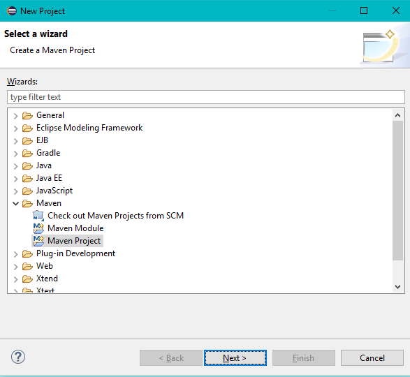
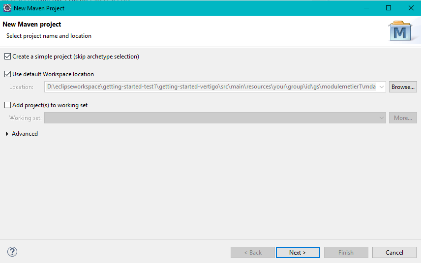
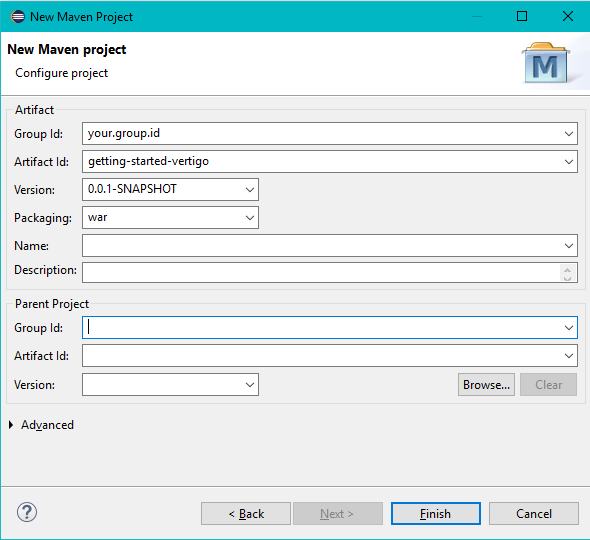
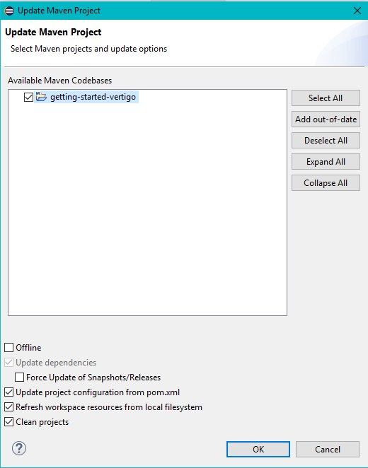
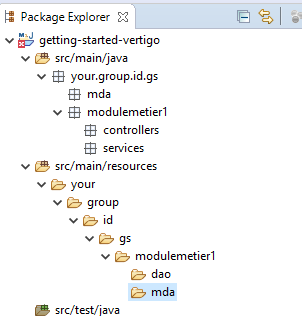
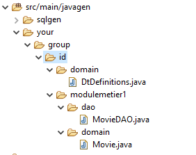
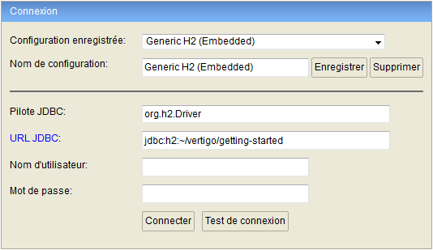
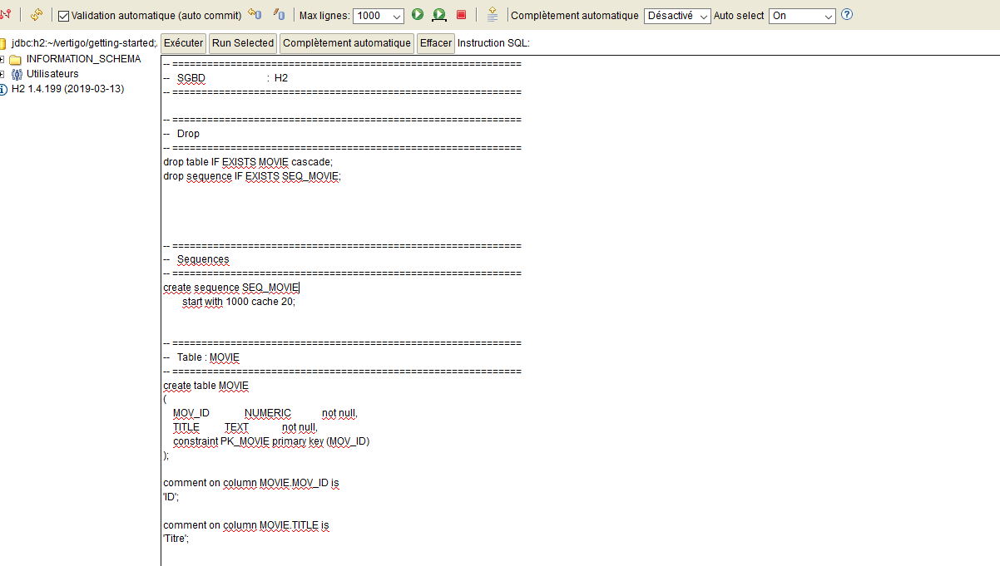

# Complete application (Real world Hello World !)

## Creating the project in the IDE

We will use Eclipse here. At the time of writing this guide, the version used is 2024-06 (or higher).


### 1. Creating the Java project (method 1: without Maven archetype)

Click on __File > New > Project__. In the dialog, choose __Maven > Maven Project__ and click on __Next__.



In the "Select project name and location" screen, check the option _Create a simple project (skip archetype selection)_ and click on __Next__.



In "Configure project", fill in the following fields:
* Group ID: your.group.id (or something more meaningful to you!)
* Artifact ID: getting-started-vertigo
* Packaging: War

Click on __Finish__.



### 2. Configuring the project pom file

Open the __pom.xml__ file at the root of the project.

Add properties to specify the Java version (here 11) as well as the file encoding to use.

Add the following dependencies to the pom.xml file:
* vertigo-ui module (this dependency will pull in all Vertigo modules required for the application)
* vertigo-studio module (this simplifies our task by generating parts of code without added value)
* External dependencies on necessary tools:
   * The `provided` dependency on the servlet 6.0.0 API or higher
   * An H2 database (this is an in-memory database, easy to use for testing purposes)
   * The C3P0 connection pool manager for database connectivity

Add the indication that the directory containing generated files (src/main/javagen) should be part of Eclipse's "Build Path".
	
The pom.xml file should now look like this:

```xml
<project xmlns="http://maven.apache.org/POM/4.0.0" xmlns:xsi="http://www.w3.org/2001/XMLSchema-instance" xsi:schemaLocation="http://maven.apache.org/POM/4.0.0 http://maven.apache.org/xsd/maven-4.0.0.xsd">
	<modelVersion>4.0.0</modelVersion>
	<groupId>your.group.id</groupId>
	<artifactId>getting-started-vertigo</artifactId>
	<version>0.0.1-SNAPSHOT</version>
	<packaging>war</packaging>
	
	<properties>
		<maven.compiler.source>11</maven.compiler.source>
		<maven.compiler.target>11</maven.compiler.target>
		<project.build.sourceEncoding>UTF-8</project.build.sourceEncoding>
	</properties>
	
	<dependencies>
		<dependency>
			<groupId>jakarta.servlet</groupId>
			<artifactId>jakarta.servlet-api</artifactId>
			<version>6.0.0</version>
			<scope>provided</scope>
		</dependency>
		<dependency>
			<groupId>io.vertigo</groupId>
			<artifactId>vertigo-ui</artifactId>
			<version>4.3.2</version>
		</dependency>
		<dependency>
			<groupId>io.vertigo</groupId>
			<artifactId>vertigo-studio</artifactId>
			<version>4.3.2</version>
		</dependency>
		<dependency>
			<groupId>com.h2database</groupId>
			<artifactId>h2</artifactId>
			<version>1.4.200</version>
		</dependency>
		<dependency>
			<groupId>com.mchange</groupId>
			<artifactId>c3p0</artifactId>
			<version>0.9.5.5</version>
		</dependency>
	</dependencies>
	
	
	
	<build>
		<plugins>
			<plugin>
				<groupId>org.codehaus.mojo</groupId>
				<artifactId>build-helper-maven-plugin</artifactId>
				<executions>
					<execution>
						<phase>generate-sources</phase>
						<goals>
							<goal>add-source</goal>
						</goals>
						<configuration>
							<sources>
								<source>src/main/javagen</source>
							</sources>
						</configuration>
					</execution>
				</executions>
			</plugin>
		</plugins>
	</build>
	
</project>
```

Once the pom.xml file is complete, right-click on the getting-started-vertigo project then on __Maven > Update Project__.
In the dialog, verify the following items are checked:
* Update project configuration from pom.xml
* Refresh workspace resources from local filesystem
* Clean projects

Click on __OK__.



### 3. Creating the project structure

Create the following package and directory tree:



## Modeling phase

Here we will create the description of the application's business entities. This description will be used by the _vertigo-studio_ tool to create the corresponding Java classes as well as the data access classes.

### 1. Create a __modele.ksp__ file in the __/src/main/resources/your/group/id/gs/modulemetier1/mda__ directory

In this file, insert the following elements:

```json
package your.group.id.gs.modulemetier1.domain 

/* Domaines représentant les types de données utilisables dans les entités */
create Domain DoId {
	dataType: Long
	storeType: "NUMERIC"
}

create Domain DoLabel {
	dataType:String
	storeType: "TEXT"
}

/* Description d'une entité métier représentant un film et son titre */
create DtDefinition DtMovie {
	id movId {domain: DoId label: "ID"}
	field title {domain: DoLabel label: "Titre" cardinality: "1"  }
}
```

### 2. Create an __application.kpr__ file in the __src/main/resources/your/group/id/gs/modulemetier1/__ directory

This file contains the following line, indicating that the file to use for class generation is the ksp file created above

```json
mda/modele.ksp
```

### 3. Create a __studio-config.yaml__ configuration file at the root of the project

```yaml
resources: 
  - { type: kpr, path: src/main/resources/your/group/id/gs/modulemetier1/application.kpr}
mdaConfig:
  projectPackageName: your.group.id.gs
  targetGenDir : src/main/
  properties: 
    vertigo.domain.java: true
    vertigo.domain.java.generateDtResources: false
    vertigo.domain.sql: true
    vertigo.domain.sql.targetSubDir: javagen/sqlgen
    vertigo.domain.sql.baseCible: H2
    vertigo.domain.sql.generateDrop: true
    vertigo.domain.sql.generateMasterData: true
    vertigo.task: true
```


### 4. Create a class named __Studio__ in the package __your/group/id/gs/mda/__

This class contains all the instructions needed to generate the Java classes and DAOs corresponding to the business entities from the KSP files pointed to by the KPR file.

Copy the following code into the Studio class:

```java
package your.group.id.gs.mda;

import java.net.MalformedURLException;
import java.nio.file.Paths;

import io.vertigo.core.lang.WrappedException;
import io.vertigo.studio.tools.VertigoStudioMda;

public class Studio {

	public static void main(final String[] args) {
		try {
			VertigoStudioMda.main(new String[] { "generate", Paths.get("studio-config.yaml").toUri().toURL().toExternalForm() });
		} catch (final MalformedURLException e) {
			throw WrappedException.wrap(e);
		}
	}
}

```

> Note: if necessary, adapt the code to match your package name

Save, right-click on the __Studio.java__ file then on __Run as > Java Application__.

File generation is launched and the generated entities appear in the __src/main/javagen/your/group/id__ directory.

__Note__: In Eclipse, you need to refresh the project's file list to see them appear (Right-click on project > Refresh).

These elements are now usable for creating services and then screens.



### 5. Creating the example database

Here we will create the database structure corresponding to the model created previously.

To do this:
* Download the H2 executable: [here](https://repo1.maven.org/maven2/com/h2database/h2/1.4.200/h2-1.4.200.jar)
* Double-click on the downloaded jar
* Fill in "JDBC URL" as follows:
    * `jdbc:h2:~/vertigo/getting-started`
* Leave the "User Name" field empty
* Click on __Connect__



* Copy / Paste the database creation SQL script (_src/main/javagen/sqlgen/crebas.sql_) into the query window
* Click on __Run__, the database structure is now created



* Click on the __Disconnect__ button


### 6. Configuring the application

Configuring our application will be done in three steps:

- Create our Java class describing our SmartTypes
- Declare our business module by creating its manifest class
- Create our application's configuration file that will use vertigo modules as well as our business module

To create our SmartTypes, simply create an enum __GsSmartTypes__ in the package __your.group.id.gs__ with the following content:

```java
package your.group.id.gs;

import io.vertigo.datamodel.smarttype.annotations.Formatter;
import io.vertigo.datamodel.smarttype.annotations.SmartTypeDefinition;
import io.vertigo.datamodel.smarttype.annotations.SmartTypeProperty;
import io.vertigo.basics.formatter.FormatterDefault;

public enum GsSmartTypes {

    @SmartTypeDefinition(Long.class)
    @Formatter(clazz = FormatterDefault.class)
    @SmartTypeProperty(property = "storeType", value = "NUMERIC")
    Id,

    @SmartTypeDefinition(String.class)
    @Formatter(clazz = FormatterDefault.class)
    @SmartTypeProperty(property = "storeType", value = "TEXT")
    Label;

}

```


To declare our business module, simply create the class __ModuleMetier1Features__ with the following content at the root of our business module's package: __your.group.id.gs.modulemetier1__
To simplify configuration we will use automatic component discovery from a root package using the `ModuleDiscoveryFeatures` class


```java
package your.group.id.gs.modulemetier1;

import io.vertigo.datamodel.impl.smarttype.ModelDefinitionProvider;
import io.vertigo.core.node.config.DefinitionProviderConfig;
import io.vertigo.core.node.config.discovery.ModuleDiscoveryFeatures;

public class ModuleMetier1Features extends ModuleDiscoveryFeatures<ModuleMetier1Features> { // we extend ModuleDiscoveryFeatures to enable automatic discovery

    public ModuleMetier1Features() {
        super("ModuleMetier1"); // We give a meaningful name to our business module
    }

    @Override
    protected void buildFeatures() {
        super.buildFeatures(); // automatic discovery of all components
        getModuleConfigBuilder()
                .addDefinitionProvider(DefinitionProviderConfig.builder(ModelDefinitionProvider.class)
                        .addDefinitionResource("smarttypes", "your.group.id.gs.GsSmartTypes")
                        .addDefinitionResource("dtobjects", "your.group.id.gs.domain.DtDefinitions") // loading our data model

                        .build());

    }

    @Override
    protected String getPackageRoot() {
        return this.getClass().getPackage().getName(); // we use the manifest class location as the module root
    }

}

```


To create the application configuration file, create a `getting-started.yaml` file in the __src/main/resources/your/group/id/gs/__ folder with the following content:

```yaml
---
boot:
  params:
    locales: fr_FR
  plugins:
    - io.vertigo.core.plugins.resource.classpath.ClassPathResourceResolverPlugin: {}
modules:
  io.vertigo.commons.CommonsFeatures: # utilisation du module vertigo-commons
    features:
      - script:
    featuresConfig:
      - script.janino:
  io.vertigo.database.DatabaseFeatures: # utilisation du module vertigo-database pour pouvoir utiliser une base de données
    features:
      - sql: # nous activons le support des bases de données SQL
    featuresConfig:
      - sql.c3p0: # nous utilisons ici le pool de connection C3P0 pour récuperer les connections à la base
          dataBaseClass: io.vertigo.database.impl.sql.vendor.h2.H2DataBase
          jdbcDriver: org.h2.Driver
          jdbcUrl: jdbc:h2:~/vertigo/getting-started
  io.vertigo.datamodel.DataModelFeatures:
  io.vertigo.vega.VegaFeatures: # utilisation du module web services
  io.vertigo.datafactory.DataFactoryFeatures: # utilisation du module collections
  io.vertigo.datastore.DataStoreFeatures: # utilisation du module vertigo-datastore
    features:
	  - entitystore: # activation du support du stockage des entités de notre modèle
	  - cache: # activation du cache
      - kvStore: # activation du support du stockage clé/valeur (utilisé pour la conservation des état de écrans)
    featuresConfig:
	  - entitystore.sql: # nous utilisons un store de type SQL (avec notre base H2)
	  - cache.memory: # nous utilisons une implémentation mémoire du cache
      - kvStore.berkeley:  # nous utilisons un stockage clé valeur avec la base de donnée BerkeleyDB
          collections: VViewContext;TTL=43200
          dbFilePath: ${java.io.tmpdir}/vertigo-ui/VViewContext
  

  your.group.id.gs.modulemetier1.ModuleMetier1Features: # utilisation de notre module métier

```


## Creating a first business service

In this section, we will create the elements (services using data access classes) that will allow us to create our first screen.

The goal is to provide a screen for saving a movie with its title to the database, then a screen for viewing the list of movies in the database.

### 1. Creating a business service

The business service provides high-level features related to a given business concept. In this guide, these are simple entity save and read functions (here a "movie").

This service will include the following functions:
* Retrieving the list of all movies
* Retrieving a movie
* Saving a movie

Create a class named `MovieServices` in the package __your.group.id.gs.modulemetier1.services__

Copy / paste the following content into the class:

```java
package your.group.id.gs.modulemetier1.services;

import javax.inject.Inject;

import io.vertigo.commons.transaction.Transactional;
import io.vertigo.core.node.component.Component;
import io.vertigo.datamodel.criteria.Criterions;
import io.vertigo.datamodel.structure.model.DtList;
import io.vertigo.datamodel.structure.model.DtListState;
import io.vertigo.core.lang.Assertion;
import your.group.id.gs.modulemetier1.dao.MovieDAO;
import your.group.id.gs.modulemetier1.domain.Movie;

@Transactional
public class MovieServices implements Component {

    @Inject
    private MovieDAO movieDAO;

    public Movie getMovieById(final Long movId) {
        Assertion.check().isNotNull(movId);
        //--- 
        return movieDAO.get(movId);
    }

    public DtList<Movie> getAllMovies() {
        return movieDAO.findAll(Criterions.alwaysTrue(), DtListState.of(100));
    }

    public Movie save(final Movie movie) {
        Assertion.check().isNotNull(movie);
        //---
        return movieDAO.save(movie);
    }
}
```

Notes:
* The class implements the `Component` interface, which identifies components in a Vertigo application
* The @Transactional annotation manages the transactional nature (database...) of the services we implement.
* The @Inject annotation enables dependency injection; here we inject the `MovieDAO` component, which handles data access for the `Movie` entity.

## Creating the first screens

### 1. Creating the movie detail screen

#### Creating the controller

Create a class `MovieDetailController` in the package __your.group.id.gs.modulemetier1.controllers__

Copy / paste the following code into the class:

```java
package your.group.id.gs.modulemetier1.controllers;

import javax.inject.Inject;

import org.springframework.stereotype.Controller;
import org.springframework.web.bind.annotation.GetMapping;
import org.springframework.web.bind.annotation.PathVariable;
import org.springframework.web.bind.annotation.PostMapping;
import org.springframework.web.bind.annotation.RequestMapping;

import io.vertigo.ui.core.ViewContext;
import io.vertigo.ui.core.ViewContextKey;
import io.vertigo.ui.impl.springmvc.argumentresolvers.ViewAttribute;
import io.vertigo.ui.impl.springmvc.controller.AbstractVSpringMvcController;
import your.group.id.gs.modulemetier1.services.MovieServices;
import your.group.id.gs.modulemetier1.domain.Movie;

@Controller
@RequestMapping("/movie")
public class MovieDetailController extends AbstractVSpringMvcController {

	private static final ViewContextKey<Movie> movieKey = ViewContextKey.of("movie");

	@Inject
	private MovieServices movieServices;

	@GetMapping("/{movId}")
	public void initContext(final ViewContext viewContext, @PathVariable("movId") final Long movId) {
		viewContext.publishDto(movieKey, movieServices.getMovieById(movId));
		toModeReadOnly();
	}

	@GetMapping("/new")
	public void initContext(final ViewContext viewContext) {
		viewContext.publishDto(movieKey, new Movie());
		toModeCreate();
	}

	@PostMapping("/_edit")
	public void doEdit() {
		toModeEdit();
	}

	@PostMapping("/_save")
	public String doSave(@ViewAttribute("movie") final Movie movie) {
		movieServices.save(movie);
		return "redirect:/movie/" + movie.getMovId();
	}

}
```

> Note: vertigo-ui controllers use the SpringMVC module enhanced by Vertigo (the class extends AbstractVSpringMvcController).

#### Creating the view

The view is made of an HTML file referencing the elements served by the controller class.

Add a __movieDetail.html__ file in the __src/main/webapp/WEB-INF/views/modulemetier1__ folder

> To simplify the developer's life, we recommend a mapping of 1 view = 1 controller
> In this same spirit of simplification, the link between a view and a controller is done by naming convention following the CoC pattern (Convention Over Configuration)
> The linking strategy is as follows: a controller `your.group.id.gs.modulemetier.controllers.NomController` will be linked to the view `/modulemetier/nom.html` and a controller `your.group.id.gs.modulemetier.controllers.subpackage.NomController` to the view `/modulemetier/subpackage/nom.html`

In this file, copy / paste the following code:

```html
<!DOCTYPE html>
<html
	xmlns:th="http://www.thymeleaf.org" 
	xmlns:vu="http://www.morphbit.com/thymeleaf/component">
	<head>
		<vu:head-meta/>
		<meta charset="utf-8"/>
		<meta http-equiv="X-UA-Compatible" content="IE=edge"/>
		<meta name="viewport" content="width=device-width, initial-scale=1.0"/>
		<title>Movie detail</title>
	</head>
	
	<body class="mat desktop no-touch platform-mat">
		<vu:page>
			<div id="page" v-cloak>
				<vu:form>
					<div>
						<vu:button-link th:if="${model.modeEdit}"  url="@{/movie/} + ${model.movie.movId}" :round size="lg" color="primary" icon="fas fa-ban" :flat ariaLabel="Cancel"   />
						<vu:button-submit th:if="${model.modeReadOnly}" action="@{_edit}" :round size="lg" color="primary" icon="edit" ariaLabel="Edit" />
					</div>
					<div>
						<vu:block title="Détail du film">
								<vu:text-field-read object="movie" field="movId" />
								<vu:text-field object="movie" field="title" />
						</vu:block>
						<div>
							<vu:button-submit th:if="${!model.modeReadOnly}"   icon="save" label="Save" action="@{_save}" size="lg" color="primary" />
							<vu:button-link th:if="${model.modeReadOnly}" url="@{/movies/}" label="Go to movies" size="lg" color="secondary" />
						</div>
					</div>
				</vu:form>
			</div>
		</vu:page>
	</body>
</html>
```


### 2. Creating the movie list screen

#### Creating the controller

Create a class `MovieListController` in the package __your.group.id.gs.modulemetier1.controllers__

Copy / paste the following code into the class:

```java
package your.group.id.gs.modulemetier1.controllers;

import javax.inject.Inject;

import org.springframework.stereotype.Controller;
import org.springframework.web.bind.annotation.GetMapping;
import org.springframework.web.bind.annotation.RequestMapping;

import io.vertigo.ui.core.ViewContext;
import io.vertigo.ui.core.ViewContextKey;
import io.vertigo.ui.impl.springmvc.controller.AbstractVSpringMvcController;
import your.group.id.gs.modulemetier1.domain.Movie;
import your.group.id.gs.modulemetier1.services.MovieServices;

@Controller
@RequestMapping("/movies")
public class MovieListController extends AbstractVSpringMvcController {

	private static final ViewContextKey<Movie> moviesKey = ViewContextKey.of("movies");

	@Inject
	private MovieServices movieServices;

	@GetMapping("/")
	public void initContext(final ViewContext viewContext) {
		viewContext.publishDtList(moviesKey, movieServices.getAllMovies());
		toModeReadOnly();
	}

}
```

> Note: vertigo-ui controllers use the SpringMVC module enhanced by Vertigo (the class extends AbstractVSpringMvcController).

#### Creating the view

Add a __movieList.html__ file in the __src/main/webapp/WEB-INF/views/modulemetier1__ folder

In this file, copy / paste the following code:

```html
<!DOCTYPE html>
<html
	xmlns:th="http://www.thymeleaf.org" 
	xmlns:vu="http://www.morphbit.com/thymeleaf/component">
	<head>
		<vu:head-meta/>
		<meta charset="utf-8"/>
		<meta http-equiv="X-UA-Compatible" content="IE=edge"/>
		<meta name="viewport" content="width=device-width, initial-scale=1.0"/>
		<title>Movie List</title>
	</head>
	
	<body class="mat desktop no-touch platform-mat">
		<vu:page>
			<div id="page" v-cloak>
				<vu:table list="movies" componentId="moviesList" tr_@click.native="|goTo('@{/movie/}'+props.row.movId)|" tr_style="cursor : pointer;">
						<vu:column field="movId" />
						<vu:column field="title" />
				</vu:table>
				<vu:button-link url="@{/movie/new}" icon="add" round size="lg" color="primary" />
			</div>
		</vu:page>
	</body>
</html>
```


### 3. Configuring SpringMVC

Create the class `GettingStartedVSpringWebConfig` in the project's classpath, for example in the package __your.group.id.gs.boot__

```java
package your.group.id.gs.boot;

import org.springframework.context.annotation.ComponentScan;

import io.vertigo.ui.impl.springmvc.config.VSpringWebConfig;

@ComponentScan({"your.group.id.gs.modulemetier1.controllers" })
public class GettingStartedVSpringWebConfig extends VSpringWebConfig {
	// nothing basic config is enough
	

}
```


Then create the `GettingStartedVSpringWebApplicationInitializer` class in the same package


```java
package your.group.id.gs.boot;

import io.vertigo.ui.impl.springmvc.config.AbstractVSpringMvcWebApplicationInitializer;

public class GettingStartedVSpringWebApplicationInitializer extends AbstractVSpringMvcWebApplicationInitializer {

	@Override
	protected Class<?>[] getServletConfigClasses() {
		return new Class[] { GettingStartedVSpringWebConfig.class };
	}
}

```

> This last class references the previously created class: `GettingStartedVSpringWebConfig`

Create the `web.xml` file for our java web application. It should be located in the __src/main/webapp/WEB-INF__ folder

Copy/Paste the following content:

```xml
<?xml version="1.0" encoding="UTF-8"?>
<web-app version="3.1" xmlns="http://java.sun.com/xml/ns/javaee"
	xmlns:xsi="http://www.w3.org/2001/XMLSchema-instance"
	xsi:schemaLocation="http://java.sun.com/xml/ns/javaee http://java.sun.com/xml/ns/javaee/web-app_3_1.xsd">

	<display-name>Vertigo SpringMVC</display-name>
	<listener>
		<listener-class>io.vertigo.vega.impl.webservice.servlet.AppServletContextListener</listener-class>
	</listener>

	<context-param>
		<param-name>boot.applicationConfiguration</param-name>
		<param-value>/your/group/id/gs/getting-started.yaml</param-value>
	</context-param>

	<filter>
		<filter-name>Character Encoding Filter</filter-name>
		<filter-class>io.vertigo.vega.impl.servlet.filter.SetCharsetEncodingFilter</filter-class>
		<init-param>
			<param-name>charset</param-name>
			<param-value>UTF-8</param-value>
		</init-param>
	</filter>	
	<filter-mapping>
		<filter-name>Character Encoding Filter</filter-name>
		<url-pattern>/*</url-pattern>
	</filter-mapping>
	
	<filter>
		<description>
			Filtre de modification des entétes HTTP pour gérer le cache.
			Désactive le cache navigateur et proxy sur toutes les URLs sauf les /static/*
			Ce filtre ne surcharge pas les headers déjà posés par le serveur, s'il y a déjà un header 'Cache-Control'
		</description>
		<filter-name>client-no-cache</filter-name>
		<filter-class>io.vertigo.vega.impl.servlet.filter.CacheControlFilter</filter-class>
		<init-param>
			<param-name>Cache-Control</param-name>
			<param-value>no-cache</param-value>
		</init-param>
		<init-param>
			<param-name>Pragma</param-name>
			<param-value>no-cache</param-value>
		</init-param>
		<init-param>
			<param-name>Expires</param-name>
			<param-value>-1</param-value>
		</init-param>
		<init-param>
			<param-name>url-exclude-pattern</param-name>
			<param-value>/index.html;/static/*;/vertigo-ui/static/*</param-value>
		</init-param>
	</filter>
	<filter-mapping>
		<filter-name>client-no-cache</filter-name>
		<url-pattern>/*</url-pattern>
	</filter-mapping>

	<filter>
		<description>
			Filtre de modification des entétes HTTP pour gérer le cache.
			Place un cache public (navigateur et proxy) de 24h sur les URLs /static/*
			Pour un site très grand public, voir à placer un cache plus long (15j => 1209600)
		</description>
		<filter-name>client-24h-cache</filter-name>
		<filter-class>io.vertigo.vega.impl.servlet.filter.CacheControlFilter</filter-class>
		<init-param>
			<param-name>Cache-Control</param-name>
			<param-value>max-age=86400, public</param-value>
		</init-param>
		<init-param>
			<param-name>force-override</param-name>
			<param-value>true</param-value>
		</init-param>
	</filter>
	<filter-mapping>
		<filter-name>client-24h-cache</filter-name>
		<url-pattern>/index.html</url-pattern>
		<url-pattern>/static/*</url-pattern>
		<url-pattern>/vertigo-ui/static/*</url-pattern>
	</filter-mapping>
	
	<servlet-mapping>
		<servlet-name>default</servlet-name>
		<url-pattern>/</url-pattern>
		<url-pattern>/index.html</url-pattern>
		<url-pattern>/static/*</url-pattern>
	</servlet-mapping>

	<session-config>
		<session-timeout>60</session-timeout>
	</session-config>

	<mime-mapping>
		<extension>html</extension>
		<mime-type>text/html</mime-type>
	</mime-mapping>
	<mime-mapping>
		<extension>txt</extension>
		<mime-type>text/plain</mime-type>
	</mime-mapping>
	<mime-mapping>
		<extension>css</extension>
		<mime-type>text/css</mime-type>
	</mime-mapping>
	<welcome-file-list>
		<welcome-file>index.html</welcome-file>
	</welcome-file-list>
</web-app>
```


## Starting the application

Install a Tomcat server (version 9.0+) in Eclipse and add our project to it:

To do this:

- Verify the Eclipse workspace encoding (Window -> Preferences -> General -> Workspace and set Text file encoding to UTF-8)
- Download the Tomcat server archive from the official site: https://tomcat.apache.org/download-10.cgi
- Extract the archive to your preferred location. For example __%userprofile%/tomcat__
- In the __Servers__ view of Eclipse click on _No Servers are available. Click this link to create a new server..._
- Select Apache->Tomcat v9.0 Server
- Click on __Next__
- Click on __Browse__ and navigate to the directory where the Tomcat archive was extracted, here __%userprofile%/tomcat__
- Click on __Next__
- Select the _vertigo-getting-started_ project in the left column then click on __Add__ (The project then appears in the right column)
- Click on __Finish__


To start the application, simply start the Tomcat Server you just installed, for example by pressing the _Play_ button

Navigate in a browser to http://localhost:8080/getting-started-vertigo/movies/ and navigate the application!
