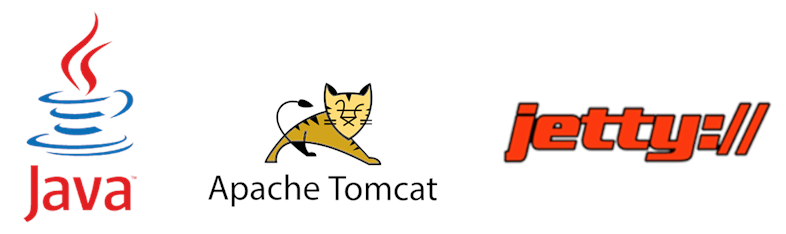
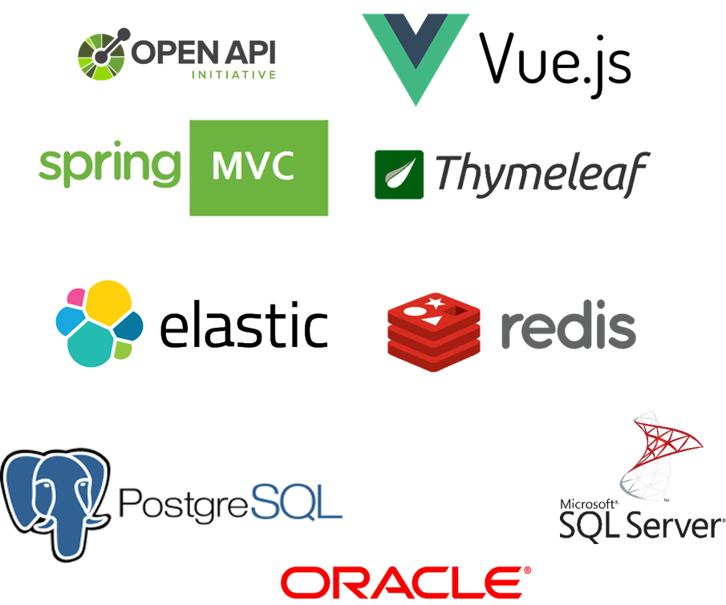
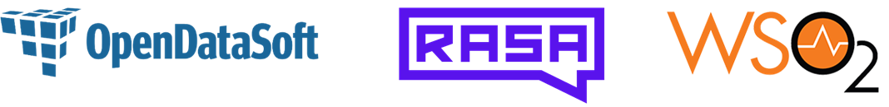

# Technological Ecosystem

Vertigo is a base built on standard infrastructure bricks

It aggregates and binds specialized technologies…

…and allows you to simply extend your applications to complete market tools

 

