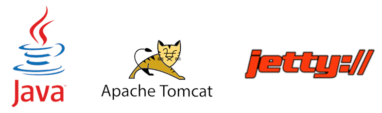
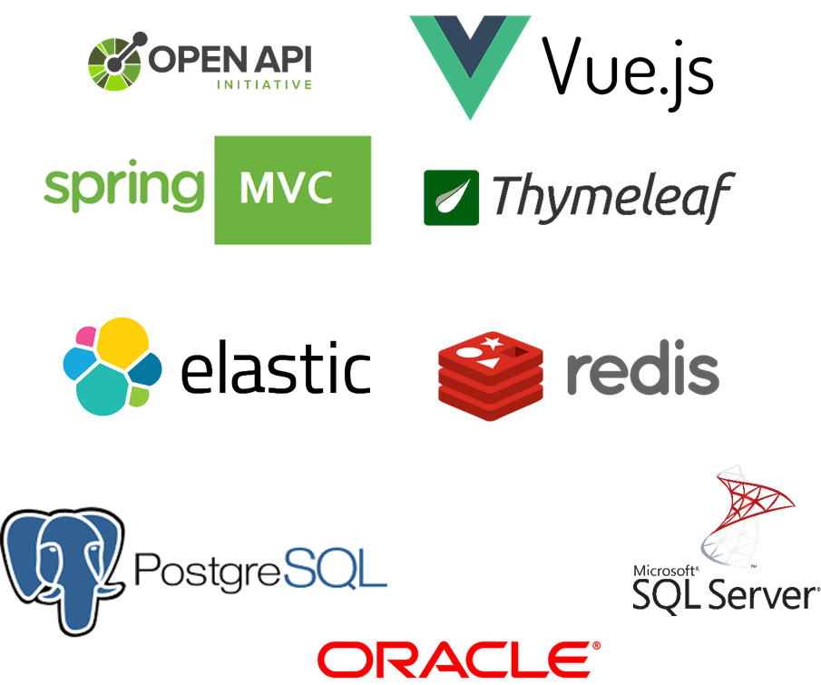

# Technology ecosystem

Vertigo is a foundation built on standard infrastructure components

It aggregates and bridges specialized technologies...

...and enables seamless extension of your applications toward full-featured market tools

