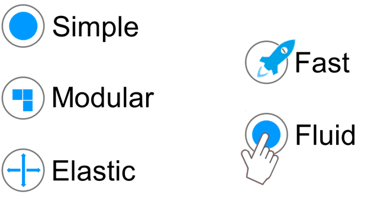
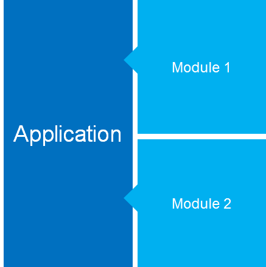
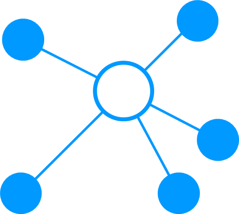

# Objectives
Our goal in building Vertigo is to provide an application framework that is:

- Centered around needs
- Informed by experience
- Consistent, yet flexible
- Simple—making straightforward tasks easy
- Open—allowing for more complex operations

To achieve this, Vertigo adheres to the following design principles.

# Design Principles

# Simple
John Maeda, a design professor at MIT, authored a book titled The Laws of Simplicity, where he outlines principles of simplicity. The final law succinctly captures the essence :

**Simplicity is about subtracting the obvious, and adding the meaningful.**

# Modular
Modularity is a key element in computer systems and forms the foundation of UNIX. As Eric Raymond states in his work Basics of the Unix Philosophy:

**Rule of Modularity : Write simple parts connected by clean interfaces.** 

# Elastic
Elasticity refers to a system’s ability to distribute processing in order to:

- Handle heavy loads
- Confine specific tasks to dedicated servers

# Fast
According to usability expert Jacob Nielsen, there are three critical timeframes for user attention. Our goal is to **build applications that respond instantly**.

- 0.1 seconds provides an instantaneous feeling of response
- 1 second maintains the user’s flow of thought
- 10 seconds is the limit for keeping the user engaged in the dialogue

# Fluid
Because users perceive applications through their interfaces, it’s crucial for the interface to be fluid and ergonomic.
