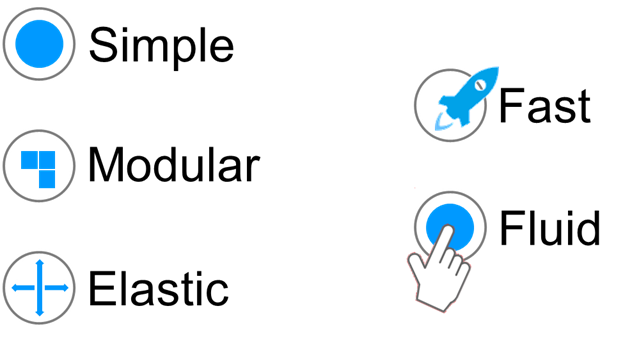
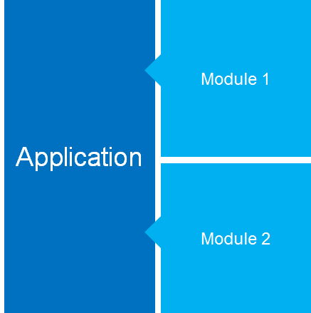
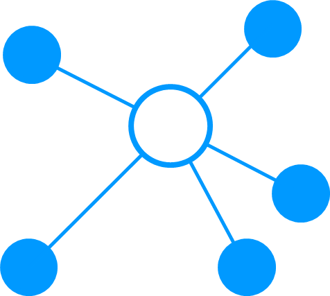

# Objectives

Our goal in building Vertigo is to provide an application foundation that is:

* Needs-driven
* Born from experience
* Consistent, non-uniform
* Simple—simple things must be easy to do
* Open—less simple things must still be possible

To this end, Vertigo follows the guidelines described below.

# Design principles

# Simple
John Maeda, design professor at MIT, wrote a short book titled *The laws of simplicity* outlining the laws of simplicity. The final law synthesizes the preceding ones.

**Simplicity is about subtracting the obvious, and adding the meaningful.**

# Modular
Modularity is a key element of computing systems, foundational to UNIX. As Erich Raymond writes in *Basics of the Unix Philosophy*,

**Rule of Modularity: Write simple parts connected by clean interfaces.**

# Elastic
The ability of the system to distribute processing in order to:

* absorb heavy loads
* confine certain tasks to dedicated servers

# Fast
According to Jacob Nielsen, a leading authority in computing systems ergonomics, here are the three critical delays. Our objective is to **build applications that respond instantaneously**.

* 0.1 seconds gives the feeling of instantaneous response
* 1 second keeps the user's flow of thought seamless.
* 10 seconds is about the limit for keeping the user's attention focused on the dialogue.

# Fluid
Because an application is perceived only through its user interface, that interface must be fluid and ergonomic.
