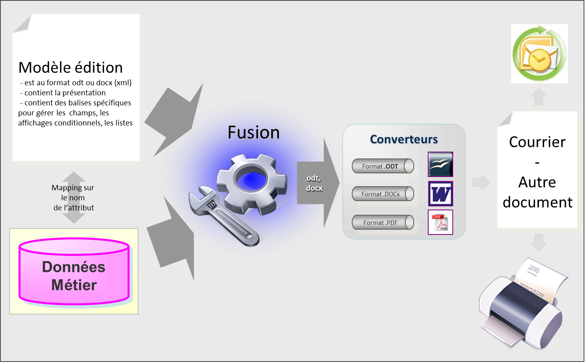
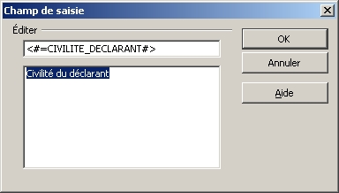
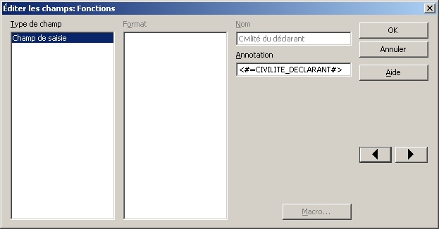
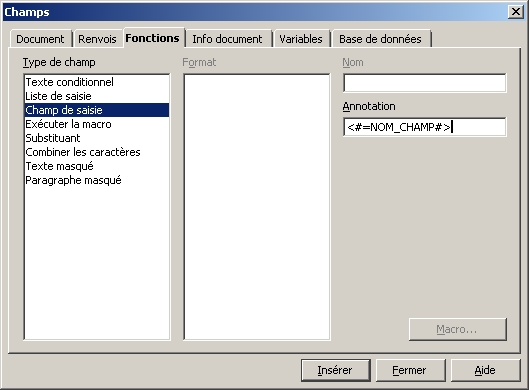
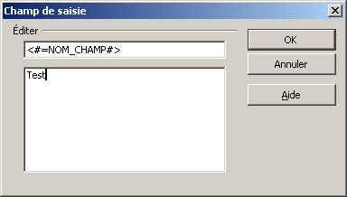
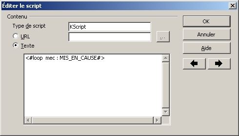

# Quarto

**Quarto** is the **document conversion, export, and publishing** module of the Vertigo platform.

It provides three independent sub-systems:

- **Publisher**: Merges business data into office document templates (ODT, DOCX). Templates are editable from OpenOffice or Microsoft Word.
- **Converter**: Converts documents from one format to another (ODT, DOC, DOCX, RTF, TXT to PDF, …) using OpenOffice (local or remote) or XDocReport.
- **Exporter**: Exports collections of business objects to utility formats: CSV, PDF, RTF, XLS, XLSX, ODS.

## Publisher

### Overview

**Publisher** was designed to:

- Simplify the creation of letter-style documents in office formats: ODT, DOC, PDF
- Give users the ability to modify templates using office software (OpenOffice, Microsoft Word)

Publisher is not designed to:

- Create raw data exports → use the **Exporter** module
- Create standardized reports (Cerfa, …) → use iText or PDFBox
- Create BI reports → use Jasper, Birt, SSRS

### Principles

**Publisher** is based on the principle of **document merging**: it inserts business data into a document serving as a template via a tag grammar (script).

  

!> The document output from the merge is therefore in the same format as the template. This document can be converted to another format using the **Converter** module.

### Creating the template — OpenOffice

Merge fields appear highlighted in gray in the ODT document.



To modify a field: Right-click then Fields, and you get a browser allowing you to edit all fields of the template.



To create a field: **Insert → Fields → Other** (or Ctrl + F2), go to the Functions tab:



Fill in the Annotation field with the name of the field to merge, then click Insert:



To add an "operation" type keyword, use script insertion: **Insert → Script**:



### Creating the template — Microsoft Word 2010

These keywords and functions are inserted into the Word document as fields; there is no difference between merge fields and operations.
These fields can be inserted via the **Insert / QuickPart / Field** command.

Keyboard shortcuts can also be used:

- `Ctrl-F9`: Add a field
- `Alt-F9`: Show/hide field contents

### Installation and setup

* Add quarto dependencies to pom.xml and run mvn install:

```xml
<dependency>
	<groupId>io.vertigo</groupId>
	<artifactId>vertigo-quarto</artifactId>
	<version>${vertigo.version}</version>
</dependency>
```

For using the XDocReportConverterPlugin (DOCX management):
```xml
<dependency>
    <groupId>fr.opensagres.xdocreport</groupId>
    <artifactId>fr.opensagres.xdocreport.converter.docx.xwpf</artifactId>
    <version>2.1.0</version>
</dependency>
```

For using the OpenOfficeLocalConverterPlugin (local ODT management):
```xml
<dependency>
	<groupId>fr.opensagres.xdocreport</groupId>
	<artifactId>fr.opensagres.xdocreport.converter.odt.odfdom</artifactId>
	<version>2.1.0</version>
</dependency>
```

* Define the Java provider that will contain the template definition files:

```xml
<module name="myApp-ressources">
	<definitions>
            <provider class="fr.projet.appli.MyPublisherDefinitionProvider" />
	</definitions>
</module>
```

* Add the module to foundation.xml:

```xml
<module name="vertigo-quarto">
	<component api="PublisherManager" class="io.vertigo.quarto.publisher.impl.PublisherManagerImpl">
		<plugin class="io.vertigo.quarto.plugins.publisher.odt.OpenOfficeMergerPlugin"/>
	</component>
</module>
```

### Template syntax

Two implementations exist: **ODT** (OpenOffice) and **DOCX** (Microsoft Word). The keyword syntax differs slightly:

| Operation | ODT Syntax | DOCX Syntax |
|---|---|---|
| Merge field | `<#=fieldName#>` | `{=fieldName}` |
| Object field | `<#=objectName.fieldName#>` | `{=objectName.fieldName}` |
| Condition | `<#if fieldName#>` … `<#endif#>` | `{if fieldName}` … `{endif}` |
| Inverse condition | `<#ifnot fieldName#>` … `<#endifnot#>` | `{ifnot fieldName}` … `{endifnot}` |
| Code condition | `<#ifequals field = "CODE"#>` … `<#endifequals#>` | `{ifequals field = "CODE"}` … `{endifequals}` |
| Inverse code condition | `<#ifnotequals field = "CODE"#>` … `<#endifnotequals#>` | `{ifnotequals field = "CODE"}` … `{endifnotequals}` |
| Loop merge field | `<#loop myVariable : collectionName#>`<br/>`  <#=fieldName #>`<br/>`<#endloop#>` | `{loop myVariable : collectionName}`<br/>`  {=fieldName}`<br/>`{endloop}` |
| Single object traversal 	| `<#var myVariable : objectName#>`<br/>`  <#=fieldName #>`<br/>`<#endvar#>` | *Not implemented* |
| Image | `<#image imageName#>` | Not implemented |

### Under OpenOffice

Merge fields appear highlighted in gray. To create a field: **Insert → Fields → Other** (Ctrl+F2) → Functions tab → fill the Annotation field.

For operational tags (if, loop, …): **Insert → Script**.

For images: place an image in the template. This image will define the maximum size of the image to be merged. The aspect ratio of the merged image will be preserved.
Then name the image: Right-click on image -> Properties -> Options -> Fill Name: `<#image IMAGE_FIELD_NAME>`

### Under Microsoft Word

Fields are inserted via **Insert → QuickPart → Field** (`Ctrl+F9`), display with `Alt+F9`.

### Dictionary definition

Template fields must correspond to a dictionary of words provided by the system. This dictionary is called PublisherDefinition.
A PublisherDefinition is made of a root PublisherNode.

A PublisherNode is made of fields and is reusable, for example in other PublisherDefinitions.
Fields can be of 5 types:

| Syntax | Description | Example |
| --- 					| --- | --- |
| stringField | String type field | `stringField name {}` |
| booleanField | Boolean type field | `booleanField isSerious {}`  |
| dataField 			| PublisherNode type field | `dataField sender { type : PnPerson }` |
| listField 			| PublisherNode list type field | `listField recipients { type : PnPerson }` |
| imageField 			| Image type field (must be a VFile) | `imageField logo` |

#### Definition example

```java
public final class MyPublisherDefinitionProvider implements SimpleDefinitionProvider {

    private static PublisherDataDefinition createTestEnquete() {
        final PublisherNodeDefinition city = new PublisherNodeDefinitionBuilder()
                .addStringField("name")
                .addStringField("postalCode")
                .build();

        final PublisherNodeDefinition address = new PublisherNodeDefinitionBuilder()
                .addStringField("street")
                .addNodeField("city", city)
                .build();

        final PublisherNodeDefinition investigator = new PublisherNodeDefinitionBuilder()
                .addStringField("lastName")
                .addStringField("firstName")
                .addNodeField("affiliationAddress", address)
                .build();

        final PublisherNodeDefinition suspect = new PublisherNodeDefinitionBuilder()
                .addBooleanField("isMale")
                .addStringField("lastName")
                .addStringField("firstName")
                .addListField("knownAddresses", address)
                .build();

        final PublisherNodeDefinition publisherNodeDefinition = new PublisherNodeDefinitionBuilder()
                .addBooleanField("investigationCompleted")
                .addStringField("investigationCode")
                .addNodeField("investigator", investigator)
                .addListField("suspects", suspect)
                .addStringField("fact")
                .addBooleanField("isSerious")
                .build();

        return new PublisherDataDefinition("PuEnquete", publisherNodeDefinition);
    }

    @Override
    public List<Definition> provideDefinitions(final DefinitionSpace definitionSpace) {
        return new ListBuilder<Definition>()
                .add(createTestEnquete())
                .build();
    }
}
```

### Usage

The simplest use case follows these steps:

1. Retrieve data
2. Create a PublisherData corresponding to the template
3. Populate PublisherData from database data
4. Retrieve the document Model
5. Create the document from the template and data
6. Save the resulting document

Here is the resulting code:

```java
public void testMergerSimple() {
    final MyData myData = loadMyData();
    final PublisherData publisherData = createPublisherData("PuMyPublish");
    PublisherDataUtil.populateData(myData, publisherData.getRootNode());
    final URL modelFileURL = resourceManager.resolve(DATA_PACKAGE + "MyModel.odt");
    final VFile result = publisherManager.publish(OUTPUT_PATH + "MyPublish.odt", modelFileURL, publisherData);
    // Don't forget to save the file (it's a temporary file that will be purged)
    save(result);
}

private static PublisherData createPublisherData(final String definitionName) {
    final PublisherDataDefinition publisherDataDefinition = Node.getNode().getDefinitionSpace().resolve(definitionName, PublisherDataDefinition.class);
    Assert.assertNotNull(publisherDataDefinition);
    final PublisherData publisherData = new PublisherData(publisherDataDefinition);
    Assert.assertNotNull(publisherData);
    return publisherData;
}
```

## Converter

The **Converter** allows converting a document from one format to another.

### Available plugins

| Plugin | Activated by | Description |
|---|---|---|
| `OpenOfficeLocalConverterPlugin` | `converter.localOpenOffice` | Conversion via locally installed OpenOffice |
| `OpenOfficeRemoteConverterPlugin` | `converter.remoteOpenOffice` | Conversion via remote OpenOffice server |
| `XDocReportConverterPlugin` | `converter.xDocReport` | Conversion via XDocReport (supported formats: DOC, DOCX, ODT, RTF, TXT to PDF) |

`MimeTypesFileTypeDetector` automatically detects the file type from the MIME type.

## Exporter

The **Exporter** exports collections (`DtList`) or business objects to tabular or document formats: CSV, PDF, RTF, XLS, XLSX, ODS.

### Available plugins

| Plugin | Activated by | Format |
|---|---|---|
| `CSVExporterPlugin` / `CSVExporter` | `exporter.csv` | CSV |
| `PDFExporterPlugin` / `PDFExporter` | `exporter.pdf` | PDF (via iText) |
| `RTFExporterPlugin` / `RTFExporter` | `exporter.rtf` | RTF |
| `XLSExporterPlugin` | `exporter.xls` | XLS (@Deprecated) |
| `XLSXExporterPlugin` | `exporter.xlsx` | XLSX |
| `ODSExporterPlugin` | `exporter.ods` | ODS |

### Export model

```java
final List<ExportField> fields = List.of(
    new ExportField(artId, LocaleMessageText.of("ID")),
    new ExportField(title, LocaleMessageText.of("Title")),
    new ExportField(quantity, LocaleMessageText.of("Quantity"))
);

final ExportSheet sheet = new ExportSheet(
    "Catalogue",
    fields,
    null,
    articlesDtList
);

final Export export = new Export(
    ExportFormat.CSV,
    "articles.csv",
    "Articles export",
    "MyApp",
    Export.Orientation.Portrait,
    List.of(sheet)
);

final VFile result = exporterManager.createExportFile(export);
```

The `Export` object can contain multiple `ExportSheet`s. Each column is an `ExportField` (or `ExportDenormField`, `ExportCustomField`).

## For Experts

### Managers

| Manager | Role | Activated by |
|---|---|---|
| `ConverterManager` | Document format conversion | `converter` |
| `ExporterManager` | Data export to tabular files/documents | `exporter` |
| `PublisherManager` | Data merging into document templates | `publisher` |

### Converter Plugins

| Plugin | Usage |
|---|---|
| `OpenOfficeLocalConverterPlugin` | Conversion via local OpenOffice |
| `OpenOfficeRemoteConverterPlugin` | Conversion via remote OpenOffice server |
| `XDocReportConverterPlugin` | Conversion via XDocReport (`ConverterFormat` enum) |

### Exporter Plugins

| Plugin | Format |
|---|---|
| `CSVExporterPlugin` / `CSVExporter` | CSV |
| `PDFExporterPlugin` / `PDFExporter` / `PDFAdvancedPageNumberEvents` / `AbstractExporterIText` | PDF (iText) |
| `RTFExporterPlugin` / `RTFExporter` | RTF |
| `XLSExporterPlugin` | XLS (@Deprecated) |
| `XLSXExporterPlugin` | XLSX |
| `ODSExporterPlugin` | ODS |

### Publisher Plugins

| Plugin | Formats | Associated classes |
|---|---|---|
| `OpenOfficeMergerPlugin` | ODT | `ODTCleanerProcessor`, `ODTImageProcessor`, `ODTUtil`, `ODTValueEncoder` |
| `DOCXMergerPlugin` | DOCX | `DOCXCleanerProcessor`, `DOCXUtil`, `DOCXValueEncoder` |

### Publisher Model

| Class | Description |
|---|---|
| `PublisherData` | Data to merge, linked to a `PublisherDataDefinition` |
| `PublisherNode` | Node containing typed fields |
| `PublisherDataDefinition` | Named definition of a publishing schema |
| `PublisherNodeDefinition` / `PublisherNodeDefinitionBuilder` | Node definition |
| `PublisherField` / `PublisherFieldType` (enum) | Node field |

### Publisher Script Engine (Merger)

| Class | Role |
|---|---|
| `ScriptContext` | Script execution context |
| `ScriptGrammar` | Tag grammar |
| `ScriptHandlerImpl` | Main merger engine |
| `ScriptTag` / `ScriptTagContent` / `ScriptTagDefinition` | Tag representation |
| `AbstractScriptTag` | Base tag implementation |
| `ScriptGrammarUtil` | Grammar utilities |

#### Grammar tags

| Tag | Class | Description |
|---|---|---|
| `<#loop … #>` | `TagFor` | Loop over a collection |
| `<#var … #>` | `TagObject` | Object traversal |
| `<#if … #>` | `TagIf` | Boolean condition |
| `<#ifequals … #>` | `TagIfEquals` | Code condition |
| `<#ifnot … #>` | `TagIfNot` | Inverse condition |
| `<#ifnotequals … #>` | `TagIfNotEquals` | Inverse code condition |
| `<#=field#>` | `TagEncodedField` | Merge field |
| `<#block#>` | `TagBlock` | Tag block |

#### Processors

| Processor | Role |
|---|---|
| `MergerProcessor` | Merge pipeline orchestration |
| `MergerScriptEvaluatorProcessor` | Script/tag evaluation |
| `GrammarEvaluatorProcessor` | Grammar evaluation |
| `GrammarXMLBalancerProcessor` | XML tag balancing |
| `ParserXMLHandler` | Document XML parsing |
| `ProcessorXMLUtil` / `TagXML` / `ZipUtil` | Processing utilities |

### Exporter Model

| Class | Description |
|---|---|
| `Export` (record) / `ExportBuilder` | Export description (format, name, title, author, orientation, sheets) |
| `ExportFormat` (enum) | Output formats: CSV, PDF, RTF, XLS, XLSX, ODS |
| `ExportSheet` | Export sheet (title, columns, data) |
| `ExportField` / `ExportDenormField` / `ExportCustomField` | Export columns |
| `ExportHelper` | Export construction utilities |
| `ExporterUtil` | General exporter utilities |

### Converter Model

| Class | Description |
|---|---|
| `ConverterPlugin` | Conversion plugins interface |
| `MimeTypesFileTypeDetector` | File type detection by MIME |

### Features (@Feature)

| Flag | Components |
|---|---|
| `converter` | `ConverterManager` |
| `converter.localOpenOffice` | `OpenOfficeLocalConverterPlugin` |
| `converter.remoteOpenOffice` | `OpenOfficeRemoteConverterPlugin` |
| `converter.xDocReport` | `XDocReportConverterPlugin` |
| `exporter` | `ExporterManager` |
| `exporter.csv` | `CSVExporterPlugin` |
| `exporter.pdf` | `PDFExporterPlugin` |
| `exporter.rtf` | `RTFExporterPlugin` |
| `exporter.xls` | `XLSExporterPlugin` (@Deprecated) |
| `exporter.xlsx` | `XLSXExporterPlugin` |
| `exporter.ods` | `ODSExporterPlugin` |
| `publisher` | `PublisherManager` |
| `publisher.odt` | `OpenOfficeMergerPlugin` |
| `publisher.docx` | `DOCXMergerPlugin` |

### Configuration YAML

```yaml
modules:
   io.vertigo.quarto.QuartoFeatures:
       features:
           - converter:
           - exporter:
           - publisher:
       featuresConfig:
           - converter.localOpenOffice:
                 unoport: 2002
                 convertTimeoutSeconds: 30
           - exporter.csv:
                 charset: "UTF-8"
           - exporter.pdf:
           - publisher.odt:
           - publisher.docx:
```