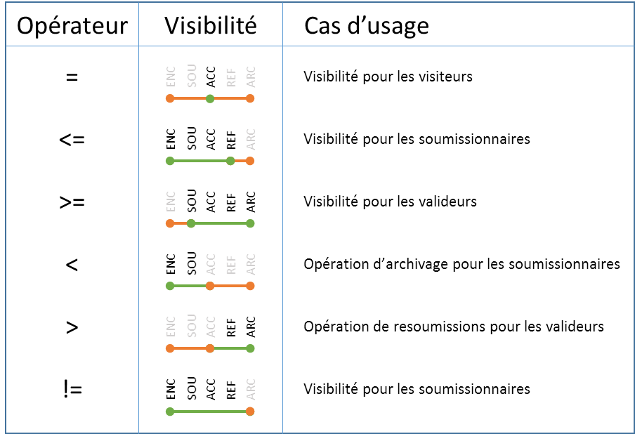

# Account

Le module **Account** de Vertigo permet la gestion simplifiée des comptes utilisateurs. 
Ce module permet avant tout la mise à disposition des autres modules de la notion transverse de compte utilisateur. Ceci permet à Vertigo de proposer des extensions comme **"notifications"** ou **"commentaires"**. 

Ce module propose des fonctionnalités de gestion des utilisateurs réparties sur trois axes orthogonaux :
- **Authentication** : Gestion de l'authentification
- **Authorization** : Gestion des autorisations
- **Identity Provider** : Connexion avec des fournisseurs d'identité
 

## Configuration

Afin d'utiliser les fonctionnalités de **Account** il est nécessaire d'ajouter ce module à la configuration de l'application.
Pour plus de détails, vous pouvez vous rapporter au chapitre dédié à la [configuration](/basic/configuration) de l'application.


Voici une configuration typique d'une application utilisant le module Account.

```yaml

modules:
  io.vertigo.account.AccountFeatures:
    features:
      - security:
          userSessionClassName: io.gestionprojet.commons.GestionProjetUserSession
      - account:
      - authentication:
      - authorization:
    featuresConfig:
      - account.store.store:
          userIdentityEntity: DtPerson
          groupIdentityEntity: DtGroups
          userAuthField: email
          photoFileInfo: FiFileInfoStd
          userToAccountMapping: 'id:personId, displayName:lastName, email:email, authToken:email, photo: picturefileId'
          groupToGroupAccountMapping: 'id:groupId, displayName:name'
      - authentication.text:
          filePath: /initdata/userAccounts.txt
```


### Features disponibles :
- **security** : Active le module, et le premier niveau de sécurité (authentifié ou non)
  - userSessionClassName : Nom de la classe de la session applicative 
- **account** : Active les fonctionnalités autour de la notion de compte utilisateur
- **authentication** : Active les fonctionnalités d'authentification
- **authorization** : Active les fonctionnalités liées aux autorisations
- **identityProvider** : Active les fonctionnalités de fournisseur d'identité

### Paramètres des Features 

#### Account
- **account.store.store** : Stockage des *Account* par le *StoreManager*
  - userIdentityEntity : Nom de l'entité portant les *Account*
  - groupIdentityEntity : Nom de l'entité portant les groupes d'*Account* (doit être reliée à `userIdentityEntity` par une association simple ou N-N ; cette association est recherchée au boot et son absence empêche le démarrage)
  - userAuthField : Nom du champ relié à l'authentification *(authToken)*
  - photoFileInfo *(optional)* : Nom du *FileInfo* utilisé pour le stockage des photos
  - userToAccountMapping : Mapping des champs de l'entité vers *Account*
  - groupToGroupAccountMapping : Mapping des champs de l'entité Groupe vers *AccountGroup*
- **account.store.text** : Stockage des *Account* par un fichier texte
  - accountFilePath : Chemin du fichier des *Account* 
  - accountFilePattern : RegExp de lecture du fichier (avec des **groupes de capture** [nommés](https://stackoverflow.com/a/415635/2273508) : id, displayName, email, authToken, photoUrl)
  - groupFilePath : Chemin du fichier des *AccountGroup* 
  - groupFilePattern :  RegExp de lecture du fichier (avec des **groupes de capture** [nommés](https://stackoverflow.com/a/415635/2273508) : id, displayName, accountIds)
- **account.store.loader** : Stockage des *Account* délégué à un loader spécifique *(implements [AccountLoader](https://github.com/vertigo-io/vertigo-libs/blob/master/vertigo-account/src/main/java/io/vertigo/account/plugins/account/store/loader/AccountLoader.java))*
  - accountLoaderName : Nom du composant `AccountLoader` à utiliser pour charger les comptes
  - groupLoaderName *(optional)* : Nom du composant [GroupLoader](https://github.com/vertigo-io/vertigo-libs/blob/master/vertigo-account/src/main/java/io/vertigo/account/plugins/account/store/loader/GroupLoader.java) à utiliser pour les groupes ; **sans `GroupLoader`, toute opération de groupe lève `UnsupportedOperationException`**
- **account.cache.memory** : Active le cache mémoire (**Attention** : pas de purge automatique)
- **account.cache.redis** : Active le cache Redis via le *RedisConnector* (**Attention** : pas de purge automatique)
  - connectorName *(optional, par défaut "main")* : Nom du `RedisConnector` à utiliser (le plugin sélectionne le connector par son nom parmi les `RedisConnector` injectés)

#### Authorization
?> Pas de configuration particulière. Le comportement de ce composant est porté par le fichier de configuration des règles des [Autorisations](#autorisations). 


## Authentification

### Principe

L'authentification dans une application métier est basée sur le rapprochement d'un moyen d'Authentification avec une source d'authentification.

- **AuthenticationToken** représente le moyen d'authentification. 
- Les **AuthenticationPlugin** représentent les sources d'authentification autorisées par le développeur.

### Configuration 

Vertigo propose, de base, deux types de moyens d'authentification :
- **UsernameAuthenticationToken** : Une seule information texte représentant le *Login* de l'utilisateur
- **UsernamePasswordAuthenticationToken** : Deux informations texte, de type *Login* / *Password*

Vertigo propose quatre types de source d'authentification :
- **LdapAuthenticationPlugin** : Authentification par Login/Password auprès d'un LDAP.
  - Si authentifié retourne le Login.
- **StoreAuthenticationPlugin** : Authentification par Login/Password ou Login seul auprès de la base de données.
  - Si authentifié peut retourner une autre colonne de la table (pour un token de sécurité par exemple)
  - Le Password doit être salé et hashé par le `PasswordHelper` de Vertigo (ie : PBKDF2)
- **TextAuthenticationPlugin** : Authentification par Login/Password ou Login seul à partir d'un fichier texte.
  - Si authentifié retourne la clé du compte
  - Le Password doit être salé et hashé par le `PasswordHelper` de Vertigo (ie : PBKDF2)
- **MockAuthenticationPlugin** : Authentification par Login/Password ou Login, utilisé pour les tests (tous comptes autorisés).


**Configuration de la *Feature* (YAML)**

- **authentication.text** : Permet l'authentification basée sur un fichier texte
  - filePath : Chemin du fichier. (Format du fichier : accountKey    login    password    //comments )

?> Le hash des mots de passe utilise l'algorithme [PBKDF2WithHmacSHA256](https://en.wikipedia.org/wiki/PBKDF2)

- **authentication.store** : Permet l'authentification basée sur le *StoreManager*
  - userCredentialEntity : Nom de l'entité portant l'authentification
  - userLoginField : Nom du champ 
  - userPasswordField : Nom du champ password
  - userTokenIdField : Nom du champ *authToken* (champ utilisé pour le lien vers *Account*)

?> Le hash des mots de passe utilise l'algorithme [PBKDF2WithHmacSHA256](https://en.wikipedia.org/wiki/PBKDF2)

- **authentication.ldap** : Permet l'authentification par Login/Password auprès d'un LDAP
  - userLoginTemplate : Modèle de DN de l'utilisateur (doit contenir {0} pour fusionner le login)
  - connectorName *(optional, par défaut "main")* : Nom du `LdapConnector` à utiliser (le plugin sélectionne le connector par son nom parmi les `LdapConnector` injectés)
  - La connexion au serveur LDAP est portée par le **connector** `LdapConnector` (module *vertigo-ldap-connector*) :
    - name *(optional, par défaut "main")* : Nom du connector
    - host : Hôte du serveur LDAP
    - port : Port du serveur LDAP
    - readerLogin *(optional)* : Compte de lecture du serveur LDAP
    - readerPassword *(optional)* : Mot de passe du compte de lecture (obligatoire si `readerLogin` est présent)
  
- **authentication.mock** : Pour les tests, authentification toujours réussie


### Utilisations

L'usage de ce module est assez simple :
- On récupère les informations depuis le controller
- On crée un Token portant ces informations
- On délègue l'authentification à l'`authenticationManager`
- Si l'authentification est bonne, on récupère l'entité de l'utilisateur et on fait les traitements spécifiques (association dans la session, récupération des droits, etc...) 
 
Globalement le login est réalisé ainsi dans le service métier : 

```java
public void login(final String login, final String password) {
  final Optional<Account> loggedAccount = authenticationManager.login(new UsernamePasswordAuthenticationToken(login, password));
  if (!loggedAccount.isPresent()) {
    throw new VUserException("Login or Password invalid");
  }
  final Account account = loggedAccount.get();
  final Person person = personServices.getPerson(Long.valueOf(account.getId()));
  getUserSession().setLoggedPerson(person);
  
  // Profil actif : les authorisations de ce profil sont ensuite accordées à la session
  // (obtainUserAuthorizations + addAuthorization) — cf. section « Accorder les droits à l'utilisateur »
  getUserSession().setCurrentProfile("Administrator");
}
```

## Autorisations

### Principes

Dans une application métier, on considère en général que tous les utilisateurs n'auront pas accès à tout. Vertigo propose un mécanisme de sécurité qui permet de protéger les éléments de l'application qui doivent l'être.

D'un point de vue technique, le mécanisme permet de sécuriser des éléments fins de l'application (que l'on nomme *Ressource*) : des pages, des services, des données ou autres.
Il peut aussi s'agir de quelque chose de plus abstrait comme un caractère **confidentiel** transverse à l'application.<br/>
Mais pour rester compréhensible, le développeur va paramétrer le mécanisme de sécurité pour englober ces *Ressources* dans des *Authorizations* qui correspondent à des fonctionnalités proposées par l'application 
(*Consulter les dossiers*, *Déposer un dossier*, *Valider les dossiers*, ...)

Le mécanisme de sécurité de Vertigo est assez *bas-niveau*. Vertigo ne connaît que la notion d'**Authorization** : soit globale, soit portée par une entité (les `SecuredEntity`).

Il est laissé à l'application la charge de rationaliser le modèle, par exemple il est préconisé que l'application gère la sécurité à un niveau plus macro avec une notion de *Profil* et de *Périmètre*.
La liste des *Profils* associés à un utilisateur est spécifique à l'application et reste à sa charge. 
Un *Profil* étant une liste d'**Authorizations** rattachée à un **Périmètre** applicatif.

**Note**<br/>
La bonne pratique dans ce domaine est que si l'utilisateur a plusieurs **Profils**, il ne devra en avoir qu'un seul actif à la fois (il pourra en changer pendant sa session), 
ceci afin d'éviter des collisions (intersections) de règles de sécurité difficiles à comprendre, à implémenter de manière performante et à tester.<br/>
Dans un système où la gestion des utilisateurs est centralisée, le **Profil** utilisateur peut être géré par le système centralisé (il fournit le **Profil** par utilisateur par appli).

### Notion de *contexte de sécurité*

Le modèle présenté ci-dessus permet déjà de gérer de nombreux cas. Mais plus les clients sont gros et plus ils ont une organisation forte qui pèse sur la sécurité de l'application. 
Il apparaît alors que la sécurité doit être relative à un contexte. Ce contexte peut être géographique, organisationnel, lié à un état, à une date ou autre, voire tout ça en même temps. <br/>
Ce *contexte de sécurité* est appelé **Périmètre** de sécurité.

Le mécanisme de Vertigo permet d’assurer et de mettre en place ce type de sécurité de manière générique dans les projets.
Au sens Vertigo, le *contexte de sécurité* est une notion :

- dans laquelle s'inscrivent les utilisateurs et les `SecuredEntities` 
- qui est composée d'axes (géographique, organisationnel, ...)
- dont chaque axe peut être hiérarchique (ex: continent, pays, régions, communes, villes)

Pour rester compatible avec le mécanisme prévu par Vertigo, l'application doit respecter quelques règles :

- L'utilisateur n'a qu'un et un seul contexte actif à la fois
- Le contexte de l'utilisateur est transverse à ses droits 
- La hiérarchie du contexte est sans exception et correctement orientée (un parent accède à tous ses enfants, petits-enfants ...) 

!>Les exceptions devront être gérées spécifiquement par l'application.


### Types d'autorisation

Deux types d'autorisations sont proposés :
- **Global Authorizations** : Autorisations globales utilisées pour protéger des fonctions de l'application (écrans, boutons, traitements, ...)
  - name : Code de l'autorisation
  - label : Libellé de l'autorisation

- **Secured Entity Operations** : Autorisations pour une opération sur une entité sécurisée
  - entity : Nom de l'entité protégée
  - securityFields : Liste des champs participants aux contraintes de sécurité (ie : critères de filtrage)
  - securityDimensions : Liste de dimensions de sécurité (pseudo-champs de sécurité déduits d'autres champs de l'entité)
    - name : Nom de la dimension
    - type : Type de la dimension (SIMPLE : champ simple, ENUM : pour une énumération ordonnée, TREE : pour une structure hiérarchique)
    - *(Type:SIMPLE)* : Champ simple — ni valeurs ordonnées, ni hiérarchie
    - values *(Type:ENUM)* : Liste ordonnée des valeurs possibles (2 minimum, 0 `fields`)
    - fields *(Type:TREE)* : Liste des champs ordonnés (et à plat) de l'arborescence (1 minimum, 0 `values` ; l'ordre des champs est l'ordre de la hiérarchie)
  - operations : Liste des opérations possibles sur l'entité
    - __comment : Permet de placer un commentaire dans la configuration
    - name : Code de l'opération
    - label : Libellé de l'opération
    - grants *(optional)* : Liste d'opérations données par cette opération (ie : l'utilisateur ayant cette opération, possède aussi celles du grants)
    - overrides *(optional)* : Liste d'opérations surchargées par cette opération (ie : pour l'utilisateur ayant cette opération, la règle de cette opération surcharge celles des autres overrides)
    - rules : Liste de règles de sécurité. 
      - Syntaxe proche du SQL ( myField *opérateur* value (and|or)? )*
      - Les différentes règles de la liste sont considérées en **OU**
      - **${myParam}** pour placer une propriété du contexte utilisateur (propriété de périmètre dans la session de l'utilisateur)
      - Écriture simple pour les axes **TREE** : GEO <= ${geo} : On sélectionne les `SecuredEntities` *inférieurs ou égaux* dans le périmètre géographique de l'utilisateur (Ex: toutes les communes ou dans le département d'un responsable départemental)
      - Écriture simple pour les axes **ENUM** : etaCd>=PUB AND etaCd<ARC (Ex : tous les `SecuredEntities` dont l'état est *supérieur ou égal* à `PUB` (publié) et *strictement inférieur* à `ARC` (archivé))

> Chaque **Secured Entity Operation** est associée à une autorisation générée. Il est ainsi possible de vérifier si un utilisateur a "à priori" le droit d'effectuer une opération sur une entité avant même de regarder le contexte de sécurité de l'utilisateur.
> Ceci est utilisé, notamment pour gérer les éléments d'IHM affichés.<br/>
> **Exemple :** Récupération des opérations possibles sur une entité pour déterminer les menus à proposer

En complément des deux types d'autorisation, le modèle de sécurité définit un 3e élément : le `Role`.

- **Role** : Groupe d'autorisations nommé (préfixe `R`)
  - name : Nom du rôle
  - description : Description du rôle
  - authorizations : Liste des autorisations comprises dans le rôle

Le `Role` est une **brique** fournie par Vertigo (héritage de compatibilité du module ASC) : il ne se déclare **pas** dans la configuration JSON de sécurité (qui ne contient que `globalAuthorizations` et `securedEntities`), les rôles se déclarent en code.

Utilisation via `UserAuthorizations` :
- **addRole(Role)** : Ajoute le rôle et toutes ses autorisations en cascade
- **hasRole** : Vérifie que l'utilisateur a le rôle
- **getRoles** : Renvoie les rôles de l'utilisateur
- **clearRoles** : Retire les rôles de l'utilisateur (retire aussi leurs autorisations)

### Utilisations

La force du modèle de sécurité de Vertigo est de permettre une unique définition du modèle pour une utilisation dans plusieurs technologies ayant chacune leur syntaxe et leurs cas d'usage.

#### API

L'API proposée par l'AuthorizationManager permet de gérer la plupart des cas d'usages rencontrés.

- **obtainUserAuthorizations()** : Renvoie le support d'autorisation de l'utilisateur courant (`UserAuthorizations`) — point d'entrée pour l'attribution des droits
- **hasAuthorization(AuthorizationName...)** : Vérifie que l'utilisateur a l'une des autorisations passées en paramètre
- **isAuthorized(Entity, OperationName)** : Vérifie que l'utilisateur peut réaliser l'opération sur l'**entité** avec son contexte de sécurité actif
- **getCriteriaSecurity(Class<Entity>, OperationName)** : Génère un [Criteria](#criteria) valable pour l'utilisateur connecté, un type d'entité et une opération. Le Criteria permet de nombreux usages, voir détails plus bas.
- **getSearchSecurity(Class<Entity>, OperationName)** : Génère le filtre de sécurité dans la syntaxe Elasticsearch applicable pour l'utilisateur connecté, un type d'entité et une opération.
- **getPriorAuthorizations()** : Renvoie les autorisations "à priori" de l'utilisateur courant, sans contexte de données (`Set<String>`) — utilisé par la couche IHM pour afficher/désactiver des boutons
- **getAuthorizedOperations(Entity)** : Liste des opérations possibles par l'utilisateur connecté sur l'entité passée en paramètre (utilisé par la couche IHM pour adapter les actions possibles)

!> Sans session utilisateur active, les contrôles retournent des valeurs neutres (aucune exception n'est lancée) : `hasAuthorization` et `isAuthorized` renvoient `false`, `getCriteriaSecurity` renvoie un critère toujours faux, `getSearchSecurity` renvoie la chaîne vide, `getPriorAuthorizations` et `getAuthorizedOperations` renvoient un ensemble vide. Seul `obtainUserAuthorizations()` lève une `IllegalArgumentException`.

#### Accorder les droits à l'utilisateur

Après l'authentification réussie, c'est l'application qui accorde les droits de l'utilisateur à sa session : les autorisations (globales et opérations sur entités) et les clés de périmètre (`securityKeys`) qui paramètrent les règles de sécurité.
Le mécanisme est volontairement bas-niveau : Vertigo fournit les briques, la politique (profils, périmètres) reste à l'application, voir [Sécurité](/basic/securite) pour le concept Profil/Périmètre.

Mécanique :
- **obtainUserAuthorizations()** : obtient le support d'autorisation de l'utilisateur courant (`UserAuthorizations`), stocké en attribut de la `UserSession` — c'est le point d'entrée de l'attribution
- **Attribuer une autorisation globale** : `userAuthorizations.addAuthorization(authorization)` — l'`Authorization` est la définition chargée depuis la configuration de sécurité ; les noms sont préfixés `Atz` (ex : `AtzAdmProject`)
- **Attribuer une opération sur une entité** : `userAuthorizations.addAuthorization(authorization)` avec un nom de forme `Atz<Entité>$<opération>` (ex : `AtzProject$read`) — les `grants` de l'opération sont accordés en cascade (récursif, avec garde anti-boucle)
- **Attribuer un rôle** : `userAuthorizations.addRole(role)` — ajoute le rôle **et** toutes ses autorisations en cascade (les rôles se déclarent en code, pas en JSON : constructeur `Role(name, description, authorizations)`)
- **Attribuer les clés de périmètre** : `userAuthorizations.withSecurityKeys("cle", valeur)` :
  - clé simple : `withSecurityKeys("utiId", "A-123")`
  - clé **TREE** (dimension hiérarchique) : tableau représentant le chemin dans la hiérarchie — valeurs `Serializable` (codes `String` ou ID numériques, ex : `Long`) — ex : `withSecurityKeys("orga", new String[] { "D01", "D01-B12" })`
  - **chemin partiel** (TREE) : les éléments du tableau peuvent être `null` — une position `null` marque la racine du sous-arbre, la règle pivote sur le dernier niveau non null du chemin, ex : `withSecurityKeys("orga", new Long[] { 1L, 2L, null })`
  - **multi-valeurs** : appels répétés sur la même clé (les valeurs sont combinées en OR)
  - **valeur `null`** : la clé blank et la valeur **entière** `null` sont rejetées par une Assertion ; les éléments `null` d'un tableau TREE sont en revanche autorisés (cf. « chemin partiel »)

```java
// Dans le service métier, après l'authentification réussie :
final DefinitionSpace definitionSpace = Node.getNode().getDefinitionSpace();
authorizationManager.obtainUserAuthorizations()
    // droits globaux + opération sur entité (noms préfixés Atz)
    .addAuthorization(definitionSpace.resolve("AtzAdmProject", Authorization.class))
    .addAuthorization(definitionSpace.resolve("AtzProject$read", Authorization.class))
    // périmètre : clé simple + clé TREE (chemin dans la hiérarchie)
    .withSecurityKeys("utiId", "A-123")
    .withSecurityKeys("orga", new String[] { "D01", "D01-B12" })
    // 2e valeur sur la même clé (combinée en OR) : chemin partiel en ID numériques,
    // position null = racine du sous-arbre (la règle pivote sur le dernier niveau non null)
    .withSecurityKeys("orga", new Long[] { 1L, 2L, null });
```

Cycle de vie :
- **Changement de profil** : avant d'appliquer les droits du nouveau profil, appeler `userAuthorizations.clearRoles()` (efface aussi les autorisations) puis `userAuthorizations.clearSecurityKeys()`, et réappliquer les droits du profil choisi
  ```java
  // Changement de profil en cours de session :
  final UserAuthorizations userAuthorizations = authorizationManager.obtainUserAuthorizations();
  userAuthorizations.clearRoles();        // efface aussi les authorizations accordées
  userAuthorizations.clearSecurityKeys(); // efface les clés de périmètre
  // puis re-appliquer les droits du nouveau profil : addAuthorization(...) + withSecurityKeys(...) (comme ci-dessus)
  ```
- **Déconnexion** : `clearRoles()` + `clearSecurityKeys()` (ou une nouvelle session utilisateur)
- **Sans session** : `obtainUserAuthorizations()` lève une `IllegalArgumentException` (voir l'encadré « sans session active » du bloc API ci-dessus)

!> Les droits sont stockés dans la session : ils sont volatils (perdus à la fin de la session) et doivent être re-accordés à chaque login / changement de profil.

#### Criteria

Le Criteria Vertigo est un élément transverse représentant un filtre, qui peut ensuite être traduit dans plusieurs langages.

> Il peut être utilisé directement dans le DAO.findAll

- **toPredicate** : Conversion en prédicat Java (pour les stream, ou un test localisé)
- **Conversion en SQL** : via `AuthorizationCriteria` (`asSqlWhere(alias, taskContext)` / `asSqlFrom(sqlEntityName, taskContext)`) — cf. l'exemple task SQL plus bas dans la section

Pour l'appliquer sur des requêtes générales du DAO
```Java
 final Criteria<Dossier> securityFilter = authorizationManager.getCriteriaSecurity(Dossier.class, SecuredEntities.DossierOperations.read);
	return dossierDAO.findAll(securityFilter, dtListState);
```

 Pour l'appliquer sur des tasks spécifiques du DAO.
 Il faut passer un AuthorizationCriteria par les paramètres IN de la Task. Il est alors possible de le traduire en SQL directement dans la requête SQL.
```Java
return dossierDAO.getLastCreatedDossiersByProjectId(projectId,
				AuthorizationUtil.authorizationCriteria(Dossier.class, SecuredEntities.DossierOperations.read));
```
 ```
create Task TkGetLastCreatedDossiersByProjectId {  
    className : "io.vertigo.basics.task.TaskEngineSelect"
    request : "
            select 
            	dos.*
			from (<%=securedDossier.asSqlFrom(\"dossier\", ctx)%>) dos
			where dos.project_id = #projectId#
			order by dos.creation_date desc
			limit 50
             "
    in 	projectId        {domain : DoId         	cardinality: "1"}
    in  securedDossier   {domain : DoAuthorizationCriteria    cardinality: "1"}
    out dossiers         {domain : DoDtDossier	cardinality: "*"}
}
```
> Note : Il est efficace de passer le filtre de sécurité sous la forme d'un from. Cela permet de limiter rapidement le périmètre de données avant de faire des jointures plus complexes.
 
Pour l'appliquer à une recherche par un moteur de recherche :
```Java
 final ListFilter securityListFilter = ListFilter.of(authorizationManager.getSearchSecurity(Dossier.class, SecuredEntities.DossierOperations.read));
	final SearchQuery searchQuery = dossierIndexSearchClient.createSearchQueryBuilderDossier(criteria, selectedFacetValues)
				.withSecurityFilter(securityListFilter)
				.build();
 ```
 
#### AuthorizationUtil

Cet utilitaire propose des méthodes statiques facilement utilisables pour vérifier les autorisations de l'utilisateur dans les services métiers.
Il est préférable de faire les contrôles le plus tôt possible dans le traitement pour des questions de performances. 
Mais si l'utilisateur n'a pas les autorisations suffisantes, une exception est lancée ce qui rollbackera la transaction et affichera une erreur à l'utilisateur.

- **assertAuthorizations(message*(optionnel)*, AuthorizationName...)** : Vérifie que l'utilisateur a l'une des autorisations passées en paramètre et lance une exception sinon
- **assertOperations(Entity, OperationName, message*(optionnel)*)** : Vérifie que l'utilisateur peut réaliser l'opération sur l'**entité** avec son contexte de sécurité actif
- **assertOperationsOnOriginalEntity(Entity, OperationName, message*(optionnel)*)** : Comme **assertOperations** mais recharge d'abord l'objet original (lecture verrouillée `FOR UPDATE` si l'entité porte un id) pour faire le contrôle de sécurité AVANT d'appliquer les modifications de l'utilisateur ; **retourne l'entité originale rechargée** : l'appelant doit exploiter cette entité rechargée, pas l'instance périmée
- **assertOr(BooleanSupplier...)** : Permet d'assembler plusieurs contrôles en OR
- **hasAuthorization(AuthorizationName...)** : Retourne un `BooleanSupplier` vérifiant que l'utilisateur a l'une des autorisations passées en paramètre
- **isAuthorized(Entity, OperationName)** : Retourne un `BooleanSupplier` vérifiant que l'utilisateur peut réaliser l'opération sur l'**entité** avec son contexte de sécurité actif (version sans exception, symétrique de `hasAuthorization`)
- **authorizationCriteria(Class\<Entity\>, OperationName)** : Construit un Criteria représentant le filtre de sécurité pour un type d'opération sur une entité
- **getCriteriaSecurity(Class\<Entity\>, OperationName)** : Version statique de l'API `AuthorizationManager` : renvoie le `Criteria` de sécurité pour l'utilisateur courant, un type d'entité et une opération
- **getSearchSecurity(Class\<Entity\>, OperationName)** : Version statique de l'API `AuthorizationManager` : renvoie le filtre de sécurité (syntaxe Elasticsearch) pour l'utilisateur courant, un type d'entité et une opération
- **assertOperationsWithLoad(UID, OperationName, message*(optionnel)*)** : Charge l'entité depuis son UID, vérifie que l'utilisateur peut réaliser l'opération sur cette entité, et **retourne l'entité chargée**
- **assertOperationsWithLoadIfNeeded(StoreVAccessor, OperationName, message*(optionnel)*)** : Vérifie que l'utilisateur peut réaliser l'opération sur l'**entité** portée par cet accesseur (FK), l'accesseur sera chargé si besoin
- **assertOperationsAndReturn(Supplier\<Entity\>, OperationName, message*(optionnel)*)** : Charge l'entité via le `Supplier` fourni, vérifie que l'utilisateur peut réaliser l'opération sur cette entité, et **retourne l'entité**
 
 Exemple :
```Java
  // check d'opération sur une entity
 AuthorizationUtil.assertOperations(projectDAO.get(projectId), SecuredEntities.ProjectOperations.read);

  // utilitaires pour les FK
  AuthorizationUtil.assertOperationsWithLoadIfNeeded(tache.dossier(), SecuredEntities.DossierOperations.readTaches);
```
	
#### UiAuthorizationUtil

Pour le rendu des pages, un utilitaire permet de valider que l'utilisateur possède des autorisations globales, ou les autorisations pour une opération sur une entité.
Cela permet de désactiver l'affichage d'un bouton ou d'un lien dans l'UI.
Habituellement, les contrôles sont faits en Thymeleaf avec un `th:if`
Exemple :
```HTML
 th:if="${authz.hasAuthorization('AdmDossier','ViewDossier')}"
 ```

API :
- **hasAuthorization(AuthorizationName...)** : Vérifie que l'utilisateur a l'une des autorisations passées en paramètre
- **hasOperation(UiObject, OperationName)** : Vérifie que l'utilisateur peut réaliser l'opération sur l'**entité** avec son contexte de sécurité actif
 
!> La désactivation d'un bouton n'est pas suffisante pour assurer un niveau de sécurité minimum. Le contrôle des autorisations doit surtout être réalisé côté serveur

#### Vue SPA

Pour une **application Vue pure (SPA)** sans rendu serveur Thymeleaf : Vertigo ne fournit pas de mécanisme d'autorisation côté client (le projet *vertigo-ui-vuejs* ne contient aucun mécanisme d'autorisation).

Pattern recommandé : exposer les droits de l'utilisateur via un WebService dédié :
- **authorizationManager.getPriorAuthorizations()** : les autorisations "à priori" de l'utilisateur, sans contexte de données (`Set<String>`)
- **authorizationManager.getAuthorizedOperations(entity)** : les opérations autorisées sur une entité donnée (`Set<String>`)

```java
public class UserSecurityWebServices implements WebServices {

	@Inject
	private AuthorizationManager authorizationManager;

	// Autorisations "à priori" de l'utilisateur connecté (sans contexte de données) :
	// la SPA n'utilise cette liste que pour l'affichage (menus, boutons)
	@GET("/current-user/authorizations")
	public Set<String> getPriorAuthorizations() {
		return authorizationManager.getPriorAuthorizations();
	}
}
```

L'évaluation de ces listes côté client sert à **l'affichage uniquement** (boutons, menus, onglets) : le contrôle côté serveur reste obligatoire et fait foi (les WebServices eux-mêmes doivent vérifier les droits — voir `AuthorizationUtil` ci-dessus).

Pour le stack SSR (rendu Thymeleaf) : voir [UI](/extensions/ui) (`vu:authz` / `th:if`), et [Sécurité](/basic/securite) pour le concept de périmètre.

#### Aspect

!> Bien que pratique, le contrôle de sécurité par aspect n'est pas préconisé, à cause du caractère non systématique de cette technique (non-réentrance). À réserver aux développeurs avertis.

**Vertigo Authorization** propose deux annotations permettant l'implémentation des contrôles de sécurité par AOP.

- **@Secured** (`{liste de noms d'authorization}`) : Permet de sécuriser une *méthode* seule ou toute une *classe* en vérifiant que l'utilisateur a l'une des autorisations
- **@SecuredOperation** (`nom d'opération`) : Permet de sécuriser une `SecuredEntity` passée en paramètre en vérifiant que l'utilisateur est autorisé à réaliser cette opération sur l'entité

> Dans ces annotations, il n'est pas nécessaire d'utiliser le préfixe `Atz` pour le nom des authorisations
 
> `@SecuredOperation` nécessite l'annotation `@Secured`, portée par la **méthode ou par la classe** (l'aspect retombe sur la classe déclarante)

!> Attention : les annotations sont vérifiées par AOP, ce mode de contrôle est donc **non réentrant**

!> Attention : le `@SecuredOperation` nécessite l'entité, ce qui signifie qu'elle doit déjà être chargée (avant le contrôle de sécurité)


 
### Chargement

Les autorisations sont chargées via un DefinitionProvider dans la Feature du module applicatif.<br/>

*Exemple :*
```java 
  .addDefinitionProvider(DefinitionProviderConfig.builder(JsonSecurityDefinitionProvider.class)
    .addDefinitionResource("security", "io/gestionprojet/gestionprojet-authorizations.json")
    .build())
```


### Exemple pour les règles de sécurité : ENUM et TREE

**ENUM** : Exemple de cas d’usage pour un dossier.<br/>
États possibles : 
- (ENC) En cours de saisie
- (SOU) Soumis
- (ACC) Accepté
- (REF) Refusé
- (ARC) Archivé




**TREE** : Exemple de cas d’usage pour un dossier.<br/>
Arbre géographique : 
- (NAT) National
- (DEP) Département
- (COM) Commune


## Identity Providers

### Principe

Vertigo propose un manager de haut niveau pour simplifier la synchronisation des comptes utilisateurs de l'application avec une source d'identité externe (**IdP** ou **Id**entity **P**rovider).
Typiquement, l'API proposée permet de récupérer les utilisateurs au format de l'entité gérée localement.
  - soit utilisateur par utilisateur à partir de son Token d'authentification (récupéré par le `AuthenticationManager`)
  - soit la photo seule d'un utilisateur
  - soit par la liste complète des utilisateurs

### Configuration

Vertigo propose de base trois types de sources d'identité :

**Configuration de la *Feature* IdentityProvider (YAML)**

- **identityProvider.store** : Provisionnement des *Identités* depuis le *StoreManager*
  - userIdentityEntity : Nom de l'entité portant les *Identités*
  - userAuthField : Nom du champ relié à l'authentification *(authToken)*
  - photoIdField *(optional)* : Id du FileInfo de stockage de la photo
  - photoFileInfo *(optional)* : Nom du *FileInfo* utilisé pour le stockage des photos
- **identityProvider.ldap** : Provisionnement des *Identités* depuis un LDAP
  - ldapAccountBaseDn : Base de recherche des DNs d'Accounts
  - ldapUserAuthAttribute : Attribut LDAP utilisé pour retrouver un utilisateur par son *authToken*
  - userIdentityEntity : Nom de l'entité portant l'identité (ie: du User au sens application)
  - ldapUserAttributeMapping : Mapping des champs du LDAP vers l'entité d'identité
  - connectorName *(optional, par défaut "main")* : Nom du `LdapConnector` à utiliser (le plugin sélectionne le connector par son nom parmi les `LdapConnector` injectés)
  - La connexion au serveur LDAP est portée par le **connector** `LdapConnector` (module *vertigo-ldap-connector*) :
    - name *(optional, par défaut "main")* : Nom du connector
    - host : Hôte du serveur LDAP
    - port : Port du serveur LDAP
    - readerLogin *(optional)* : Compte de lecture du serveur LDAP
    - readerPassword *(optional)* : Mot de passe du compte de lecture (obligatoire si `readerLogin` est présent)
- **identityProvider.text** : Provisionnement des *Identités* depuis un fichier texte
  - identityFilePath : Chemin du fichier des *Identités*
  - identityFilePattern : RegExp de lecture du fichier (avec des **groupes de capture** [nommés](https://stackoverflow.com/a/415635/2273508))
  - userAuthField : Nom du champ relié à l'authentification *(authToken)*
  - userIdentityEntity : Nom de l'entité portant l'identité (ie: du User au sens application)

## Pour les experts

### Managers

| Manager | Rôle | Activé par |
|---|---|---|
| `VSecurityManager` | Gestion des sessions utilisateur et authentification session | `security` |
| `AuthenticationManager` | Authentification des utilisateurs (login/mot de passe, token) | `authentication` |
| `AuthorizationManager` | Contrôle des autorisations (globales et entités sécurisées) | `authorization` |
| `AccountManager` | Gestion des comptes et groupes | `account` |
| `IdentityProviderManager` | Synchronisation avec les fournisseurs d'identité externes | `identityProvider` |

### Features (@Feature)

| Flag | Composants |
|---|---|
| `security` | `VSecurityManagerImpl` — session, utilisateur connecté |
| `authentication` | `AuthenticationManagerImpl` — moteur d'authentification |
| `authentication.text` | `TextAuthenticationPlugin` — auth depuis fichier texte (PBKDF2) |
| `authentication.store` | `StoreAuthenticationPlugin` — auth depuis base de données |
| `authentication.ldap` | `LdapAuthenticationPlugin` — auth depuis annuaire LDAP |
| `authentication.mock` | `MockAuthenticationPlugin` — auth fictive pour tests |
| `account` | `AccountManagerImpl`, `AccountDefinitionProvider` |
| `account.store.store` | `StoreAccountStorePlugin` — comptes persistés en base |
| `account.store.text` | `TextAccountStorePlugin` — comptes depuis fichier texte |
| `account.store.loader` | `LoaderAccountStorePlugin` — comptes chargés par `AccountLoader`/`GroupLoader` |
| `account.cache.memory` | `MemoryAccountCachePlugin` — cache mémoire des comptes |
| `account.cache.redis` | `RedisAccountCachePlugin` — cache Redis (`Base64File`, `PhotoCodec`) |
| `authorization` | `AuthorizationManagerImpl`, `AuthorizationAspect` |
| `identityProvider` | `IdentityProviderManagerImpl` |
| `identityProvider.store` | `StoreIdentityProviderPlugin` — identités depuis base |
| `identityProvider.ldap` | `LdapIdentityProviderPlugin` — identités depuis LDAP |
| `identityProvider.text` | `TextIdentityProviderPlugin` — identités depuis fichier texte |

### Plugins d'authentification

| Plugin | Description |
|---|---|
| `TextAuthenticationPlugin` | Authentification par login/mot de passe depuis un fichier texte |
| `StoreAuthenticationPlugin` | Authentification par login/mot de passe depuis la base (via EntityStore) |
| `LdapAuthenticationPlugin` | Authentification par binding LDAP, retourne le login |
| `MockAuthenticationPlugin` | Toujours valide, pour les tests unitaires |

### DSL de règles de sécurité

Les règles sont traduites dans trois cibles via des `SecurityRuleTranslator` :

| Traducteur | Usage |
|---|---|
| `SqlSecurityRuleTranslator` | Traduction en clause `WHERE` SQL pour les requêtes DAO |
| `SearchSecurityRuleTranslator` | Traduction en syntaxe Elasticsearch pour `SearchManager` |
| `CriteriaSecurityRuleTranslator` | Traduction en `Criteria` Vertigo (filtre transversal) |

Les éléments du DSL sont : `DslSyntaxRules`, `DslParserUtil`, `DslExpressionRule`, `DslFixedValueRule`, `DslOperatorRule`, `DslMultiExpressionRule`, `DslUserPropertyValueRule`.

### Chargeurs d'autorisations

| Classe | Rôle |
|---|---|
| `JsonSecurityDefinitionProvider` | Chargement des règles depuis fichier JSON |
| `AuthorizationDeserializer` | Désérialisation des définitions d'autorisation |
| `SecuredEntityDeserializer` | Désérialisation des entités sécurisées |
| `AdvancedSecurityConfiguration` | Configuration avancée de la sécurité |

### Annotations

| Annotation | Cible | Description |
|---|---|---|
| `@Secured` | Classe/Méthode | Vérifie les autorisations globales |
| `@SecuredOperation` | Paramètre | Vérifie l'opération sur une SecuredEntity |

### Exceptions

| Exception | Rôle |
|---|---|
| `VSecurityException` | Lancée quand le contrôle d'autorisation échoue |

### Configuration YAML

Voir la section [Configuration](#configuration) pour les détails de chaque Feature et la section [Identity Providers](#identity-providers) (sous-section Configuration) pour la configuration IdentityProvider.