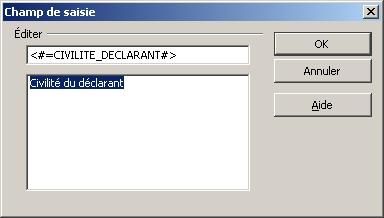
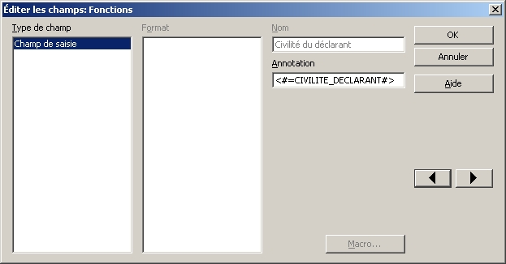
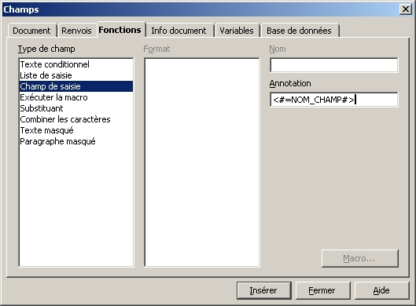
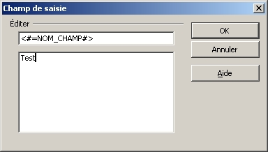
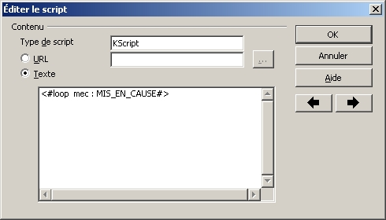

# Quarto

**Quarto** est une extension Vertigo permettant la gestion des publications.

Elle permet à la fois de programmer et lancer des processus avec une stratégie prédéfinie et de fournir une API pour les configurer et les superviser.

Elle inclut plusieurs modules :

- **Publisher** : Outil d'éditique simple et léger. Permet de produire des documents à partir de modèle de document utilisateur et des données de l'application. Les modèles sont très simples à modifier car ils sont des documents ODT ou DOCX avec des marqueurs.
- **Converter** : Permet de convertir un format de document dans un autre (les plugins existants supportent : ODT, DOC, DOCX, RTF, TXT vers PDF)
- **Export** : Permet d'exporter des collections ou des objets métiers vers des formats utilitaires (les plugins existants supportent : CSV, PDF, RTF, XLS)

## Publisher

### Présentation

**Publisher** a été conçu pour :

- Faciliter la création de documents type courrier au format bureautique : odt, doc, pdf
- Donner aux utilisateurs la possibilité de modifier les modèles en utilisant un logiciel bureautique (OpenOffice)

Publisher n’est pas prévu pour :

- Créer un export brut des données : on utilisera le module [Export]
- Créer des rapports normalisés (Cerfa ….)  : on utilisera iText
- Créer des rapports BI : on utilisera Jasper, Birt, SSRS, ...

Ce module n’est composé que d’un seul service homonyme.

### Principes

**Publisher** est basé sur le principe de la fusion de documents. C’est-à-dire qu’il procède à l’insertion des données métier dans un document servant de modèle.

  

> Le document en sortie de fusion est donc dans le même format que le modèle. Ce document peut être converti dans un autre format grâce au module [Converter].

### Création du modèle

L’algorithme de fusion est un plugin du `PublisherManager`. Il existe deux implémentations : odt (OpenOffice) et docx (Microsoft Word). La syntaxe des mots clés est légèrement différente mais les principes restent les même.
Dans un modèle on définit des mots clés et des scripts qui feront référence aux champs et aux objets contenus dans un `PublisherNode` (notion à voir plus bas) à fusionner.

Le nom des champs est important, il doit être identique au nom des champs définis dans la description `KSP` de l'édition (voir plus bas) afin d'être fusionné correctement.

La syntaxe est la suivante :

| Type d'opération | Syntaxe ODT | Syntaxe DOCX |
| --- 					| --- | --- |
| Champs de fusion 		| `<#=nomChamp #>` | `{=nomChamp}` |
| Champs de fusion d'un objet 		| `<#=nomObjet.nomChamp #>` | `{=nomObjet.nomChamp}` |
| Condition 			| `<#if nomChampBoolean #>`<br/>`<#endif#>` | `{if nomChampBoolean}`<br/>`{endif}` |
| Condition inverse 	| `<#ifnot nomChampBoolean #>`<br/>`<#endifnot#>` | `{ifnot nomChampBoolean}`<br/>`{endifnot}` |
| Condition sur code 	| `<#ifequals nomChampBoolean = "CODE" #>`<br/>`<#endifequals#>` | `{ifequals nomChampBoolean = "CODE"}`<br/>`{endifequals}` |
| Condition inverse sur code 	| `<#ifnotequals nomChampBoolean = "CODE" #>`<br/>`<#endifnotequals#>` | `{ifnotequals nomChampBoolean = "CODE"}`<br/>`{endifnotequals}` |
| Boucle sur une liste d'objet 	| `<#loop maVariable : nomCollection#>`<br/>`  <#=nomChamp #>`<br/>`<#endloop#>` | `{loop maVariable : nomCollection}`<br/>`  {=nomChamp}`<br/>`{endloop}` |
| Parcours d'un objet seul 	| `<#var maVariable : nomObjet#>`<br/>`  <#=nomChamp #>`<br/>`<#endvar#>` | *Non implémenté* |
| Ajout d'une image 	| `<#image nomImage#>` | *Non implémenté* |


Pour ajouter un mot clés cela dépend de l’éditeur que vous utilisez.

#### Sous OpenOffice 
On distingue deux types de mots clés : ceux qui représente un champ de fusion, et ceux qui représente une opération visant à manipuler le modèle (conditions ou boucles).

Les champs de fusion apparaissent surlignés en gris dans le document ODT. Quand on clique dessus on accède en lecture seule aux propriétés de ce champ.



Pour modifier le champ il faut faire : Clic droit puis Champs et on obtient un navigateur nous permettant d'éditer tous les champs du modèle.



Pour créer un champ : Insertion -> Champs -> Autres (ou Ctrl + F2) Se placer dans l'onglet Fonctions. On obtient alors l'écran suivant :



Remplir le champ Annotation avec le nom du champ à fusionner puis cliquer sur Insérer. On obtient l'écran suivant :



Remplir le commentaire du champ, cliquer sur OK, le champ est ajouté dans le modèle.

Pour ajouter un mot clé de type « opération », on utilise une insertion de script. Dans openOffice ce marqueur est bien exclu du contenu, et permet plus de liberté sur son placement.
Dans le modèle ODT pour ajouter un script : Insertion -> Script Remplissez la boite de dialogue de la façon suivante :




Pour image, il faut poser une image dans le modèle. Cette image servira pour définir la taille maximum de l'image qui sera fusionner. Le ratio de l'image fusionnée sera conservé.
Puis il faut nommer l'image : Click-droit sur l'image -> Propriétés -> Options -> Remplir le Nom : <#image IMAGE_FIELD_NAME>

#### Sous Microsoft Word 2010

Ces mots clés et fonctions sont insérés dans le document word sous forme de champs, il n’y a pas de différence entre champs de fusion et opérations.
L’insertion de ces champs peut se faire par la commande « Insertion / QuickPart /  Champ ».
Des raccourcis claviers peuvent aussi être utilisés :
 
- `Ctrl-F9` : Ajout un champ

- `Alt-F9` : Affiche/masque le contenu des champs

Le principe est le même que pour OpenOffice, seul la syntaxe est légèrement différente.

#### Déclaration du dictionnaire
Les champs du modèle de document doivent correspondre à un dictionnaire de mot prévu par le système. Ce dictionnaire est nommé PublisherDefinition.
Une PublisherDefinition est constituée d’une PublisherNode racine.

Un PublisherNode est constitué de champs et est réutilisable, dans d’autre PublisherDefinition par exemple.
Les champs peuvent être de 5 types :

| Syntaxe | Description | Exemple |
| --- 					| --- | --- |
| stringField | Champ de type chaine de caractères | `stringField nom {}` |
| booleanField | Champ de type booléen | `booleanField siGrave {}`  |
| dataField 			| Champ de type PublisherNode | `dataField emetteur { type : PnPersonne }` |
| listField 			| Champ de type liste de PublisherNode | `listField destinataires { type : PnPersonne }` |
| imageField 			| Champ de type image (doit être un VFile) | `imageField logo` |


#### Exemple

```java
public final class MyPublisherDefinitionProvider implements SimpleDefinitionProvider {

	private static PublisherDataDefinition createTestEnquete() {
		final PublisherNodeDefinition ville = new PublisherNodeDefinitionBuilder()
				.addStringField("nom")
				.addStringField("codePostal")
				.build();

		final PublisherNodeDefinition address = new PublisherNodeDefinitionBuilder()
				.addStringField("rue")
				.addNodeField("ville", ville)
				.build();

		final PublisherNodeDefinition enqueteur = new PublisherNodeDefinitionBuilder()
				.addStringField("nom")
				.addStringField("prenom")
				.addNodeField("adresseRatachement", address)
				.build();

		final PublisherNodeDefinition misEnCause = new PublisherNodeDefinitionBuilder()
				.addBooleanField("siHomme")
				.addStringField("nom")
				.addStringField("prenom")
				.addListField("adresseConnues", address)
				.build();

		final PublisherNodeDefinition publisherNodeDefinition = new PublisherNodeDefinitionBuilder()
				.addBooleanField("enqueteTerminee")
				.addStringField("codeEnquete")
				.addNodeField("enqueteur", enqueteur)
				.addListField("misEnCause", misEnCause)
				.addStringField("fait")
				.addBooleanField("siGrave")
				.build();

		return new PublisherDataDefinition("PuEnquete", publisherNodeDefinition);
	}


	@Override
	public List<Definition> provideDefinitions(final DefinitionSpace definitionSpace) {

		return new ListBuilder<Definition>()
				.add(createTestEnquete())
				.build();
	}
```

### Mise en place

Pour mettre en place Publisher, il faut :

* Ajouter les dépendances quarto dans pom.xml et lancer mvn install 

```Xml
<dependency>
	<groupId>io.vertigo</groupId>
	<artifactId>vertigo-quarto</artifactId>
	<version>${vertigo.version}</version>
</dependency>
```

Pour l'utilisation du plugin XDocReportConverterPlugin (gestion du DOCX) :
```Xml
<dependency>
    <groupId>fr.opensagres.xdocreport</groupId>
    <artifactId>fr.opensagres.xdocreport.converter.docx.xwpf</artifactId>
    <version>2.0.2</version>
</dependency>
```

Pour l'utilisation du plugin OpenOfficeLocalConverterPlugin (gestion de l'ODT en local) :
```Xml
<dependency>
	<groupId>fr.opensagres.xdocreport</groupId>
	<artifactId>fr.opensagres.xdocreport.converter.odt.odfdom</artifactId>
	<version>2.0.2</version>
</dependency>
```


* Définir le provider Java qui contiendra les fichiers de définition du modèle

```Xml
<module name="myApp-ressources">
	<definitions>
              <provider class="fr.projet.appli.MyPublisherDefinitionProvider" />
	</definitions>
</module>
```

* Ajouter le module dans dans foundation.xml

```Xml
<module name="vertigo-quarto">
	<component api="PublisherManager" class="io.vertigo.quarto.publisher.impl.PublisherManagerImpl">
		<plugin class="io.vertigo.quarto.plugins.publisher.odt.OpenOfficeMergerPlugin"/>
	</component>
</module>
```

### Utilisation

Le cas d'usage le plus simple suit les étapes suivantes :

1- Récupération des données
2- Création d'un PublisherData correspondant au modèle
3- Peuplement du PublisherData à partir des données de la base
4- Récupération du Model de document
5- Création du document à partir du modèle et des données
6- Sauvegarde du document résultat

Voici le code résultant :
```Java
public void testMergerSimple() {
  final MyData myData= loadMyData();
  final PublisherData publisherData = createPublisherData("PuMyPublish");
  PublisherDataUtil.populateData(myData, publisherData.getRootNode());
  final URL modelFileURL = resourceManager.resolve(DATA_PACKAGE + "MyModel.odt");
  final VFile result = publisherManager.publish(OUTPUT_PATH + "MyPublish.odt", modelFileURL, publisherData);
  //Ne pas oublier de sauver le fichier (actuellement c'est un fichier temporaire qui sera purgé)
  save(result);
}

private static PublisherData createPublisherData(final String definitionName) {
  final PublisherDataDefinition publisherDataDefinition = Home.getApp().getDefinitionSpace().resolve(definitionName, PublisherDataDefinition.class);
  Assert.assertNotNull(publisherDataDefinition);
  final PublisherData publisherData = new PublisherData(publisherDataDefinition);
  Assert.assertNotNull(publisherData);
  return publisherData;
}
```