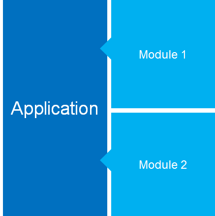

# Objectifs
Notre but en construisant vertigo est de proposer un socle applicatif :

* Centré sur les besoins
* Issu de l’expérience
* Cohérent, non-uniforme
* Simple, les choses simples doivent se faire aisément
* Ouvert, les choses moins simples doivent être possibles

A cette fin, vertigo respecte la ligne de conduite décrite ci-dessous.

# Principes de conception

# Simple
John Maeda, professeur de design au MIT, a rédigé un petit livre intitulé *The laws of simplicity* où il référence les lois de la simplicité. La dernière loi, forme une synthèse des précédentes.

**Simplicity is about subtracting the obvious, and adding the meaningful.**

# Modular
La modularité est un élément clé des systèmes informatiques, elle est à la base d'UNIX ; comme le dit Erich Raymond dans son ouvrage Basics of the Unix Philosophy,

**Rule of Modularity : Write simple parts connected by clean interfaces.** 

# Elastic
Capacité du système à distribuer les traitements afin :

* d'absorber des charges importantes
* de confiner certaines tâches sur des serveurs dédiés

# Fast
Voici selon Jacob Nielsen, référence dans le domaine de l'ergonomie des systèmes informatiques, les 3 délais importants. Notre objectif est de **construire des applications qui répondent instantanément**.

* 0.1 seconds gives the feeling of instantaneous response
* 1 second keeps the user's flow of thought seamless.
* 10 seconds is about the limit for keeping the user's attention focused on the dialogue.

# Fluid
Parce qu'une application n'est perçue qu'au travers de son interface utilisateur, celle-ci doit être fluide et ergonomique.
